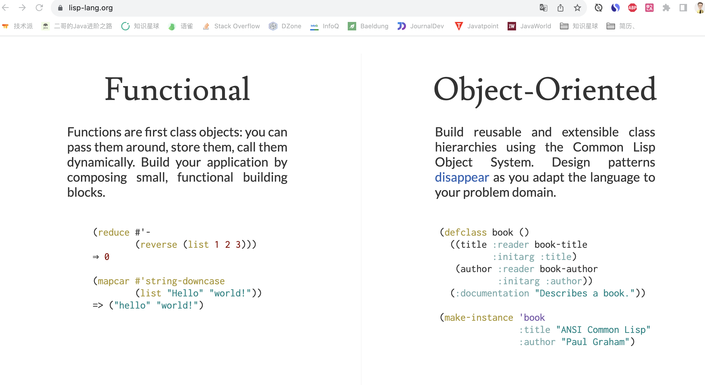
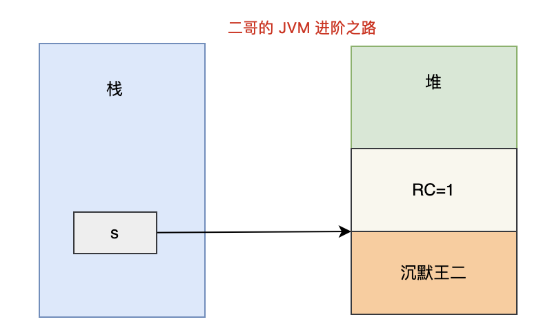
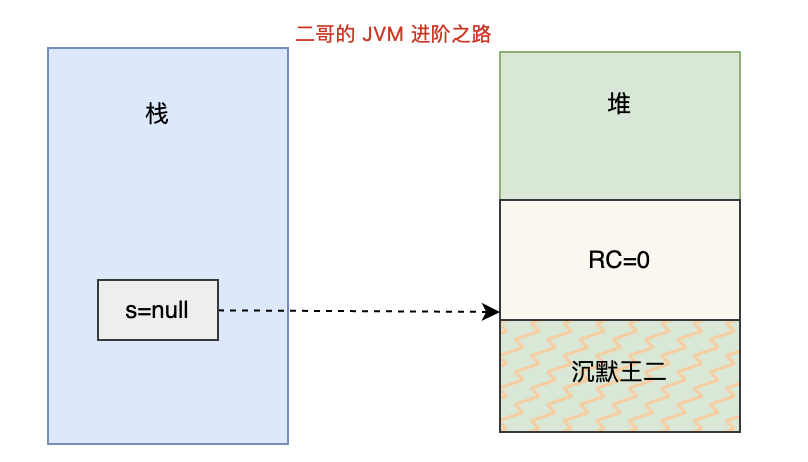
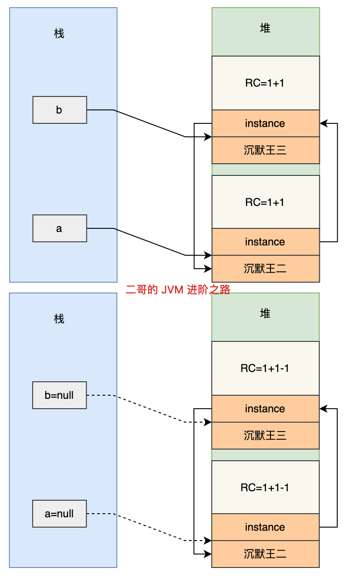
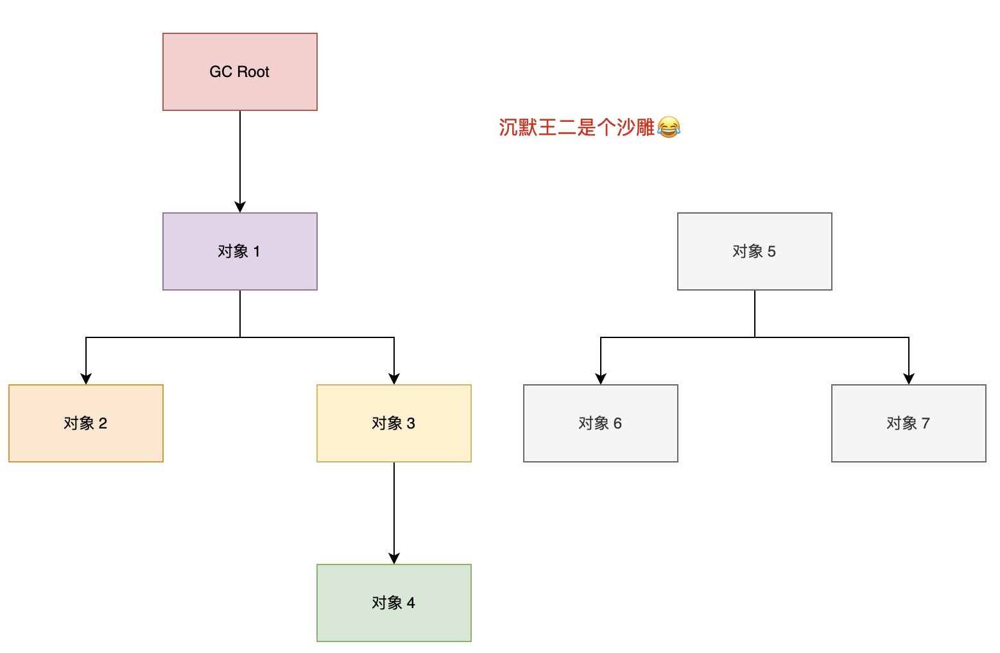
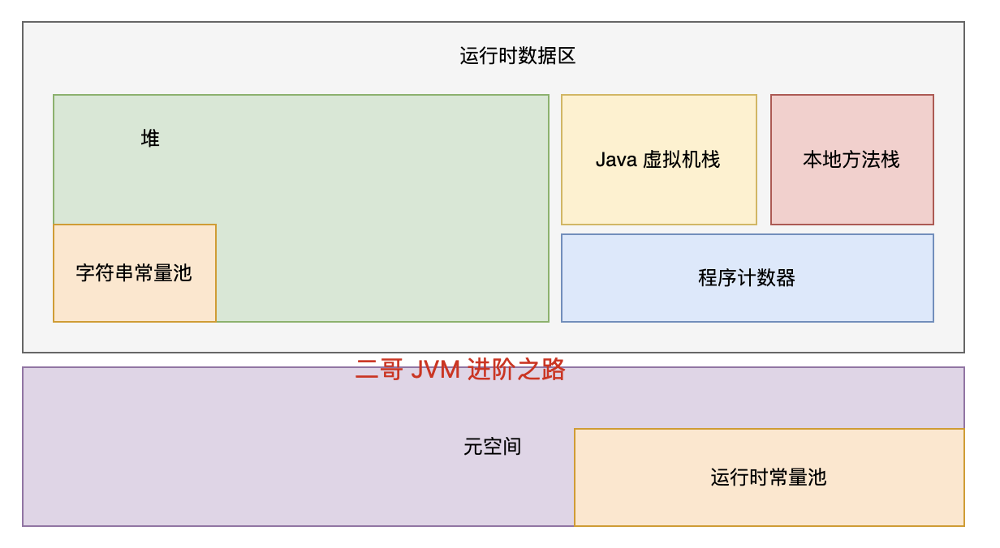
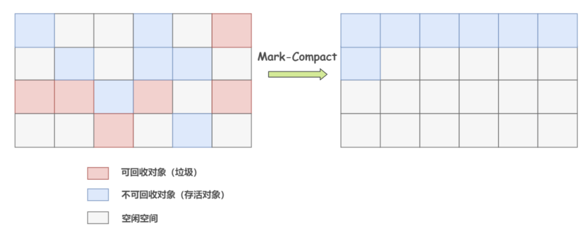

# 第十节：深入理解垃圾回收机制

记得以前有这样一副动图，用来嘲笑 JVM 的垃圾回收机制，大致的意思就是，JVM 的垃圾回收机制很工业化，但是好像是在做无用功，垃圾回收不彻底（😂）。


C/C++ 虽然需要手动释放内存，但开发者信誓旦旦，认为自己一定能清理得很彻底。那这次，我们就从头到尾来详细地聊一聊 JVM 的垃圾回收机制，看看到底如何。

## 垃圾回收的概念

垃圾回收（Garbage Collection，GC），顾名思义就是释放垃圾占用的空间，防止内存爆掉。有效的使用可以使用的内存，对内存[堆](./neicun-jiegou.md)中已经死亡的或者长时间没有使用的对象进行清除和回收。

Java 语言出来之前，大家都在拼命的写 C 或者 C++ 的程序，而此时存在一个很大的矛盾，C++ 等语言创建对象要不断的去开辟空间，不用的时候又需要不断的去释放空间，既要写构造函数，又要写析构函数。

> 构造函数和 Java 中的构造方法类似，用来创建对象，析构函数和 Java 中的 finalize 方法有一点类似，可以在对象被垃圾回收器回收之前执行清理操作，但不推荐，因为 finalize 的执行时机并不确定。

于是，有人就提出，能不能写一段程序实现这块功能，每次创建对象、释放内存空间的时候复用这段代码？

牛人还是多啊，1960 年，基于 MIT 的 Lisp 首先提出了垃圾回收的概念，用于处理 C 语言等不停的析构操作，Java 的垃圾回收机制算是发扬光大了。

> [Lisp](https://lisp-lang.org/) 是一种函数式编程语言，我从官网上截幅图大家感受下。



## 垃圾判断算法

既然 JVM 要做垃圾回收，就要搞清楚什么是垃圾，什么不是垃圾。通常会有这么几种算法来确定一个对象是否是垃圾，这块也是面试当中常考的一个知识点，大家一定要掌握。

- 引用计数算法
- 可达性分析算法
- 分代收集算法
- 复制算法

### 引用计数算法

引用计数算法（Reachability Counting）是通过在对象头中分配一个空间来保存该对象被引用的次数（Reference Count）。

如果该对象被其它对象引用，则它的引用计数加 1，如果删除对该对象的引用，那么它的引用计数就减 1，当该对象的引用计数为 0 时，那么该对象就会被回收。

```java
String s = new String("沉默王二");
```

我们来创建一个[字符串](../string/string-source.html)，这时候"沉默王二"有一个引用，就是 s。此时 Reference Count 为 1。



然后将 s 设置为 null。

```java
s = null;
```

这时候"沉默王二"的引用次数就等于 0 了，在引用计数算法中，意味着这块内容就需要被回收了。



引用计数算法将垃圾回收分摊到整个应用程序的运行当中，而不是集中在垃圾收集时。因此，采用引用计数的垃圾收集不属于严格意义上的"Stop-The-World"的垃圾收集机制（随后我们会细讲）。

引用计数算法看似很美好，但实际上它存在一个很大的问题，那就是无法解决循环依赖的问题。来看下面的代码。

```java
public class ReferenceCountingGC {

    public Object instance;  // 对象属性，用于存储对另一个 ReferenceCountingGC 对象的引用

    public ReferenceCountingGC(String name) {
        // 构造方法
    }

    public static void testGC() {
        // 创建两个 ReferenceCountingGC 对象
        ReferenceCountingGC a = new ReferenceCountingGC("沉默王二");
        ReferenceCountingGC b = new ReferenceCountingGC("沉默王三");

        // 使 a 和 b 相互引用
        a.instance = b;
        b.instance = a;

        // 将 a 和 b 设置为 null
        a = null;
        b = null;

        // 这个位置是垃圾回收的触发点
    }
}
```

代码中创建了两个 ReferenceCountingGC 对象 a 和 b。


然后使它们相互引用。接着，将这两个对象的引用设置为 null，理论上它们会在接下来被垃圾回收器回收。但由于它们相互引用着对方，导致它们的引用计数永远都不会为 0，通过引用计数算法，也就永远无法通知 GC 收集器回收它们。




### 可达性分析算法

可达性分析算法（Reachability Analysis）的基本思路是，通过一些被称为引用链（GC Roots）的对象作为起点，然后向下搜索，搜索走过的路径被称为（Reference Chain），当一个对象到 GC Roots 之间没有任何引用相连时，即从 GC Roots 到该对象节点不可达，则证明该对象是需要垃圾收集的。



通过可达性算法，成功解决了引用计数无法解决的问题-“循环依赖”，只要你无法与 GC Root 建立直接或间接的连接，系统就会判定你为可回收对象。

在 Java 语言中，可作为 GC Root 的对象包括以下 4 种：

- 虚拟机栈中引用的对象
- 本地方法栈引用的对象
- 类静态变量引用的对象
- 常量引用的对象

大家可以回想一下我们前面讲过的[JVM 运行时数据区](./neicun-jiegou.html)。



#### 1、虚拟机栈中引用的对象

来看下面这段代码：

```java
public class StackLocalParameter {
    // 构造方法
    public StackLocalParameter(String name) {}

    public static void testGC() {
        // 创建一个 StackLocalParameter 对象，引用存储在栈上，对象在堆上
        StackLocalParameter s = new StackLocalParameter("localParameter");

        // 将引用 s 设置为 null，使 StackLocalParameter 对象成为垃圾回收的候选对象
        s = null;

        // 此时，垃圾回收器可以回收之前创建的 StackLocalParameter 对象，
        // 因为它不再有任何强引用指向它
    }
}
```

这个代码片段主要展示了 Java 中局部变量的生命周期和垃圾回收机制。当局部变量（如这里的 s）不再指向任何对象，或者变量本身离开了作用域，它指向的对象就可以被视为垃圾回收的候选对象。

>局部变量的引用存储在虚拟机栈中，而对象存储在堆中。

#### 2、本地方法栈中引用的对象

来看下面这段代码：

```java
public class NativeExample {
    private native void nativeMethod(Object obj);

    public void exampleMethod() {
        Object myObject = new Object();

        // 调用本地方法，传递对象
        nativeMethod(myObject);

        // 即使在 Java 代码中不再使用 myObject，
        // 只要 nativeMethod 还持有它的引用，它就不会被垃圾回收。
    }
}
```

在这个示例中，nativeMethod 是一个本地方法，它从 Java 代码中接收一个对象引用。即使 Java 方法 exampleMethod 完成了对 myObject 的使用，只要本地方法 nativeMethod 还在执行并且持有对 myObject 的引用，myObject 就不会被回收。

把本地方法栈中引用的对象作为 GC Root，是 JVM 保证 Java 与本地代码交互时内存安全的一个关键机制。

#### 3、类静态变量引用的对象

来看下面这段代码：

```java
public class MethodAreaStaicProperties {
    // 静态变量的引用 m 存储在方法区中（JDK8 以后的元空间）
    public static MethodAreaStaicProperties m;

    // 构造方法
    public MethodAreaStaicProperties(String name) {}

    public static void testGC() {
        // 创建一个 MethodAreaStaicProperties 实例
        MethodAreaStaicProperties s = new MethodAreaStaicProperties("properties");

        // 通过实例 s 设置静态变量 m 的值
        // 此时，m 指向堆上的一个新 MethodAreaStaicProperties 实例
        s.m = new MethodAreaStaicProperties("parameter");

        // 将 s 置为 null
        // 此时，s 指向的对象可以被垃圾回收，但静态变量 m 指向的对象不会被回收
        s = null;

        // 虽然 s 被置为 null，但 m 作为静态变量，仍然引用着一个 MethodAreaStaicProperties 实例
        // 因此，这个由 m 引用的对象不会被垃圾回收
    }
}
```

在这个示例中，静态变量 m 指向堆上的一个 MethodAreaStaicProperties 实例。即使 s 被置为 null，但 m 仍然引用着一个对象实例，因此 m 引用的对象不会被垃圾回收。

>静态变量的引用通常存储在元空间，而对象仍然存储在堆中。

#### 3、常量引用的对象

来看这段代码：

```java
public class MethodAreaStaicProperties {
    // 常量 m 的引用存储在方法区（JDK8 以后元空间）
    public static final MethodAreaStaicProperties m = new MethodAreaStaicProperties("final");

    // 构造方法
    public MethodAreaStaicProperties(String name) {}

    public static void testGC() {
        // 创建 MethodAreaStaicProperties 类的实例
        MethodAreaStaicProperties s = new MethodAreaStaicProperties("staticProperties");

        // 将引用 s 设置为 null，这使得 s 指向的对象成为垃圾回收的候选对象
        s = null;

        // 常量 m 的对象不会被回收
    }
}
```

常量 m 应用的对象和 testGC 方法中的 s 其实不存在关系，所以局部变量 s 引用的对象回收和其没有任何关系。

## Stop The World

"Stop The World"是 Java 垃圾收集中的一个重要概念。在垃圾收集过程中，JVM 会暂停所有的用户线程，这种暂停被称为"Stop The World"事件。

这么做的主要原因是为了防止在垃圾收集过程中，用户线程修改了堆中的对象，导致垃圾收集器无法准确地收集垃圾。

值得注意的是，"Stop The World"事件会对 Java 应用的性能产生影响。如果停顿时间过长，就会导致应用的响应时间变长，对于对实时性要求较高的应用，如交易系统、游戏服务器等，这种情况是不能接受的。

因此，在选择和调优垃圾收集器时，需要考虑其停顿时间。Java 中的一些垃圾收集器，如 G1 和 ZGC，都会尽可能地减少了"Stop The World"的时间，通过并发的垃圾收集，提高应用的响应性能。

总的来说，"Stop The World"是 Java 垃圾收集中必须面对的一个挑战，其目标是在保证内存的有效利用和应用的响应性能之间找到一个平衡。

## 垃圾收集算法

在确定了哪些垃圾可以被回收后，垃圾收集器要做的事情就是进行垃圾回收，但是这里面涉及到一个问题是：**如何高效地进行垃圾回收**。由于 JVM 规范并没有对如何实现垃圾收集器做出明确的规定，因此各个厂商的虚拟机可以采用不同的方式来实现垃圾收集器，这里我们讨论几种常见的垃圾收集算法。

### 标记清除算法

标记清除算法（Mark-Sweep）是最基础的一种垃圾回收算法，它分为 2 部分，先把内存区域中的这些对象进行标记，哪些属于可回收的标记出来（用前面提到的可达性分析法），然后把这些垃圾拎出来清理掉。


就像上图一样，清理掉的垃圾就变成可使用的空闲空间，等待被再次使用。逻辑清晰，并且也很好操作，但它存在一个很大的问题，那就是内存碎片。碎片太多可能会导致当程序运行过程中需要分配较大对象时，因无法找到足够的连续内存而不得不提前触发新一轮的垃圾收集。

### 复制算法

复制算法（Copying）是在标记清除算法上演化而来的，用于解决标记清除算法的内存碎片问题。它将可用内存按容量划分为大小相等的两块，每次只使用其中的一块。

当这一块的内存用完了，就将还存活着的对象复制到另外一块上面，然后再把已使用过的内存空间一次清理掉。这样就保证了内存的连续性，逻辑清晰，运行高效。


但复制算法也存在一个很明显的问题，合着我这 190 平的大四室，只能当 90 平米的小两室来居住？代价实在太高。

### 标记整理算法

标记整理算法（Mark-Compact），标记过程仍然与标记清除算法一样，但后续步骤不是直接对可回收对象进行清理，而是让所有存活的对象都向一端移动，再清理掉端边界以外的内存区域。



标记整理算法一方面在标记-清除算法上做了升级，解决了内存碎片的问题，也规避了复制算法只能利用一半内存区域的弊端。看起来很美好，但内存变动更频繁，需要整理所有存活对象的引用地址，在效率上比复制算法差很多。

### 分代收集算法

分代收集算法（Generational Collection）严格来说并不是一种思想或理论，而是融合上述 3 种基础的算法思想，而产生的针对不同情况所采用不同算法的一套组合拳。

对象存活周期的不同将内存划分为几块，一般是把 Java 堆分为新生代和老年代，这样就可以根据各个年代的特点采用最适当的收集算法。


在新生代中，每次垃圾收集时都发现有大批对象死去，只有少量存活，那就选用复制算法，只需要付出少量存活对象的复制成本就可以完成收集。

老年代中因为对象存活率高、没有额外空间对它进行分配担保，就必须使用标记清理或者标记整理算法来进行回收。

## 新生代和老年代

堆（Heap）是 JVM 中最大的一块内存区域，也是垃圾收集器管理的主要区域。


堆主要分为 2 个区域，年轻代与老年代，其中年轻代又分 Eden 区和 Survivor 区，其中 Survivor 区又分 From 和 To 两个区。

### Eden 区

据 IBM 公司之前的研究表明，有将近 98% 的对象是朝生夕死，所以针对这一现状，大多数情况下，对象会在新生代 Eden 区中进行分配，当 Eden 区没有足够空间进行分配时，JVM 会发起一次 Minor GC，Minor GC 相比 Major GC 更频繁，回收速度也更快。

通过 Minor GC 之后，Eden 区中绝大部分对象会被回收，而那些无需回收的存活对象，将会进到 Survivor 的 From 区，如果 From 区不够，则直接进入 To 区。

### Survivor 区

Survivor 区相当于是 Eden 区和 Old 区的一个缓冲，类似于我们交通灯中的黄灯。

#### 1、为啥需要 Survivor 区？

不就是新生代到老年代吗，直接 Eden 到 Old 不好了吗，为啥要这么复杂。

如果没有 Survivor 区，Eden 区每进行一次 Minor GC，存活的对象就会被送到老年代，老年代很快就会被填满。而有很多对象虽然一次 Minor GC 没有消灭，但其实也并不会蹦跶多久，或许第二次，第三次就需要被清除。

这时候移入老年区，很明显不是一个明智的决定。

所以，Survivor 的存在意义就是减少被送到老年代的对象，进而减少 Major GC 的发生。Survivor 的预筛选保证，只有经历 16 次 Minor GC 还能在新生代中存活的对象，才会被送到老年代。

#### 2、Survivor 区为啥划分为两块？

设置两个 Survivor 区最大的好处就是解决内存碎片化，我们先假设一下，Survivor 只有一个区域会怎样。

Minor GC 执行后，Eden 区被清空，存活的对象放到了 Survivor 区，而之前 Survivor 区中的对象，可能也有一些是需要被清除的。那么问题来了，这时候我们怎么清除它们？

在这种场景下，我们只能标记清除，而我们知道标记清除最大的问题就是内存碎片，在新生代这种经常会消亡的区域，采用标记清除必然会让内存产生严重的碎片化。

但因为 Survivor 有 2 个区域，所以每次 Minor GC，会将之前 Eden 区和 From 区中的存活对象复制到 To 区域。第二次 Minor GC 时，From 与 To 职责兑换，这时候会将 Eden 区和 To 区中的存活对象再复制到 From 区域，以此反复。

这种机制最大的好处就是，整个过程中，永远有一个 Survivor space 是空的，另一个非空的 Survivor space 是无碎片的。

那么，Survivor 为什么不分更多块呢？比方说分成三个、四个、五个？

显然，如果 Survivor 区再细分下去，每一块的空间就会比较小，容易导致 Survivor 区满，两块 Survivor 区可能是经过权衡之后的最佳方案。

### Old 区

老年代占据着 2/3 的堆内存空间，只有在 Major GC 的时候才会进行清理，每次 GC 都会触发“Stop-The-World”。内存越大，STW 的时间也越长，所以内存也不仅仅是越大就越好。

由于复制算法在对象存活率较高的老年代会进行很多次的复制操作，效率很低，所以老年代这里采用的是标记整理算法。

除了上述所说，在内存担保机制下，无法安置的对象会直接进到老年代，以下几种情况也会进入老年代。

#### 1、大对象

大对象指需要大量连续内存空间的对象，这部分对象不管是不是“朝生夕死”，都会直接进到老年代。这样做主要是为了避免在 Eden 区及 2 个 Survivor 区之间发生大量的内存复制。当你的系统有非常多“朝生夕死”的大对象时，得注意了。

#### 2、长期存活对象

虚拟机给每个对象定义了一个对象年龄（Age）计数器。正常情况下对象会不断的在 Survivor 的 From 区与 To 区之间移动，对象在 Survivor 区中每经历一次 Minor GC，年龄就增加 1 岁。当年龄增加到 15 岁时，这时候就会被转移到老年代。当然，这里的 15，JVM 也支持进行特殊设置 `-XX:MaxTenuringThreshold=10`。

可通过 `java -XX:+PrintFlagsFinal -version | grep MaxTenuringThreshold` 查看默认的阈值。


#### 3、动态对象年龄

JVM 并不强制要求对象年龄必须到 15 岁才会放入老年区，如果 Survivor 空间中某个年龄段的对象总大小超过了 Survivor 空间的一半，那么该年龄段及以上年龄段的所有对象都会在下一次垃圾回收时被晋升到老年代，无需等你“成年”。

有点类似于负载均衡，轮询是负载均衡的一种，保证每台机器都分得同样的请求。看似很均衡，但每台机器的硬件不同，健康状况不同，所以我们可以基于每台机器接收的请求数、响应时间等，来调整负载均衡算法。

这种动态调整机制有助于优化内存使用和减少垃圾收集的频率，特别是在处理大量短生命周期对象的应用程序时。

## 总结

本篇内容我们从头到尾讲了一遍 JVM 的垃圾回收机制，包括垃圾回收的概念、垃圾判断算法、垃圾收集算法、Stop The World、新生代和老年代等等。


> - 参考链接 1：[从头到尾再讲一次 Java 的垃圾回收](https://zhuanlan.zhihu.com/p/73628158)
> - 参考链接 2：[详解Java的垃圾回收机制](https://segmentfault.com/a/1190000038256027)
> - 参考链接 3：[三大垃圾收集算法](https://www.51cto.com/article/708223.html)

---

.

