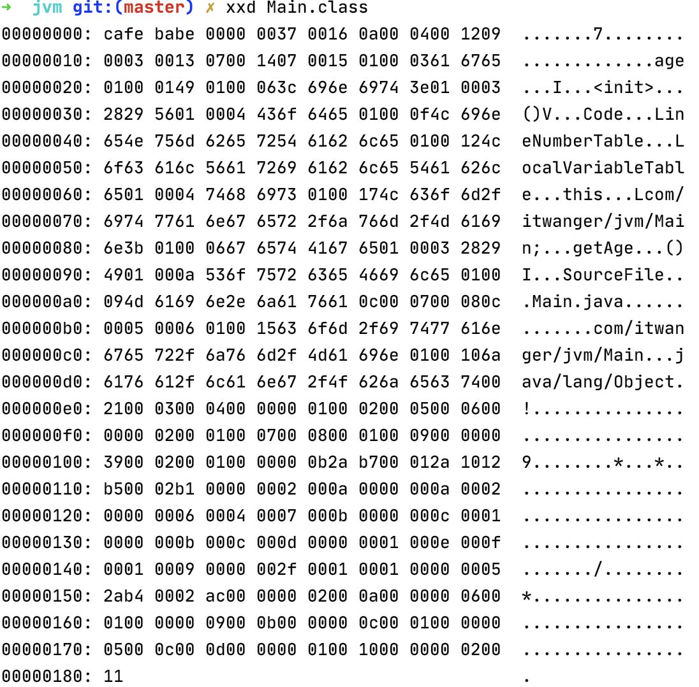
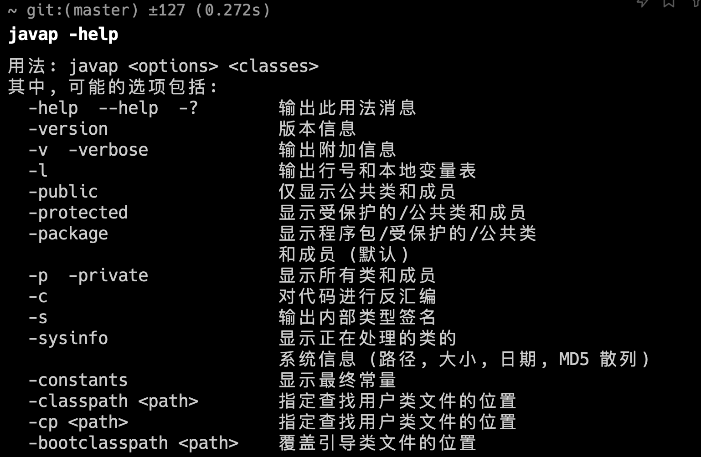
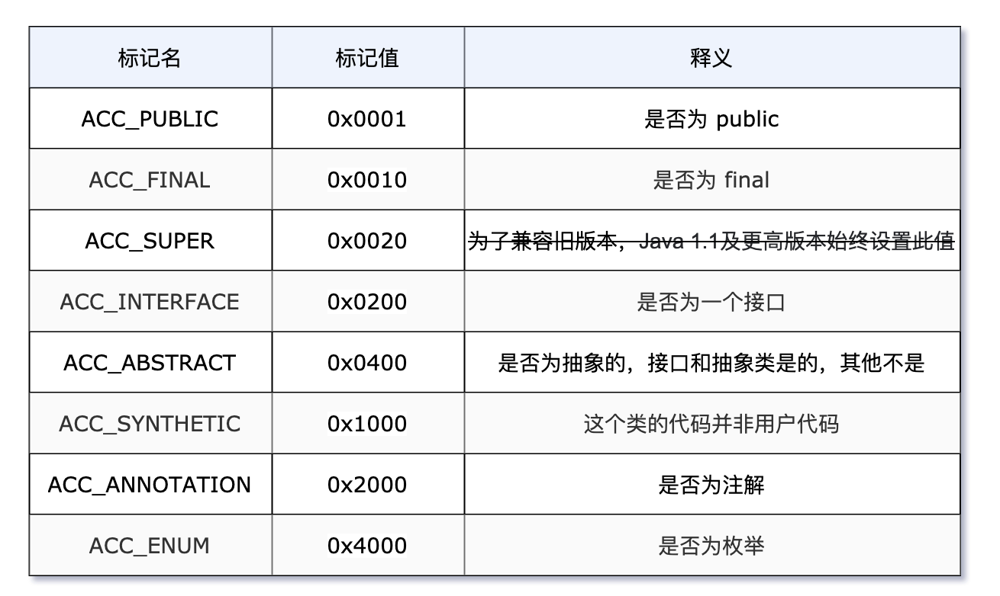
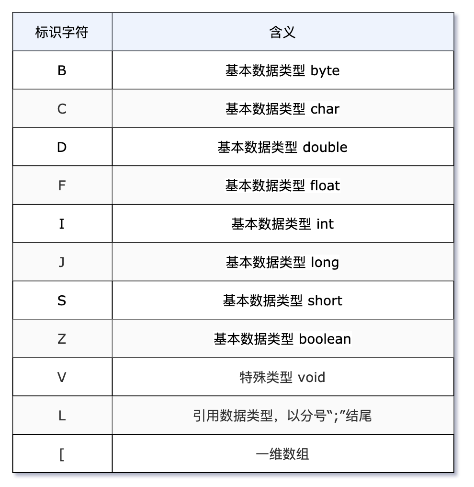
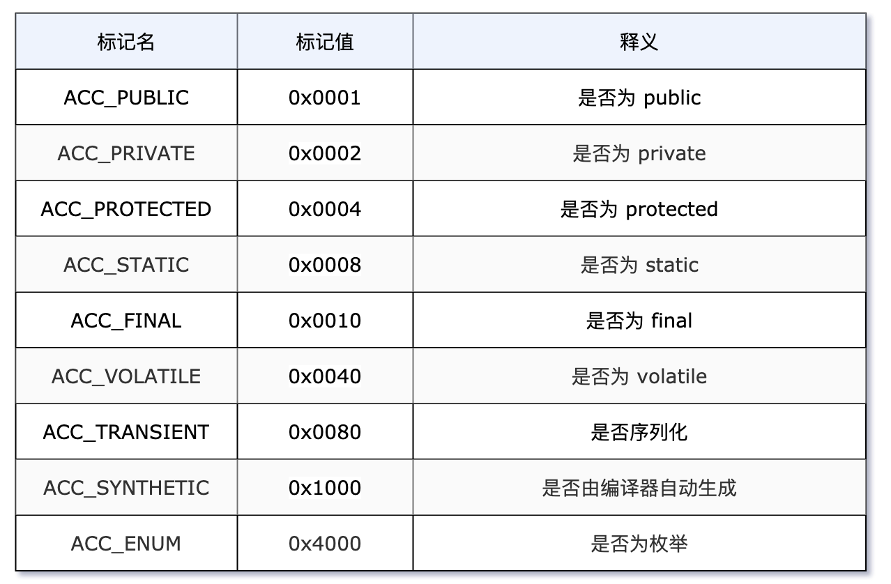
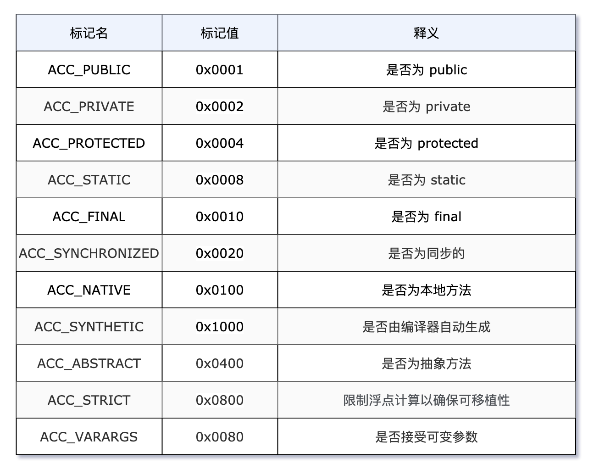

# 第五节：javap 与字节码

计算机比较“傻”，只认 0 和 1，这意味着我们编写的代码最终都要编译成机器码才能被计算机执行。Java 在诞生之初就提出了一个非常著名的宣传口号: "**一次编写，处处运行**"。

> **Write Once, Run Anywhere.**

为了这个口号，Java 的亲妈 Sun 公司以及其他虚拟机提供商发布了许多可以在不同平台上运行的 Java 虚拟机，而这些虚拟机都拥有一个共同的功能，那就是可以载入和执行同一种与平台无关的字节码（Byte Code）。

（前面其实我们也讲过，但为了这篇内容的完整性，我们简单过一下，这一节我们的重点是**通过 javap 这个命令来了解字节码**）

有了 Java 虚拟机的帮助，我们编写的 Java 源代码不必再根据不同平台编译成对应的机器码了，只需要生成一份字节码，然后再将字节码文件交由运行在不同平台上的 Java 虚拟机读取后执行就可以了。

如今的 Java 虚拟机非常强大，不仅支持 Java 语言，还支持很多其他的编程语言，比如说 Groovy、Scala、Koltin 等等。


来看一段代码吧。

```java
public class Main {
    private int age = 18;
    public int getAge() {
        return age;
    }
}
```

编译生成 Main.class 文件后，可以在命令行使用 `xxd Main.class` 打开 class 文件（[前面我们已经讲过了](./class-load.html)，还不会用的同学可以回头看一眼）。




对于这些 16 进制内容，除了开头的 cafe babe，剩下的内容大致可以翻译成：啥玩意啊这......

但经过[上一节类文件结构](./class-file-jiegou.html)的洗礼，相信大家对这份文件的内容已经很熟悉了。

## javap

Java 内置了一个反编译命令 javap，可以通过 `javap -help` 了解 javap 的基本用法。




当然了，执行这个命令的前提条件是你需要配置好 Java 环境变量，如果没有配置好，可以参考[这篇文章](../overview/jdk-install-config.html)。

javap 是 JDK 自带的一个命令行工具，主要用于反编译类文件（.class 文件）。我本机是 macOS，使用了 jenv 来管理的 JDK 版本，所以看到的位置如下图所示。

> Windows 用户以及没有使用 jenv 的 macOS 用户可以根据[这个帖子](../overview/jdk-install-config.html)了解 jenv，真的好用。


javap 主要用于反编译 Java 类文件，即将编译后的 .class 文件转换回更易于理解的形式。虽然它不会生成原始的 Java 源代码，但它可以显示类的结构，包括[构造方法](../oo/construct.html)、[方法](../oo/method.html)、[字段](../oo/var.html)等，帮助我们更好地理解 Java 字节码以及 Java 程序的运行机制。

前面我们已经写了一个简单的类，大家应该还记得：

```java
public class Main {
    private int age = 18;
    public int getAge() {
        return age;
    }
}
```

当然了，我希望你是用 [Intellij IDEA](../overview/IDEA-install-config.html) 来编写而不是记事本，这样就省去了我们主动编译的过程，可以直接在 [target 目录下找到 class 文件](./how-run-java-code.html)，这些知识我们前面都已经讲过了。

OK，我们在 class 文件的同级目录下输入命令 `javap -v -p Main.class` 来查看一下输出的内容（-v 显示附加信息，如局部变量表、操作码等；-p 显示所有类和成员，包括私有的，不懂的同学可以回头看在看一眼 `javap -help` 的输出结果 😁）。

```java
Classfile /Users/maweiqing/Documents/GitHub/TechSisterLearnJava/codes/TechSister/target/classes/com/itwanger/jvm/Main.class
  Last modified 2021年4月15日; size 385 bytes
  SHA-256 checksum 6688843e4f70ae8d83040dc7c8e2dd3694bf10ba7c518a6ea9b88b318a8967c6
  Compiled from "Main.java"
public class com.itwanger.jvm.Main
  minor version: 0
  major version: 55
  flags: (0x0021) ACC_PUBLIC, ACC_SUPER
  this_class: #3                          // com/itwanger/jvm/Main
  super_class: #4                         // java/lang/Object
  interfaces: 0, fields: 1, methods: 2, attributes: 1
Constant pool:
   #1 = Methodref          #4.#18         // java/lang/Object."<init>":()V
   #2 = Fieldref           #3.#19         // com/itwanger/jvm/Main.age:I
   #3 = Class              #20            // com/itwanger/jvm/Main
   #4 = Class              #21            // java/lang/Object
   #5 = Utf8               age
   #6 = Utf8               I
   #7 = Utf8               <init>
   #8 = Utf8               ()V
   #9 = Utf8               Code
  #10 = Utf8               LineNumberTable
  #11 = Utf8               LocalVariableTable
  #12 = Utf8               this
  #13 = Utf8               Lcom/itwanger/jvm/Main;
  #14 = Utf8               getAge
  #15 = Utf8               ()I
  #16 = Utf8               SourceFile
  #17 = Utf8               Main.java
  #18 = NameAndType        #7:#8          // "<init>":()V
  #19 = NameAndType        #5:#6          // age:I
  #20 = Utf8               com/itwanger/jvm/Main
  #21 = Utf8               java/lang/Object
{
  private int age;
    descriptor: I
    flags: (0x0002) ACC_PRIVATE

  public com.itwanger.jvm.Main();
    descriptor: ()V
    flags: (0x0001) ACC_PUBLIC
    Code:
      stack=2, locals=1, args_size=1
         0: aload_0
         1: invokespecial #1                  // Method java/lang/Object."<init>":()V
         4: aload_0
         5: bipush        18
         7: putfield      #2                  // Field age:I
        10: return
      LineNumberTable:
        line 6: 0
        line 7: 4
      LocalVariableTable:
        Start  Length  Slot  Name   Signature
            0      11     0  this   Lcom/itwanger/jvm/Main;

  public int getAge();
    descriptor: ()I
    flags: (0x0001) ACC_PUBLIC
    Code:
      stack=1, locals=1, args_size=1
         0: aload_0
         1: getfield      #2                  // Field age:I
         4: ireturn
      LineNumberTable:
        line 9: 0
      LocalVariableTable:
        Start  Length  Slot  Name   Signature
            0       5     0  this   Lcom/itwanger/jvm/Main;
}
SourceFile: "Main.java"
```

睁大眼睛瞧过去，内容挺多。同学们不要着急，我们来一行一行分析。

## 字节码的基本信息

第 1 行：

```java
Classfile /Users/maweiqing/Documents/GitHub/TechSisterLearnJava/codes/TechSister/target/classes/com/itwanger/jvm/Main.class
```

顾名思义，这行表示字节码文件的位置。

第 2 行：

```java
Last modified 2021年4月15日; size 385 bytes
```

字节码文件的修改日期（我 2021 年在「沉默王二」公众号里分享过，不知道还有多少同学记得 😄）、文件大小是 385 bytes。

第 3 行：

```java
SHA-256 checksum 6688843e4f70ae8d83040dc7c8e2dd3694bf10ba7c518a6ea9b88b318a8967c
```

字节码文件的 SHA-256 值，用于校验文件的完整性。

> SHA-256 是一种加密哈希算法，将任意长度的输入数据处理成固定长度（256 位，即 32 字节）的输出数据，且输出数据的哈希值在数学上很难被反向计算出原始数据，所以常用于校验数据的完整性。

第 4 行：

```java
Compiled from "Main.java"
```

说明该字节码文件编译自 Main.java 源文件。

第 5 行：

```java
public class com.itwanger.jvm.Main
```

类访问修饰符和类型，表明这是一个公开的类，名为 `com.itwanger.jvm.Main`。

第 6 行 `minor version: 0`，次版本号。

第 7 行 `major version: 55`，主版本号（由 Java 11 编译，[上一节](./class-file-jiegou.html)讲过）。

第 8 行：

```java
flags: (0x0021) ACC_PUBLIC, ACC_SUPER
```

类访问标记，一共有 8 种，[上一节](./class-file-jiegou.html)我们曾提到。



表明当前类是 `ACC_PUBLIC | ACC_SUPER`（表明这个类是 [public](../oo/access-control.html) 的，并且使用了 [super 关键字](../oo/this-super.html#_07%E3%80%81super-%E5%85%B3%E9%94%AE%E5%AD%97)）。

[位运算符](../basic-grammar/operator.html#_03%E3%80%81%E4%BD%8D%E8%BF%90%E7%AE%97%E7%AC%A6) `|` 的意思是如果相对应位是 0，则结果为 0，否则为 1，所以 `0x0001 | 0x0020` 的结果是 `0x0021`（需要转成二进制进行运算）。

第 9 行：

```java
this_class: #3 // com/itwanger/jvm/Main
```

当前类的索引，指向[常量池](./class-file-jiegou.html#_03%E3%80%81%E5%B8%B8%E9%87%8F%E6%B1%A0)中下标为 3 的常量（上一节刚讲过），可以看得出当前类是 Main 类。

第 10 行：

```java
super_class: #4 // java/lang/Object
```

父类的索引，指向常量池中下标为 6 的常量，可以看得出当前类的父类是 Object 类（所有没有明确父类都默认继承超类，这也是**万物皆对象**的重要原因）。

第 11 行：

```java
interfaces: 0, fields: 1, methods: 2, attributes: 1
```

当前类有 0 个接口，1 个字段（age），2 个方法（`write()`方法和缺省的默认构造方法，讲《[面向对象编程](../oo/object-class.html)》的时候都讲过），1 个属性（该类仅有的一个属性是 SourceFIle，包含了源码文件的信息，第一行讲过了）。

## 常量池

接下来是 Constant pool，也就是字节码文件最重要的常量池部分。可以把常量池理解为字节码文件中的资源仓库，主要存放两大类信息。

> [上一节](./class-file-jiegou.html)我们就讲过字面量和符号引用，这里再讲一次，应该是第三次讲了，确实比较难懂，我们就多讲几次，直到大家都能理解为止（😁）。

**1）字面量（Literal）**，有点类似 Java 中的常量概念，比如文本字符串，final 常量等。

**2）符号引用（Symbolic References）**，属于编译原理方面的概念，包括 3 种：

- 类和接口的全限定名（Fully Qualified Name）
- 字段的名称和描述符（Descriptor）
- 方法的名称和描述符

Java 虚拟机是在加载字节码文件的时候才进行的动态链接，也就是说，字段和方法的符号引用只有经过运行期转换后才能获得真正的内存地址。

当 Java 虚拟机运行时，需要从常量池获取对应的符号引用，然后在类创建或者运行时解析并翻译到具体的内存地址上。

当前字节码文件中一共有 21 个常量，它们之间是有链接的，逐个分析会比较乱，我们采用顺藤摸瓜的方式，从上依次往下看，那些被链接的常量我们就点到为止。

_注_：

- `#` 号后面跟的是索引，索引没有从 0 开始而是从 1 开始，是因为设计者考虑到，“如果要表达不引用任何一个常量的含义时，可以将索引值设为 0 来表示”（周志明老师《深入理解 Java 虚拟机》一书描述的）。
- `=` 号后面跟的是常量的类型，没有包含前缀 `CONSTANT_` 和后缀 `_info`。
- **全文中提到的索引等同于下标**，为了灵活描述，没有做统一。

好，开始。

第 1 个常量：

```java
#1 = Methodref #4.#18 // java/lang/Object."<init>":()V
```

类型为 Methodref，表明是用来定义方法的，指向常量池中下标为 4 和 18 的常量。

第 4 个常量：

```java
#4 = Class #21 // java/lang/Object
```

类型为 Class，表明是用来定义类（或者接口）的，指向常量池中下标为 21 的常量。

第 21 个常量：

```java
#21 = Utf8 java/lang/Object
```

类型为 Utf8，UTF-8 编码的字符串，值为 `java/lang/Object`。

第 18 个常量：

```java
#18 = NameAndType #7:#8 // "<init>":()V
```

类型为 NameAndType，表明是字段或者方法的部分符号引用，指向常量池中下标为 7 和 8 的常量。

第 7 个常量：

```java
#7 = Utf8 <init>
```

类型为 Utf8，UTF-8 编码的字符串，值为 `<init>`，表明为构造方法。

第 8 个常量：

```java
#8 = Utf8 ()V
```

类型为 Utf8，UTF-8 编码的字符串，值为 `()V`，表明方法的返回值为 void。

到此为止，第 1 个常量算是摸完了。组合起来的意思就是，Main 类使用的是默认的构造方法，来源于 Object 类。`#4` 指向 `Class #21`（即 `java/lang/Object`），`#18` 指向 `NameAndType #7:#8`（即 `<init>:()V`）。

第 2 个常量：

```java
#2 = Fieldref #3.#19 // com/itwanger/jvm/Main.age:I
```

类型为 Fieldref，表明是用来定义字段的，指向常量池中下标为 3 和 19 的常量。

第 3 个常量：

```java
#3 = Class #20 // com/itwanger/jvm/Main
```

类型为 Class，表明是用来定义类（或者接口）的，指向常量池中下标为 20 的常量。

第 19 个常量：

```java
#19 = NameAndType #5:#6 // age:I
```

类型为 NameAndType，表明是字段或者方法的部分符号引用，指向常量池中下标为 5 和 6 的常量。

第 5 个常量：

```java
#5 = Utf8 age
```

类型为 Utf8，UTF-8 编码的字符串，值为 `age`，表明字段名为 age。

第 6 个常量：

```java
#6 = Utf8               I
```

类型为 Utf8，UTF-8 编码的字符串，值为 `I`，表明字段的类型为 int。

关于字段类型的描述符映射表如下图所示，[上一节](./class-file-jiegou.html)其实也讲过，只不过是从 16 进制来看的，这一节是从 javap 的角度来看的。



到此为止，第 2 个常量算是摸完了。组合起来的意思就是，声明了一个类型为 int 的字段 age。`#3` 指向 `Class #20`（即 `com/itwanger/jvm/Main`），`#19` 指向 `NameAndType #5:#6`（即 `age:I`）。

## 字段表集合

字段表用来描述接口或者类中声明的变量，包括类变量和成员变量，但不包含声明在方法中局部变量。

> 带链接的都是我们之前讲过的，是不是发现所有的知识都串联起来了？这就是我们学习 javap 和字节码的原因，了解字节码的同时，也能够加深对 Java 知识的理解。

字段的修饰符一般有：

- [访问权限修饰符](../oo/access-control.html)，比如 public private protected
- [静态变量修饰符](../oo/static.html)，比如 static
- [final 修饰符](../oo/final.html)
- 并发可见性修饰符，比如 [volatile](../thread/volatile.html)
- 序列化修饰符，比如 [transient](../io/transient.html)

然后是字段的类型（可以是[基本数据类型](../basic-grammar/basic-data-type.html)、[数组](../array/array.html)和[对象](../oo/object-class.html)）和名称。

在 Main.class 字节码文件中，字段表的信息如下所示。

```java
private int age;
    descriptor: I
    flags: (0x0002) ACC_PRIVATE
```

表明字段的访问权限修饰符为 private，类型为 int，名称为 age。字段的访问标志和类的访问标志非常类似。



## 方法表集合

方法表用来描述[接口](../oo/interface.html)或者类中声明的方法，包括类方法和成员方法，以及构造方法。方法的修饰符和字段略有不同，比如说 volatile 和 transient 不能用来修饰方法，再比如说方法的修饰符多了 [synchronized](../thread/synchronized-1.html)、[native](../oo/native-method.html)、[strictfp](../basic-extra-meal/48-keywords.html) 和 [abstract](../oo/abstract.html)。



### 构造方法

下面这部分为构造方法，返回类型为 void，访问标志为 public。

```java
public com.itwanger.jvm.Main();
  descriptor: ()V
  flags: (0x0001) ACC_PUBLIC
```

- 声明：`public com.itwanger.jvm.Main();` 这是 Main 类的构造方法，用于创建 Main 类的实例。它是公开的（public）。
- 描述符：`descriptor: ()V`
  这表示构造方法没有参数 (`()`) 并且没有返回值 （`V`，代表 `void`）。
- 访问标志：`flags: (0x0001) ACC_PUBLIC`，表示这个构造方法是公开的，可以从其他类中访问。

来详细看一下其中 Code 属性。

```java
Code:
  stack=2, locals=1, args_size=1
      0: aload_0
      1: invokespecial #1                  // Method java/lang/Object."<init>":()V
      4: aload_0
      5: bipush        18
      7: putfield      #2                  // Field age:I
    10: return
  LineNumberTable:
    line 6: 0
    line 7: 4
  LocalVariableTable:
    Start  Length  Slot  Name   Signature
        0      11     0  this   Lcom/itwanger/jvm/Main;
```

①、stack 为最大操作数栈，Java 虚拟机在运行的时候会根据这个值来分配栈帧的操作数栈深度（关于操作数栈和栈帧，我们会在[下一节](./how-jvm-run-zijiema-zhiling.html)详细讲解），这里的值为 2，意味着操作数栈的深度为 2。

操作栈是一个 LIFO（后进先出）栈，用于存放临时变量和中间结果。在构造方法中，bipush 和 aload_0 指令可能会同时需要栈空间，所以需要 2 个操作数栈深度。

②、locals 为局部变量所需要的存储空间，单位为槽（slot），方法的参数变量和方法内的局部变量都会存储在局部变量表中。

局部变量表的容量以变量槽为最小单位，一个变量槽可以存放一个 32 位以内的数据类型，比如 boolean、byte、char、short、int、float、reference 和 returnAddress 类型。

局部变量表所需的容量大小是在编译期间完成计算的，大小由编译器决定，因此不同的编译器编译出来的字节码可能会不一样。

locals=1，这表示局部变量表中有 1 个变量的空间。对于实例方法（如构造方法），局部变量表的第一个位置（索引 0）总是用于存储 this 引用。

③、args_size 为方法的参数个数。

为什么 stack 的值为 2，locals 的值为 1，args_size 的值为 1 呢？**默认的构造方法不是没有参数和局部变量吗**？

这是因为有一个隐藏的 this 变量，只要不是静态方法，都会有一个当前类的对象 this 悄悄的存在着。

这就解释了为什么 locals 和 args_size 的值为 1 的问题。

那为什么 stack 的值为 2 呢？因为字节码指令 invokespecial（调用父类的构造方法进行初始化）会消耗掉一个当前类的引用，所以 aload_0 执行了 2 次，也就意味着操作数栈的大小为 2。

关于[字节码指令](./zijiema-zhiling.html)，我们后面会详细介绍，这里只是简单提一下。

④、LineNumberTable，该属性的作用是描述源码行号与字节码行号(字节码偏移量)之间的对应关系。这对于调试非常重要，因为它允许调试器将正在执行的字节码指令精确地关联到源代码的特定行。

```
LineNumberTable:
  line 6: 0
  line 7: 4
```

这里的意思是，第 6 行对应的字节码行号为 0，第 7 行对应的字节码行号为 4。

在调试过程中，当一个断点被触发或出现异常时，通过 LineNumberTable，我们可以知道这是源代码中的哪一行导致的。

④、LocalVariableTable，该属性的作用是描述帧栈中的局部变量与源码中定义的变量之间的关系。大家仔细看一下，就能看到 this 的影子了。

- Start 和 Length：定义变量在方法中的作用域。Start 是变量生效的字节码偏移量，Length 是它保持活动的长度。
- Slot：变量在局部变量数组中的索引。
- Name：变量的名称，如在源代码中定义的。
- Signature：变量的类型描述符。

这里，只有一个局部变量 this，它指代构造方法正在初始化的对象。它的作用域是从指令偏移量 0 开始，持续整个方法的长度（长度为 11），并且被分配到局部变量表的第一个槽位（索引 0）。`Lcom/itwanger/jvm/Main;` 表明这个变量的类型是 com.itwanger.jvm.Main。

### 成员方法

下面这部分为成员方法 `getAge()`，返回类型为 int，访问标志为 public。

```java
public int getAge();
  descriptor: ()I
  flags: (0x0001) ACC_PUBLIC
```

理解了构造方法的 Code 属性后，再看 `getAge()` 方法的 Code 属性时，就很容易理解了。

```java
Code:
  stack=1, locals=1, args_size=1
      0: aload_0
      1: getfield      #2                  // Field age:I
      4: ireturn
  LineNumberTable:
    line 9: 0
  LocalVariableTable:
    Start  Length  Slot  Name   Signature
        0       5     0  this   Lcom/itwanger/jvm/Main;
```

最大操作数栈为 1，局部变量所需要的存储空间为 1，方法的参数个数为 1，是因为局部变量只有一个隐藏的 this，并且字节码指令中只执行了一次 aload_0。

①、字节码指令

- aload_0: 加载 this 引用到栈顶，以便接下来访问实例字段 age。
- `getfield #2`: 获取字段值。这条指令读取 this 对象的 age 字段的值，并将其推送到栈顶。`#2` 是对常量池中的字段引用。
- ireturn: 返回栈顶整型值。这里返回的是 age 字段的值。

②、附加信息

LineNumberTable 和 LocalVariableTable 同样提供了源代码的行号对应和局部变量信息，有助于调试和理解代码的执行流程。

## 小结

其实学习是这样的，可以横向扩展，也可以纵向扩展。当我们初学编程的时候，特别想多学一点，属于横向扩展，当有了一定的编程经验后，想更上一层楼，就需要纵向扩展，不断深入地学，连根拔起，从而形成自己的知识体系。

无论是从十六进制的字节码角度，还是 jclasslib 图形化查看反编译后的字节码的角度，也或者是今天这样从 javap 反编译后的角度，都能窥探出一些新的内容来！

初学者一开始接触字节码的时候会感觉比较头大，没关系，我当初也是这样，随着时间的推移，经验的积累，慢慢就好了，越往深处钻，就越能体会到那种“技术我有，雄霸天下”的感觉~

---

.

