# 第四节：Java类文件结构

大家好，我是二哥呀，今天我拿了一把小刀，准备带大家解剖一下 Java 的类文件结构，也就是 .class 文件的内容结构，虽然它实际上是一串连续的二进制，由 0 和 1 组成，但我们仍然可以借助一些工具来看清楚它的真面目。

>类文件结构=.class文件的结构=Class文件结构，这三个说法都是一个意思，.class是从文件后缀名的角度来说的，Class是从Java类的角度来说的，类文件结构就是 Class 的中文译名。

---这部分内容前面其实已经讲过，但为了保持这篇内容的完整性，就暂时保留了下来，已经掌握的同学可以略过 start----

计算机的世界里流传着这么一句话，“**计算机科学领域的任何问题都可以通过增加一个中间层来解决**”。对于 Java 来说，[JVM](./what-is-jvm.html) 就是这么一个产物，“Write once, Run anywhere”之所以能实现，靠得就是 JVM，它能在不同的操作系统下运行同一份源代码编译后的 class 文件。

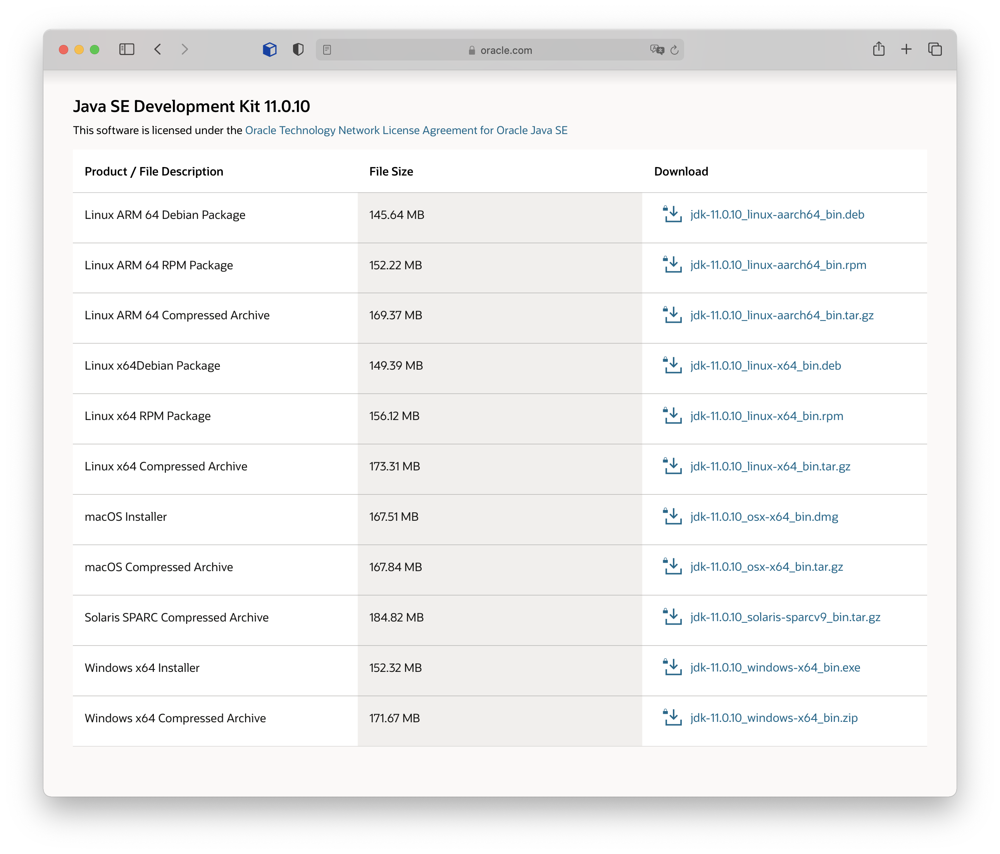

Java 是跨平台的，JVM 作为中间层，自然要针对不同的操作系统提供不同的实现。拿 JDK 11 来说，它的实现就有上图中提到的这么多种（目前最新版本已经是 [JDK 21](https://www.oracle.com/java/technologies/downloads/) 了）。

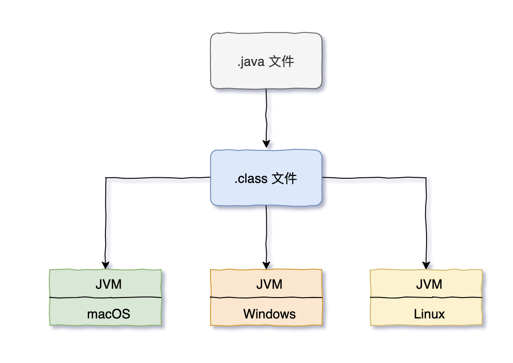

通过不同操作系统的 JVM，我们的源代码就可以不用根据不同的操作系统编译成不同的二进制可执行文件了，跨平台的目标也就实现了。

**那这个 class 文件到底是什么玩意呢？它是怎么被 JVM 识别的呢？**

我们用 IDEA 编写一段[简单的 Java 代码](../overview/hello-world.html)，文件名为 Hello.java。

```java
package com.itwanger.jvm;
class Hello {
    public static void main(String[] args) {
        System.out.println("Hello!");
    }
}
```

点击编译按钮后（也不用主动点，IDEA 会自动编译），IDEA 会帮我们生成一个名为 Hello.class 的文件，在 `target/classes` 的对应包目录下。直接双击打开后长下面这样子：

```java
//
// Source code recreated from a .class file by IntelliJ IDEA
// (powered by Fernflower decompiler)
//

package com.itwanger.jvm;

class Hello {
    Hello() {
    }

    public static void main(String[] args) {
        System.out.println("Hello!");
    }
}
```

看起来和源代码很像，只是多了一个空的[构造方法](../oo/construct.html)，对吧？它是 class 文件被 IDEA 自带的反编译工具 Fernflower 反编译后的样子。那真实的 class 文件长什么样子呢？

可以在终端中通过 `xxd Hello.class` 命令来查看（前面我们已经讲过了，大家可以戳[这个链接](./class-load.html)回看）。

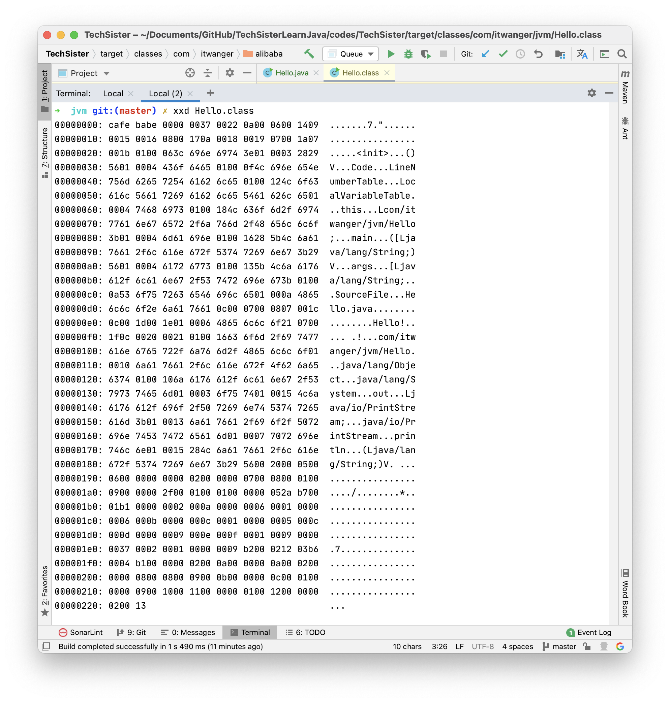

这就是 class 文件的十六进制形式。

---这部分内容前面其实已经讲过，但为了保持这篇内容的完整性，就暂时保留了下来，已经掌握的同学可以略过 end----

类文件的内容通常可以分为下面这几部分，见下图。

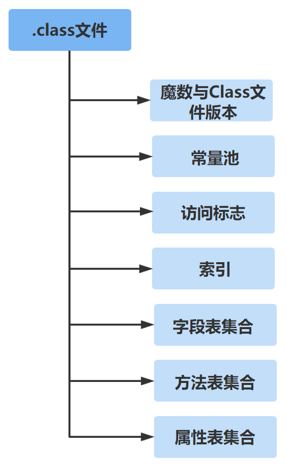


## 01、魔数

回看 class 文件的十六进制形式截图。

第一行中有一串特殊的字符 `cafebabe`，它就是一个魔数，是 JVM 识别 class 文件的标志，[JVM 会在验证阶段](./class-load.html)检查 class 文件是否以该魔数开头，如果不是则会抛出 `ClassFormatError`。

魔数 `cafebabe` 的中文意思显而易见，咖啡宝贝，再加上 Java 的图标本来就是一个热气腾腾的咖啡，可见 Java 与咖啡的渊源有多深。


## 02、版本号

紧跟着魔数后面的四个字节 `0000 0037` 分别表示副版本号和主版本号。也就是说，主版本号为 55（0x37 的十进制），也就是 Java 11 对应的版本号，副版本号为 0。

上一个 LTS 版本是 Java 8，对应的主版本号为 52，也就是说 Java 9 是 53，Java 10 是 54，只不过 Java 9 和 Java 10 都是过渡版本，下一个 LTS 版本是 Java 17，预计 2021 年 9 月份推出（从这里大家可以推断出这篇内容的初稿时间，哈哈哈）。 

那现在是 2023年12月14日，Java 21 已经发布了。通过上面的方法，大家可以查看一下 Java 21 对应的版本号是多少，这个小作业就留给大家了，动动手，你会发现不一样的世界。

## 03、常量池

紧跟在版本号之后的是常量池，它包含了类、接口、字段和方法的符号引用，以及字符串字面量和数值常量。这些信息在编译时被创建，并在运行时被Java虚拟机（JVM）使用。

相当于一个资源仓库，主要存放量大类型常量：

- 字面量（Literals）：字面量是不变的数据，主要包括数值（如整数、浮点数）和字符串字面量。例如，一个整数100或一个字符串"Hello World"，在源代码中直接赋值，编译后存储在常量池中。
- 符号引用（Symbolic References）：符号引用是对类、接口、字段、方法等的引用，它们不是由字面量值给出的，而是通过符号名称（如类名、方法名）和其他额外信息（如类型、签名）来表示。这些引用在类文件中以一种抽象的方式存在，它们在类加载时被虚拟机解析为具体的内存地址。

（这部分内容我们前面讲过，[戳链接](./class-load.html#_4-resolution-%E8%A7%A3%E6%9E%90)回顾一下）

好，接下来，我们通过实际的代码示例来看一下常量池到底是什么。

Java 定义了 boolean、byte、short、char 和 int 等[基本数据类型](../basic-grammar/basic-data-type.html)，它们在常量池中都会被当做 int 来处理。我们来通过一段简单的 Java 代码了解下。

```java
public class ConstantTest {
    public final boolean bool = true;
    public final char aChar = 'a';
    public final byte b = 66;
    public final short s = 67;
    public final int i = 68;
}
```

布尔值 true 的十六进制是 0x01、字符 a 的十六进制是 0x61，字节 66 的十六进制是 0x42，短整型 67 的十六进制是 0x43，整型 68 的十六进制是 0x44。所以编译生成的整型常量在 class 文件中的位置如下图所示。

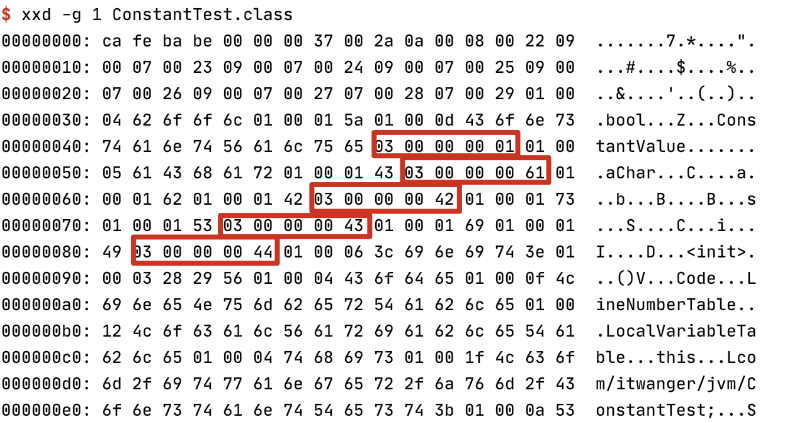

第一个字节 0x03 表示常量的类型为 CONSTANT_Integer_info，是 JVM 定义的 14 种常量类型之一，对应的还有 CONSTANT_Float_info、CONSTANT_Long_info、CONSTANT_Double_info 等，它们对应的标识分别是 0x04、0x05、0x06。

我用表格来简单表示下：

| 常量类型 | 标识符 | 描述符 |
| :--- | :--- | :--- |
| CONSTANT_Integer_info | 0x03 | int 类型字面量 |
| CONSTANT_Float_info | 0x04 | float 类型字面量 |
| CONSTANT_Long_info | 0x05 | long 类型字面量 |
| CONSTANT_Double_info | 0x06 | double 类型字面量 |


对于 int 和 float 来说，它们占 4 个字节；对于 long 和 double 来说，它们占 8 个字节。来个 long 型的最大值观察下。

```java
public class ConstantTest {
    public final long ong = Long.MAX_VALUE;
}
```

来看一下它在 class 文件中的位置。05 开头，7f ff ff ff ff ff ff ff 结尾，果然占 8 个字节，以前知道 long 型会占 8 个字节，但没有直观的感受，现在有了（😁）。

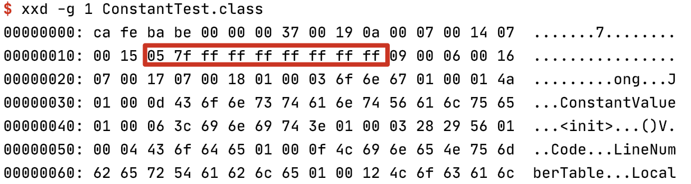

接下来，我们再来看一段代码。

```java
class Hello {
    public final String s = "hello";
}
```

“hello”是一个字符串，它的十六进制为 `68 65 6c 6c 6f`，我们来看一下它在 class 文件中的位置。

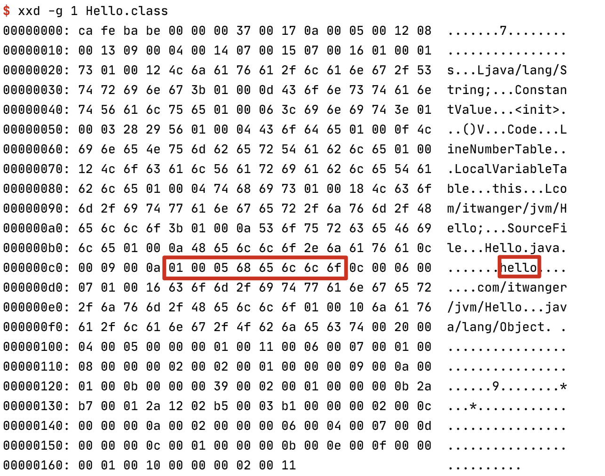

前面还有 3 个字节，第一个字节 0x01 是标识，标识类型为 CONSTANT_Uft8_info，第二个和第三个 0x00 0x05 用来表示第三部分字节数组的长度，如下图所示。

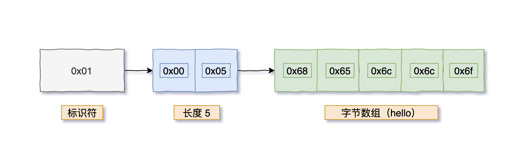

与 CONSTANT_Uft8_info 类型对应的，还有一个 CONSTANT_String_info，用来表示字符串对象的引用（之前代码中的 s），标识是 0x08。前者存储了字符串真正的值，后者并不包含字符串的内容，仅仅包含了一个指向常量池中 CONSTANT_Uft8_info 的索引。

这和我们前面讲的对象和引用就关联起来了，有没有？（😁）

- [Java到底是值传递还是引用传递？](../basic-extra-meal/pass-by-value.html)

来看一下它在 class 文件中的位置。

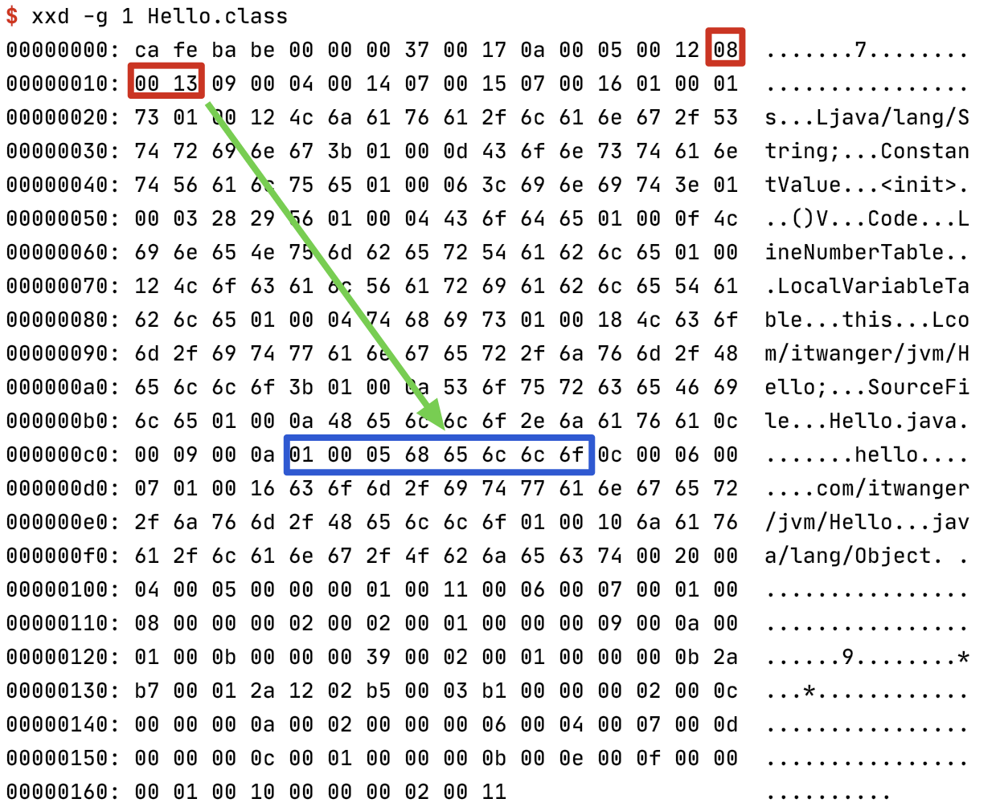

CONSTANT_String_info 通过索引 19 来找到 CONSTANT_Uft8_info，见下图。

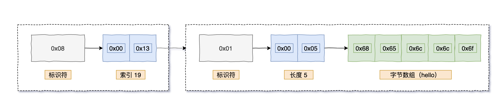

除此之外，还有 CONSTANT_Class_info，用来表示类和接口，和 CONSTANT_String_info 类似，第一个字节是标识，值为 0x07，后面两个字节是常量池索引，指向 CONSTANT_Utf8_info——字符串存储的是类或者接口的全路径限定名。

拿 Hello.java 类来说，它的全路径限定名为 `com/itwanger/jvm/Hello`，对应的十六进制为“636f6d2f697477616e6765722f6a766d2f48656c6c6f”，是一串 CONSTANT_Uft8_info，指向它的 CONSTANT_Class_info 在 class 文件中的什么位置呢？

先不着急，这里给大家介绍一款可视化字节码的工具 [jclasslib bytecode viewer](./how-run-java-code.html)（前面也曾讲过），可以直接在 IDEA 的插件市场安装。安装完成后，选中 class 文件，然后在 View 菜单里找到 Show Bytecode With Jclasslib 子菜单，就可以查看 class 文件的关键信息了。

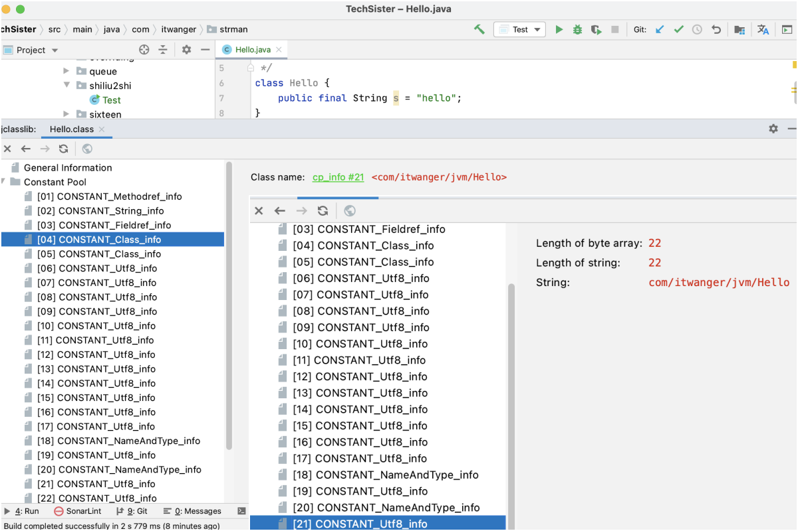

从上图中可以看到，常量池的总大小为 23，索引为 04 的 CONSTANT_Class_info 指向的是是索引为 21 的 CONSTANT_Uft8_info，值为 `com/itwanger/jvm/Hello`。21 的十六进制为 0x15，有了这个信息，我们就可以找到 CONSTANT_Class_info 在 class 文件中的位置了。

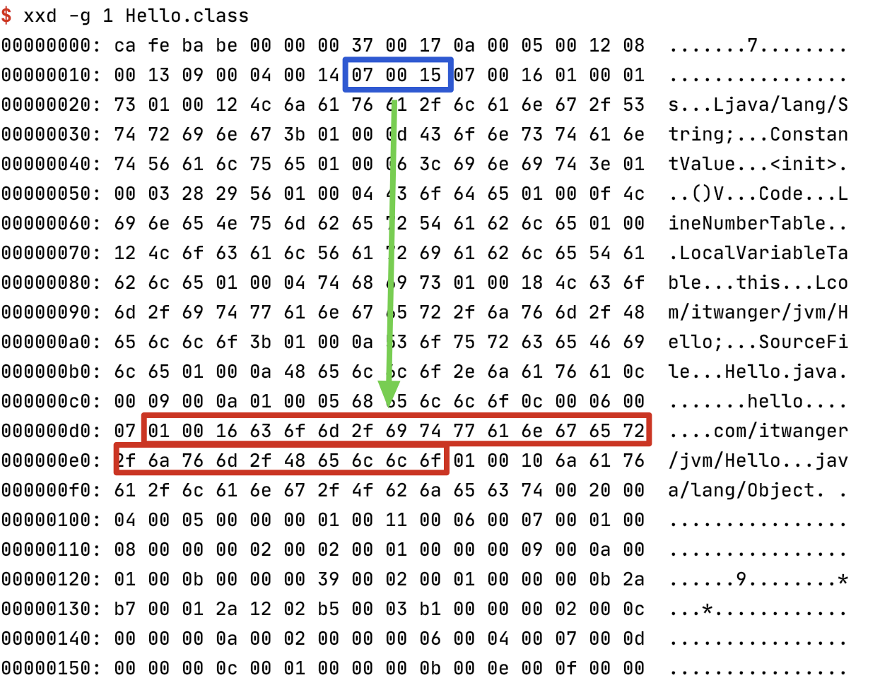

0x07 是第一个字节，CONSTANT_Class_info 的标识符，然后是两个字节，标识索引。

还有 CONSTANT_NameAndType_info，用来标识字段或方法，标识符为 12，对应的十六进制是 0x0c。后面还有 4 个字节，前两个是字段或者方法的索引，后两个是字段或方法的描述符，也就是字段或者方法的类型。

来看下面这段代码。

```java
class Hello {
    public void testMethod(int id, String name) {
    }
}
```

用 jclasslib 可以看到 CONSTANT_NameAndType_info 包含的索引有两个。

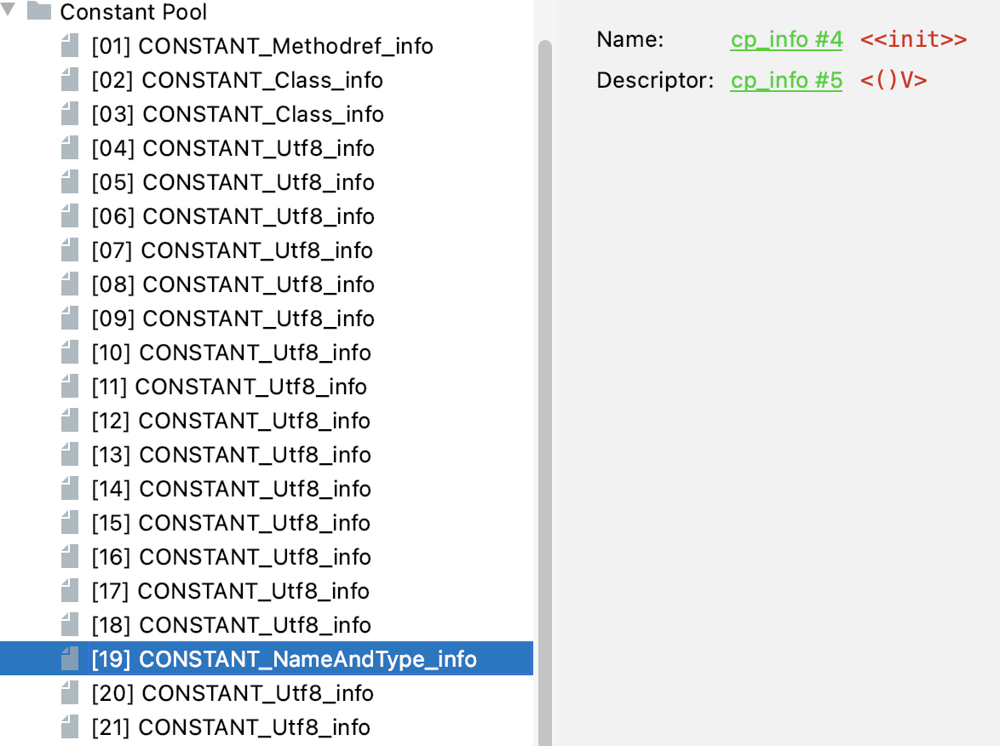

一个是 4，一个是 5，可以通过下图来表示 CONSTANT_NameAndType_info 的构成。

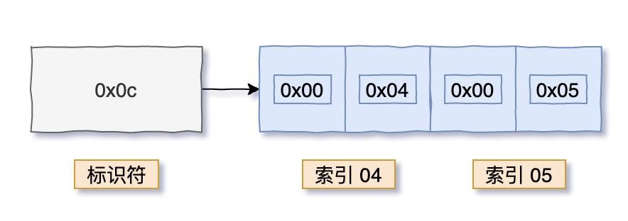

对应 class 文件中的位置如下图所示。

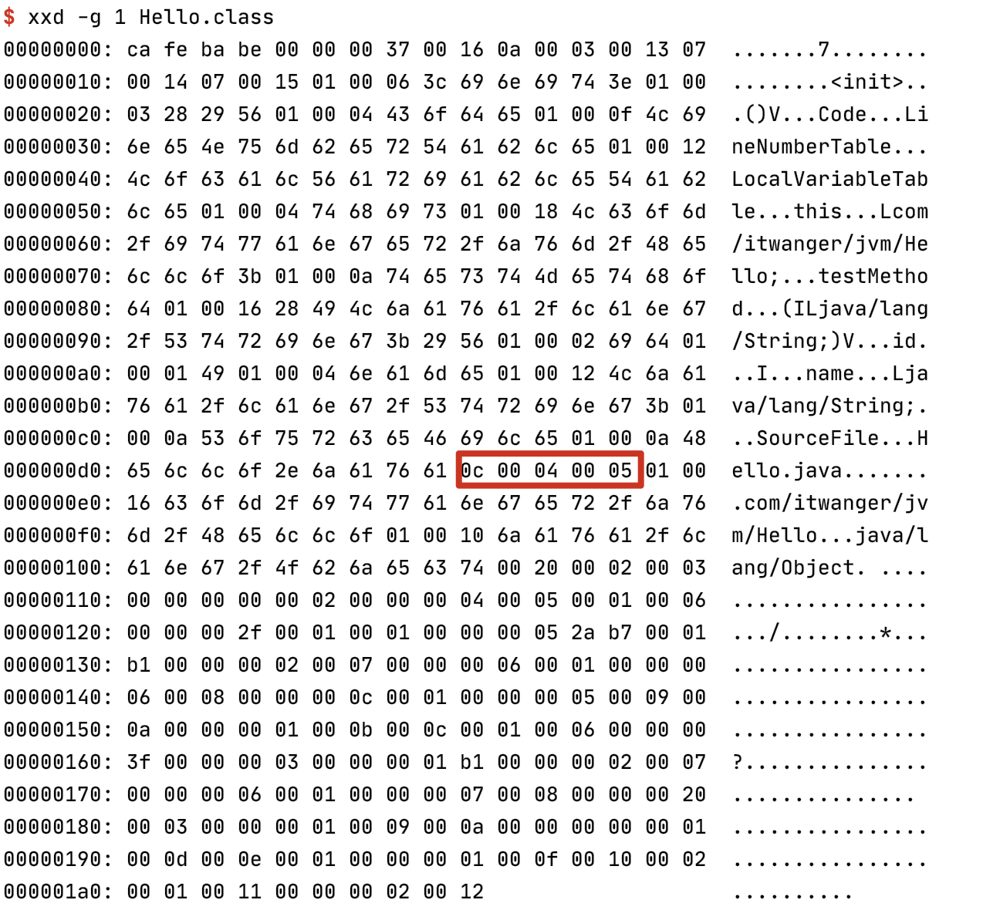

接下来是 CONSTANT_Fieldref_info 、CONSTANT_Methodref_info 和 CONSTANT_InterfaceMethodref_info，它们三个的结构比较类似，可以通过下面的伪代码来表示。

```
CONSTANT_*ref_info {
  u1 tag;
  u2 class_index;
  u2 name_and_type_index;
}
```

学过 [C 语言](../xuexiluxian/c.html)的符号表（Symbol Table）的话，对这段伪代码并不会陌生。

- tag 为标识符，Fieldref 的为 9，也就是十六进制的 0x09；Methodref 的为 10，也就是十六进制的 0x0a；InterfaceMethodref 的为 11， 也就是十六进制的 0x0b。
- class_index 为 CONSTANT_Class_info 的常量池索引，表示字段 | 方法 | 接口方法所在的类信息。
- name_and_type_index 为 CONSTANT_NameAndType_info 的常量池索引，拿 Fieldref 来说，表示字段名和字段类型；拿 Methodref 来说，表示方法名、方法的参数和返回值类型；拿 InterfaceMethodref 来说，表示接口方法名、接口方法的参数和返回值类型。

还有 CONSTANT_MethodHandle_info 、CONSTANT_MethodType_info 和 CONSTANT_InvokeDynamic_info，我这里用一个表格来表示下：

| 常量类型 | 标识符 | 描述符 |
| :--- | :--- | :--- |
| CONSTANT_MethodHandle_info | 0x0f | 方法句柄 |
| CONSTANT_MethodType_info | 0x10 | 方法类型 |
| CONSTANT_InvokeDynamic_info | 0x12 | 动态调用点 |
| CONSTANT_Fieldref_info | 0x09 | 字段 |
| CONSTANT_Methodref_info | 0x0a | 普通方法 |
| CONSTANT_InterfaceMethodref_info | 0x0b | 接口方法 |
| CONSTANT_Class_info | 0x07 | 类或接口的全限定名 |
| CONSTANT_String_info | 0x08 | 字符串字面量 |
| CONSTANT_Uft8_info | 0x01 | 字符串 |

啊，class 文件中最复杂的常量池部分就算是解剖完了，真不容易！

## 04、访问标记

紧跟着常量池之后的区域就是访问标记（Access flags），这个标记用于识别类或接口的访问信息，比如说：

- 到底是 [class 类](../oo/object-class.html) 还是 [interface 接口](../oo/interface.html)？
- 是 [public](../oo/access-control.html) 吗？
- 是 [abstract 抽象类](../oo/abstract.html)吗？
- 是 [final 类](../oo/final.html)吗？
- 等等。
  
总共有 16 个标记位可供使用，但常用的只有其中 7 个，见下图。

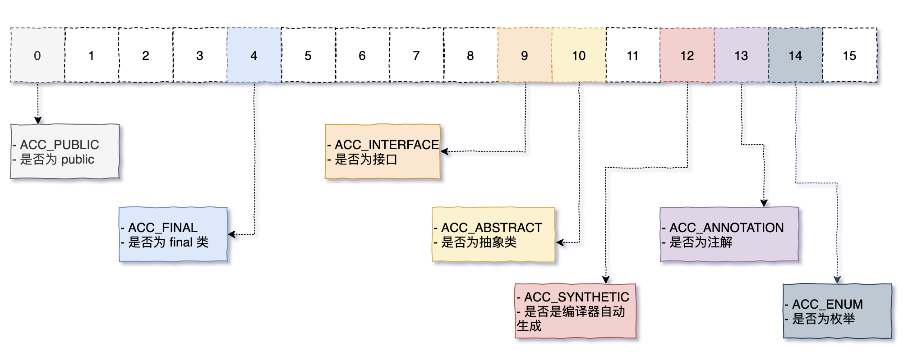

这里用一个表格来表示下。

| 标记位 | 标识符 | 描述 |
| :--- | :--- | :--- |
| 0x0001 | ACC_PUBLIC | public 类型 |
| 0x0010 | ACC_FINAL | final 类型 |
| 0x0020 | ACC_SUPER | 调用父类的方法时，使用 invokespecial 指令 |
| 0x0200 | ACC_INTERFACE | 接口类型 |
| 0x0400 | ACC_ABSTRACT | 抽象类类型 |
| 0x1000 | ACC_SYNTHETIC | 标记为编译器自动生成的类 |
| 0x2000 | ACC_ANNOTATION | 标记为注解类 |
| 0x4000 | ACC_ENUM | 标记为枚举类 |
| 0x8000 | ACC_MODULE | 标记为模块类 |

来看一个简单的枚举代码。

```java
public enum Color {
    RED,GREEN,BLUE;
}
```

通过 jclasslib 可以看到访问标记的信息有 `0x4031 [public final enum]`。

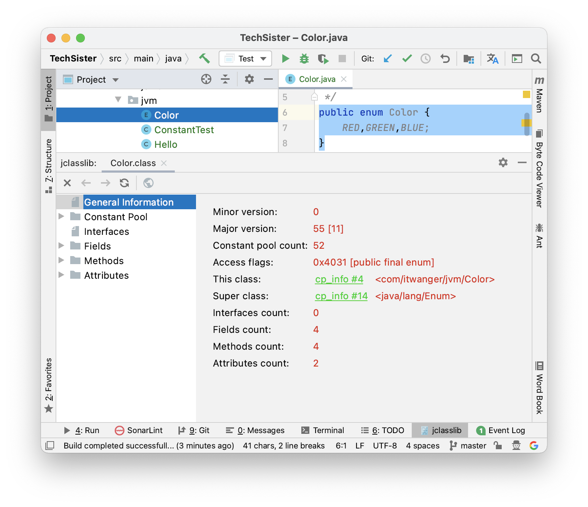

对应 class 文件中的位置如下图所示。

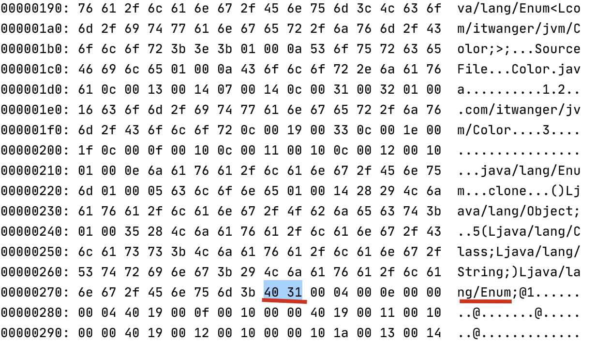

## 05、类索引、父类索引和接口索引

这三部分用来确定类的继承关系，this_class 为当前类的索引，super_class 为父类的索引，interfaces 为接口。

来看下面这段简单的代码，没有接口，默认继承 Object 类。

```java
class Hello {
    public static void main(String[] args) {
        
    }
}
```

通过 jclasslib 可以看到类的继承关系。

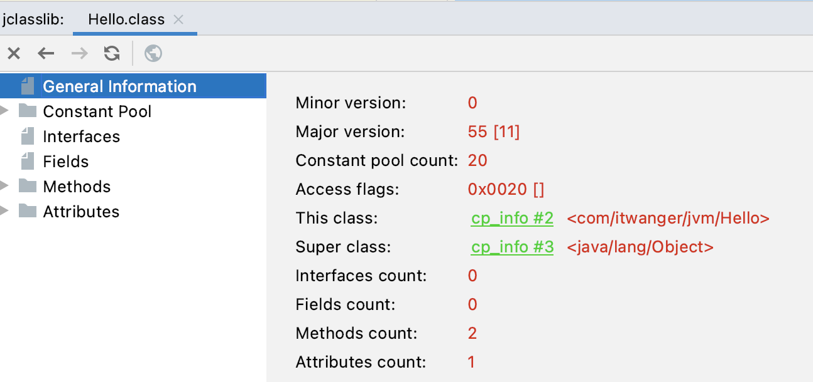

- this_class 指向常量池中索引为 2 的 CONSTANT_Class_info。
- super_class 指向常量池中索引为 3 的 CONSTANT_Class_info。
- 由于没有接口，所以 interfaces 的信息为空。

对应 class 文件中的位置如下图所示。

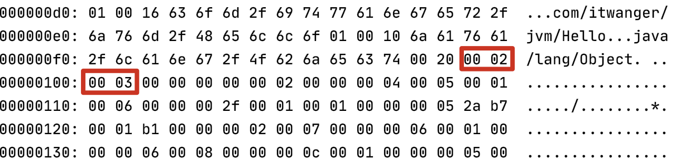

## 06、字段表

一个类中定义的字段会被存储在字段表（fields）中，包括[静态的和非静态的](../oo/static.html)。

来看这样一段代码。

```java
public class FieldsTest {
    private String name;
}
```

字段只有一个，修饰符为 private，类型为 String，字段名为 name。可以用下面的伪代码来表示 field 的结构。

```
field_info {
  u2 access_flag;
  u2 name_index;
  u2 description_index;
}
```

- access_flag 为字段的访问标记，比如说是不是 public | private | protected，是不是 static，是不是 final 等。
- name_index 为字段名的索引，指向常量池中的 CONSTANT_Utf8_info， 比如说上例中的值就为 name。
- description_index 为字段的描述类型索引，也指向常量池中的 CONSTANT_Utf8_info，针对不同的数据类型，会有不同规则的描述信息。

1）对于基本数据类型来说，使用一个字符来表示，比如说 I 对应的是 int，B 对应的是 byte。

2）对于引用数据类型来说，使用 `L***;` 的方式来表示，`L` 开头，`;` 结束，比如字符串类型为 `Ljava/lang/String;`。

3）对于数组来说，会用一个前置的 `[` 来表示，比如说字符串数组为 `[Ljava/lang/String;`。

对应到 class 文件中的位置如下图所示。

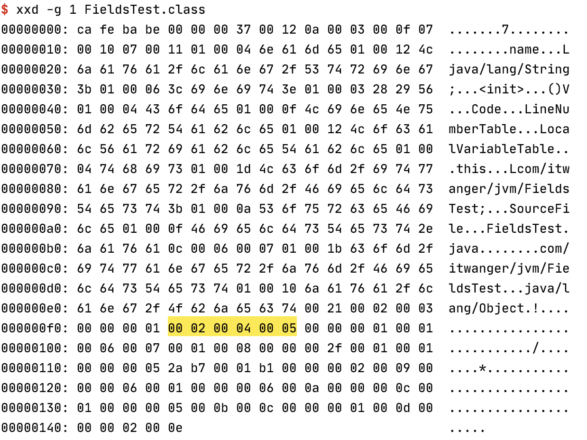

看到这里相信你就能明白经常在 javap 命令中看到的一些奇怪的字符的意思了。

## 07、方法表

方法表和字段表类似，区别是用来存储方法的信息，包括方法名，方法的参数，方法的签名。 

就拿 main 方法来说吧。

```java
public class MethodsTest {
    public static void main(String[] args) {
        
    }
}
```

先用 jclasslib 看一下大概的信息。

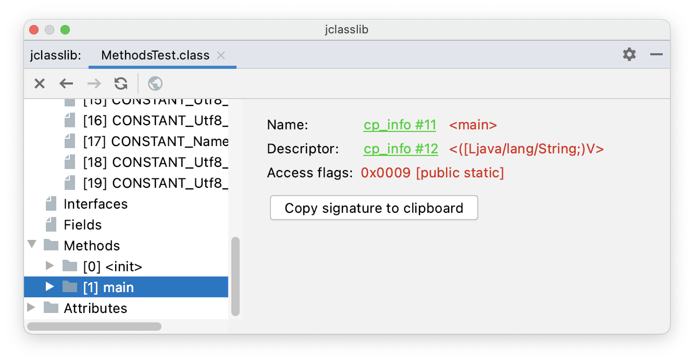

- 访问标记是 public static 的。
- 方法名为 main。
- 方法的参数为字符串数组；返回类型为 Void。

对应到 class 文件中的位置如下图所示。


## 08、属性表

属性表是 class 文件中的最后一部分，通常出现在字段和方法中。

来看这样一段代码。

```java
public class AttributeTest {
    public static final int DEFAULT_SIZE = 128;
}
```

只有一个常量 DEFAULT_SIZE，它属于字段中的一种，就是加了 [final 的静态变量](../oo/final.html)。先通过 jclasslib 看一下它当中一个很重要的属性——ConstantValue，用来表示静态变量的初始值。

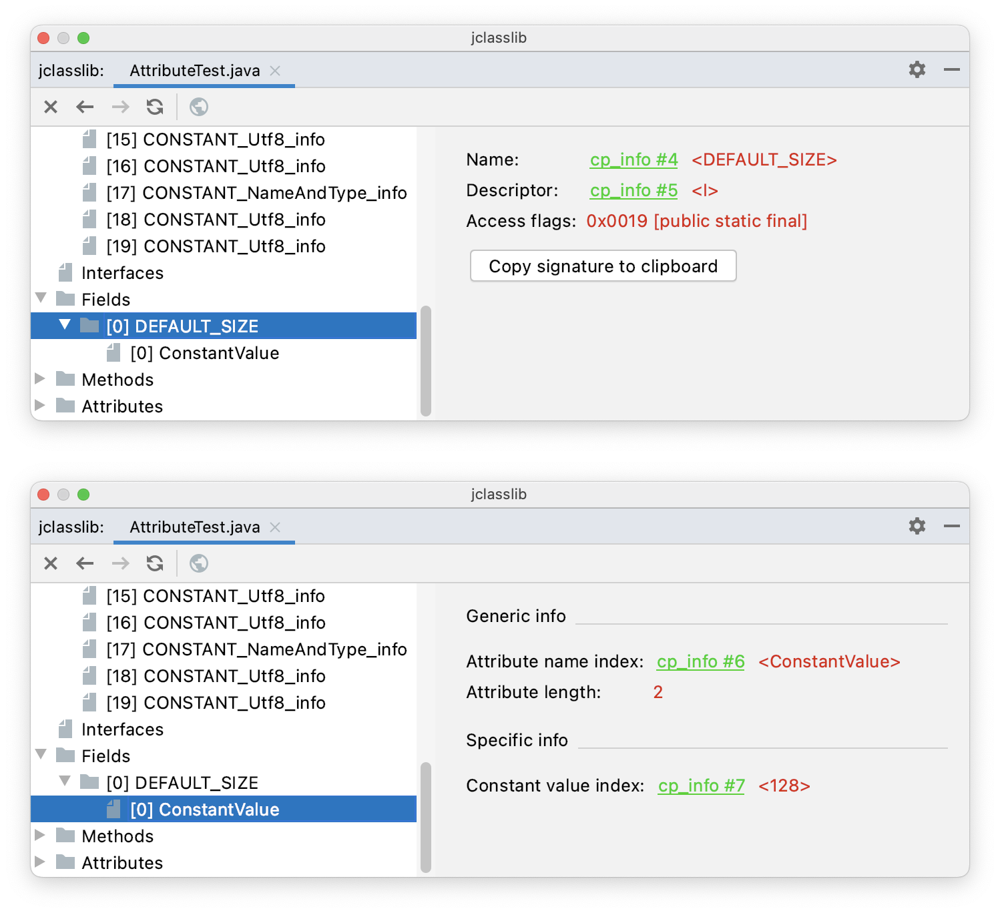


- Attribute name index 指向常量池中值为“ConstantValue”的常量。
- Attribute length 的值为固定的 2，因为索引只占两个字节的大小。
- Constant value index 指向常量池中具体的常量，如果常量类型为 int，指向的就是 CONSTANT_Integer_info。

我画了一副图，可以完整的表示字段的结构，包含属性表在内。

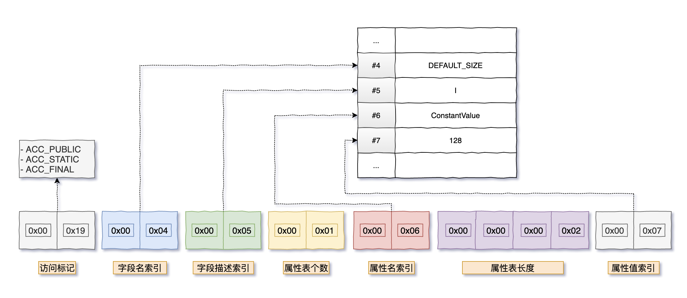

对应到 class 文件中的位置如下图所示。

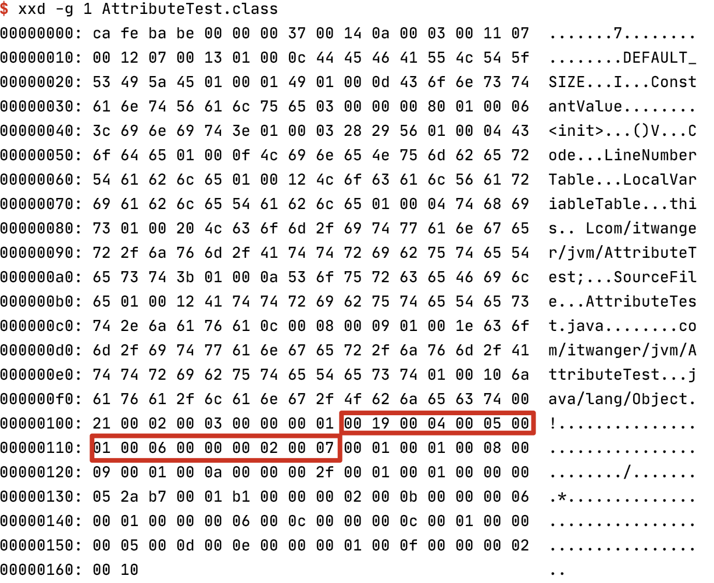

来看下面这段代码。

```java
public class MethodCode {
    public static void main(String[] args) {
        foo();
    }

    private static void foo() {
    }
}
```

main 方法中调用了 foo 方法。通过 jclasslib 看一下它当中一个很重要的属性——Code， 方法的关键信息都存储在里面。


- Attribute name index 指向常量池中值为“Code”的常量。
- Attribute length 为属性值的长度大小。
- bytecode 存储真正的字节码指令。
- exception table 表示方法内部的异常信息。
- maximum stack size 表示操作数栈的最大深度，方法执行的任意期间操作数栈深度都不会超过这个值。
- maximum local variable 表示临时变量表的大小，注意，并不等于方法中所有临时变量的数量之和，当一个作用域结束，内部的临时变量占用的位置就会被替换掉。
- code length 表示字节码指令的长度。

对应 class 文件中的位置如下图所示。

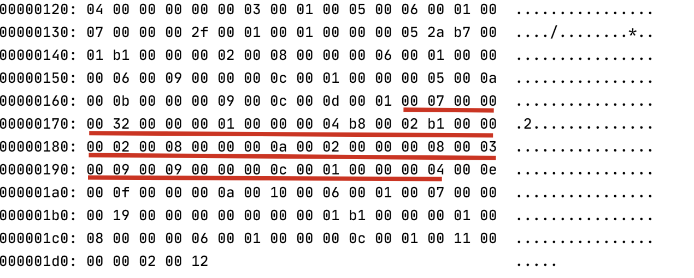

## 09、QA

评论区有读者问到：“怎么通过索引值，定位到在class 文件中的位置，这个是咋算的？”

在Java类文件中，常量池是一个索引表，它从索引值1开始计数，每个条目都有一个唯一的索引。

- 常量池计数器：在常量池之前，类文件有一个16位的常量池计数器，表示常量池中有多少项。它的值比实际常量数大1（因为索引从1开始）。
- 常量池条目：每个常量池条目的开始是一个标签（1个字节），表明了常量的类型（如Class、Fieldref、Methodref等）。根据这个类型，后面跟着的数据结构也不同。

定位过程大致如下：

- 读取常量池计数器：首先，从类文件的开头读取常量池计数器的值，确定常量池中有多少条目。
- 遍历常量池：从常量池的第一项开始遍历。由于不同类型的常量长度不同，需要根据每个常量的类型来确定它的长度。
- 根据索引定位：继续遍历，直到到达所需的索引值。每次遍历时，根据条目类型读取相应长度的数据，直到达到目标索引。

可以抽象成一个数组和一个 for 循环，就能明白了。

```java
int[] constantPool = new int[constantPoolCount];
for (int i = 1; i < constantPoolCount; i++) {
    int tag = constantPool[i];
    switch (tag) {
        case CONSTANT_Integer_info:
            i += 4;
            break;
        case CONSTANT_Float_info:
            i += 4;
            break;
        case CONSTANT_Long_info:
            i += 8;
            break;
        case CONSTANT_Double_info:
            i += 8;
            break;
        case CONSTANT_Utf8_info:
            int length = constantPool[i + 1];
            i += length + 1;
            break;
        case CONSTANT_String_info:
            i += 2;
            break;
        case CONSTANT_Class_info:
            i += 2;
            break;
        case CONSTANT_Fieldref_info:
            i += 4;
            break;
        case CONSTANT_Methodref_info:
            i += 4;
            break;
        case CONSTANT_InterfaceMethodref_info:
            i += 4;
            break;
        case CONSTANT_NameAndType_info:
            i += 4;
            break;
        case CONSTANT_MethodHandle_info:
            i += 3;
            break;
        case CONSTANT_MethodType_info:
            i += 2;
            break;
        case CONSTANT_InvokeDynamic_info:
            i += 4;
            break;
        default:
            throw new RuntimeException("Unknown tag: " + tag);
    }
}
```

## 10、小结

到此为止，class 文件的内部算是剖析得差不多了，希望能对大家有所帮助。第一次拿刀，手有点颤，如果哪里有不足的地方，欢迎大家在评论区毫不留情地指出来！

- class 文件是一串连续的二进制，由 0 和 1 组成，但我们仍然可以借助一些工具来看清楚它的真面目。
- class 文件的内容通常可以分为下面这几部分，魔数、版本号、常量池、访问标记、类索引、父类索引、接口索引、字段表、方法表、属性表。
- 常量池包含了类、接口、字段和方法的符号引用，以及字符串字面量和数值常量。
- 访问标记用于识别类或接口的访问信息，比如说是不是 public | private | protected，是不是 static，是不是 final 等。
- 类索引、父类索引和接口索引用来确定类的继承关系。
- 字段表用来存储字段的信息，包括字段名，字段的参数，字段的签名。
- 方法表用来存储方法的信息，包括方法名，方法的参数，方法的签名。
- 属性表用来存储属性的信息，包括字段的初始值，方法的字节码指令等。

相信大家看完这篇内容应该能对 class 文件有一个比较清晰的认识了。

----


