# **第1章  Kafka入门**
## **1.1  概述**
### **1.1.1  初识Kafka**
Kafka是一个由Scala和Java语言开发的，经典高吞吐量的分布式消息发布和订阅系统，也是大数据技术领域中用作数据交换的核心组件之一。以高吞吐，低延迟，高伸缩，高可靠性，高并发，且社区活跃度高等特性，从而备受广大技术组织的喜爱。
2010年，Linkedin公司为了解决消息传输过程中由各种缺陷导致的阻塞、服务无法访问等问题，主导开发了一款分布式消息日志传输系统。主导开发的首席架构师Jay Kreps因为喜欢写出《变形记》的西方表现主义文学先驱小说家Jay Kafka，所以给这个消息系统起了一个很酷，却和软件系统特性无关的名称Kafka。
因为备受技术组织的喜爱，2011年，Kafka软件被捐献给Apache基金会，并于7月被纳入Apache软件基金会孵化器项目进行孵化。2012年10月，Kafka从孵化器项目中毕业，转成Apache的顶级项目。由独立的消息日志传输系统转型为开源分布式事件流处理平台系统，被数千家公司用于高性能数据管道、流分析、数据集成和关键任务应用程序。
官网地址：[https://kafka.apache.org/](https://www.scala-lang.org/)
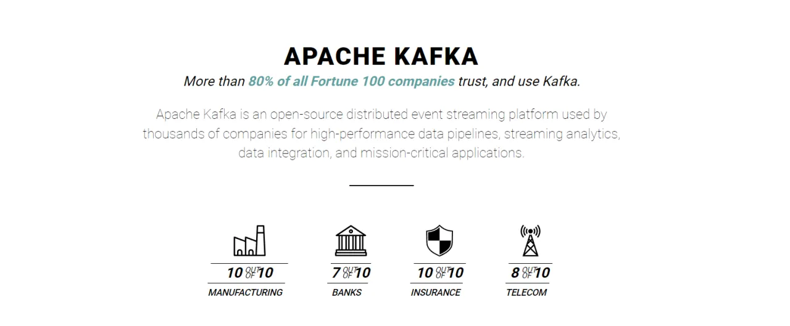
### **1.1.2  消息队列**
Kafka软件最初的设计就是专门用于数据传输的消息系统，类似功能的软件有RabbitMQ、ActiveMQ、RocketMQ等。这些软件名称中的MQ是英文单词Message Queue的简称，也就是所谓的消息队列的意思。这些软件的核心功能是传输数据，而Java中如果想要实现数据传输功能，那么这个软件一般需要遵循Java消息服务技术规范JMS（Java Message Service）。前面提到的ActiveMQ软件就完全遵循了JMS技术规范，而RabbitMQ是遵循了类似JMS规范并兼容JMS规范的跨平台的AMQP（Advanced Message Queuing Protocol）规范。除了上面描述的JMS，AMQP外，还有一种用于物联网小型设备之间传输消息的MQTT通讯协议。
Kafka拥有作为一个消息系统应该具备的功能，但是却有着独特的设计。可以这样说，Kafka借鉴了JMS规范的思想，但是却并没有完全遵循JMS规范。这也恰恰是软件名称为Kafka，而不是KafkaMQ的原因。
由上可知，无论学习哪一种消息传输系统，JMS规范都是大家应该首先了解的。所以咱们这里就对JMS规范做一个简单的介绍：
Ø JMS是Java平台的消息中间件通用规范，定义了主要用于消息中间件的标准接口。如果不是很理解这个概念，可以简单地将JMS类比为Java和数据库之间的JDBC规范。Java应用程序根据JDBC规范种的接口访问关系型数据库，而每个关系型数据库厂商可以根据JDBC接口来实现具体的访问规则。JMS定义的就是系统和系统之间传输消息的接口。
Ø 为了实现系统和系统之间的数据传输，JMS规范中定义很多用于通信的组件：

**l JMS Provider**：JMS消息提供者。其实就是实现JMS接口和规范的消息中间件，也就是我们提供消息服务的软件系统，比如RabbitMQ、ActiveMQ、Kafka。
**l JMS Message**：JMS消息。这里的消息指的就是数据。一般采用Java数据模型进行封装，其中包含消息头，消息属性和消息主体内容。
**l JMS Producer：**JMS消息生产者。所谓的生产者，就是生产数据的客户端应用程序，这些应用通过JMS接口发送JMS消息。
**l JMS Consumer**：JMS消息消费者。所谓的消费者，就是从消息提供者（**JMS** **Provider**）中获取数据的客户端应用程序，这些应用通过JMS接口接收JMS消息。
Ø JMS支持两种消息发送和接收模型：一种是P2P（Peer-to-Peer）点对点模型，另外一种是发布/订阅（Publish/Subscribe）模型。
**l P2P模型**：P2P模型是基于队列的，消息生产者将数据发送到消息队列中，消息消费者从消息队列中接收消息。因为队列的存在，消息的异步传输成为可能。P2P模型的规定就是每一个消息数据，只有一个消费者，当发送者发送消息以后，不管接收者有没有运行都不影响消息发布到队列中。接收者在成功接收消息后会向发送者发送接收成功的消息
**l 发布 / 订阅模型**：所谓得发布订阅模型就是事先将传输的数据进行分类，我们管这个数据的分类称之为主题（Topic）。也就是说，生产者发送消息时，会根据主题进行发送。比如咱们的消息中有一个分类是NBA，那么生产者在生产消息时，就可以将NBA篮球消息数据发送到NBA主题中，这样，对NBA消息主题感兴趣的消费者就可以申请订阅NBA主题，然后从该主题中获取消息。这样，也就是说一个消息，是允许被多个消费者同时消费的。这里生产者发送消息，我们称之为发布消息，而消费者从主题中获取消息，我们就称之为订阅消息。Kafka采用就是这种模型。
### **1.1.3  生产者-消费者模式**
生产者-消费者模式是通过一个容器来解决生产者和消费者的强耦合问题。生产者和消费者彼此之间不直接通信，而通过阻塞队列来进行通信，所以生产者生产完数据之后不用等待消费者处理，直接扔给阻塞队列，消费者不找生产者要数据，而是直接从阻塞队列里取，阻塞队列就相当于一个消息缓冲区，平衡了生产者和消费者的处理能力。在数据传输过程中，起到了一个削弱峰值的作用，也就是我们经常说到的削峰。
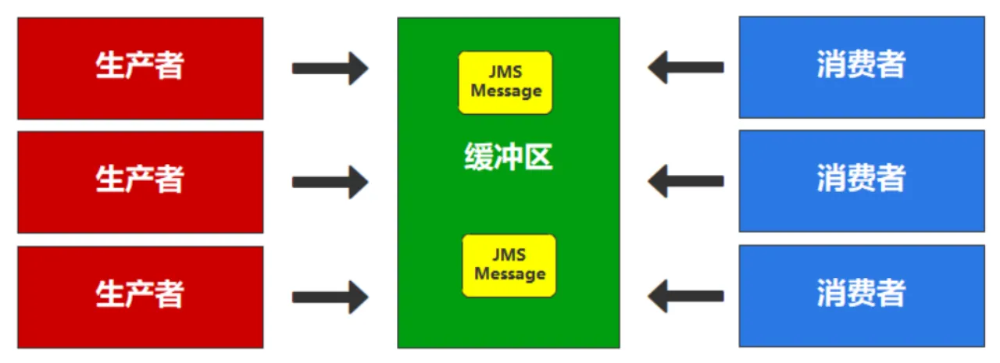
图形中的缓冲区就是用来给生产者和消费者解耦的。在单点环境中，我们一般会采用阻塞式队列实现这个缓冲区。而在分布式环境中，一般会采用第三方软件实现缓冲区，这个第三方软件我们一般称之为中间件。纵观大多数应用场景，解耦合最常用的方式就是增加中间件。
遵循JMS规范的消息传输软件（RabbitMQ、ActiveMQ、Kafka、RocketMQ），我们一般就称之为消息中间件。使用软件的目的本质上也就是为了降低消息生产者和消费者之间的耦合性。提升消息的传输效率。
### **1.1.4  消息中间件对比**
| **特性** | **ActiveMQ** | **RabbitMQ** | **RocketMQ** | **Kafka** |
| --- | --- | --- | --- | --- |
| 单机吞吐量 | 万级，比RocketMQ,Kafka低一个数量级 | 万级，比RocketMQ,Kafka低一个数量级 | 10万级，支持高吞吐 | 10万级，支持高吞吐 |
| Topic数量对吞吐量的影响 | 
 | 
 | Topic可以达到几百/几千量级 | Topic可以达到几百量级，如果更多的话，吞吐量会大幅度下降 |
| 时效性 | ms级 | 微秒级别，延迟最低 | ms级 | ms级 |
| 可用性 | 高，基于主从架构实现高可用 | 高，基于主从架构实现高可用 | 非常高，分布式架构 | 非常高，分布式架构 |
| 消息可靠性 | 有较低的概率丢失数据 | 基本不丢 | 经过参数优化配置，可以做到0丢失 | 经过参数优化配置，可以做到0丢失 |
| 功能支持 | MQ领域的功能极其完备 | 并发能力强，性能极好，延时很低 | MQ功能较为完善，分布式，扩展性好 | 功能较为简单，支持简单的MQ功能，在大数据领域被广泛使用 |
| 其他 | 很早的软件，社区不是很活跃 | 开源，稳定，社区活跃度高 | 阿里开发，社区活跃度不高 | 开源，高吞吐量，社区活跃度极高 |

通过上面各种消息中间件的对比，大概可以了解，在大数据场景中我们主要采用kafka作为消息中间件，而在JaveEE开发中我们主要采用ActiveMQ、RabbitMQ、RocketMQ作为消息中间件。如果将JavaEE和大数据在项目中进行融合的话，那么Kafka其实是一个不错的选择。
### **1.1.5  ZooKeeper**
ZooKeeper是一个开放源码的分布式应用程序协调服务软件。在当前的Web软件开发中，多节点分布式的架构设计已经成为必然，那么如何保证架构中不同的节点所运行的环境，系统配置是相同的，就是一个非常重要的话题。一般情况下，我们会采用独立的第三方软件保存分布式系统中的全局环境信息以及系统配置信息，这样系统中的每一个节点在运行时就可以从第三方软件中获取一致的数据。也就是说通过这个第三方软件来协调分布式各个节点之间的环境以及配置信息。Kafka软件是一个分布式事件流处理平台系统，底层采用分布式的架构设计，就是说，也存在多个服务节点，多个节点之间Kafka就是采用ZooKeeper来实现协调调度的。
**ZooKeeper的核心作用：**
l ZooKeeper的数据存储结构可以简单地理解为一个Tree结构，而Tree结构上的每一个节点可以用于存储数据，所以一般情况下，我们可以将分布式系统的元数据（环境信息以及系统配置信息）保存在ZooKeeper节点中。
l ZooKeeper创建数据节点时，会根据业务场景创建临时节点或永久（持久）节点。永久节点就是无论客户端是否连接上ZooKeeper都一直存在的节点，而临时节点指的是客户端连接时创建，断开连接后删除的节点。同时，ZooKeeper也提供了Watch（监控）机制用于监控节点的变化，然后通知对应的客户端进行相应的变化。Kafka软件中就内置了ZooKeeper的客户端，用于进行ZooKeeper的连接和通信。
其实，Kafka作为一个独立的分布式消息传输系统，还需要第三方软件进行节点间的协调调度，不能实现自我管理，无形中就导致Kafka和其他软件之间形成了耦合性，制约了Kafka软件的发展，所以从Kafka 2.8.X版本开始，Kafka就尝试增加了Raft算法实现节点间的协调管理，来代替ZooKeeper。不过Kafka官方不推荐此方式应用在生产环境中，计划在Kafka 4.X版本中完全移除ZooKeeper，让我们拭目以待。
## **1.2  快速上手**
### **1.2.1  环境安装**
作为开源分布式事件流处理平台，Kafka分布式软件环境的安装相对比较复杂，不利于Kafka软件的入门学习和练习。所以我们这里先搭建相对比较简单的windows单机环境，让初学者快速掌握软件的基本原理和用法，后面的课程中，我们再深入学习Kafka软件在生产环境中的安装和使用。
#### **1.2.1.1安装Java8（略）**
当前Java软件开发中，主流的版本就是Java  8，而Kafka 3.X官方建议Java版本更新至Java11，但是Java8依然可用。未来Kafka 4.X版本会完全弃用Java8，不过，咱们当前学习的Kafka版本为3.6.1版本，所以使用Java8即可，无需升级。
Kafka的绝大数代码都是Scala语言编写的，而Scala语言本身就是基于Java语言开发的，并且由于Kafka内置了Scala语言包，所以Kafka是可以直接运行在JVM上的，无需安装其他软件。你能看到这个课件，相信你肯定已经安装Java8了，基本的环境变量也应该配置好了，所以此处安装过程省略。
#### **1.2.1.2安装Kafka**
**Ø 下载软件安装包**：kafka_2.12-3.6.1.tgz，下载地址：[https://kafka.apache.org/downloads](https://kafka.apache.org/downloads)
l 这里的3.6.1，是Kafka软件的版本。截至到2023年12月24日，Kafka最新版本为3.6.1。
l 2.12是对应的Scala开发语言版本。Scala2.12和Java8是兼容的，所以可以直接使用。
l tgz是一种linux系统中常见的压缩文件格式，类似与windows系统的zip和rar格式。所以Windows环境中可以直接使用压缩工具进行解压缩。
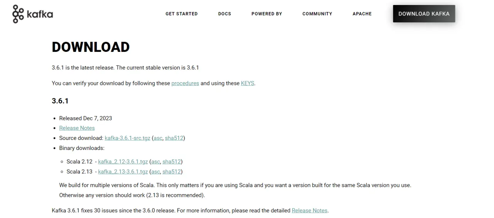
**Ø 解压文件**：kafka_2.12-3.6.1.tgz，解压目录为非系统盘的根目录，比如e:/

为了访问方便，可以将解压后的文件目录改为kafka， 更改后的文件目录结构如下：

| bin | linux系统下可执行脚本文件 |
| --- | --- |
| bin/windows | windows系统下可执行脚本文件 |
| config | 配置文件 |
| libs | 依赖类库 |
| licenses | 许可信息 |
| site-docs | 文档 |
| logs | 服务日志 |

#### **1.2.1.3启动ZooKeeper**
当前版本Kafka软件内部依然依赖ZooKeeper进行多节点协调调度，所以启动Kafka软件之前，需要先启动ZooKeeper软件。不过因为Kafka软件本身内置了ZooKeeper软件，所以无需额外安装ZooKeeper软件，直接调用脚本命令启动即可。具体操作步骤如下：
Ø 进入Kafka解压缩文件夹的config目录，修改zookeeper.properties配置文件
# the directory where the snapshot is stored.
# 修改dataDir配置，用于设置ZooKeeper数据存储位置，该路径如果不存在会自动创建。
dataDir=E:/kafka_2.12-3.6.1/data/zk
Ø 打开DOS窗口，进入e:/kafka_2.12-3.6.1/bin/windows目录

Ø 因为本章节演示的是Windows环境下Kafka软件的安装和使用，所以启动 ZooKeeper软件的指令为Windows环境下的bat批处理文件。调用启动指令时， 需要传递配置文件的路径
# 因为当前目录为windows，所以需要通过相对路径找到zookeeper的配置文件。
zookeeper-server-start.bat ../../config/zookeeper.properties
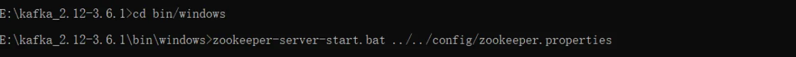
Ø 出现如下界面，ZooKeeper启动成功。

Ø 为了操作方便，也可以在kafka解压缩后的目录中，创建脚本文件zk.cmd。
# 调用启动命令，且同时指定配置文件。
call bin/windows/zookeeper-server-start.bat config/zookeeper.properties
#### **1.2.1.4启动Kafka**
Ø 进入Kafka解压缩文件夹的config目录，修改server.properties配置文件
```
# Listener name, hostname and port the broker will advertise to clients.
# If not set, it uses the value for "listeners".
# 客户端访问Kafka服务器时，默认连接的服务为本机的端口**9092**，如果想要改变，可以修改如下配置
# 此处我们不做任何改变，默认即可
#advertised.listeners=PLAINTEXT://your.host.name:9092

# A comma separated list of directories under which to store log files
# 配置Kafka数据的存放位置，如果文件目录不存在，会自动生成。
log.dirs=E:/kafka_2.12-3.6.1/data/kafka
```
Ø 打开DOS窗口，进入e:/kafka_2.12-3.6.1/bin/windows目录

Ø 调用启动指令，传递配置文件的路径
# 因为当前目录为windows，所以需要通过相对路径找到kafka的配置文件。
kafka-server-start.bat ../../config/server.properties
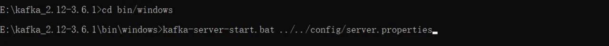
Ø 出现如下界面，Kafka启动成功。
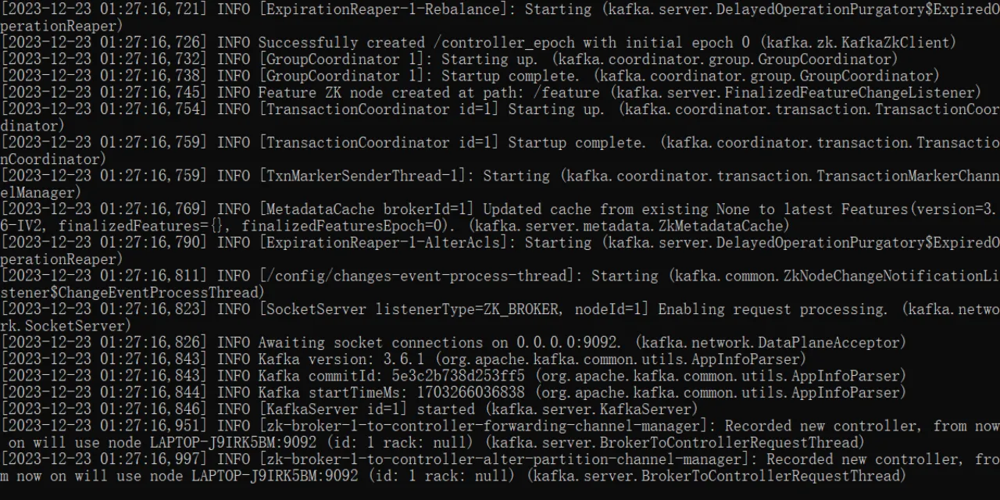
Ø 为了操作方便，也可以在kafka解压缩后的目录中，创建脚本文件kfk.cmd。
# 调用启动命令，且同时指定配置文件。
call bin/windows/kafka-server-start.bat config/server.properties
Ø DOS窗口中，输入jps指令，查看当前启动的软件进程
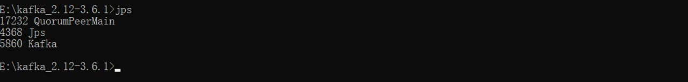
这里名称为QuorumPeerMain的就是ZooKeeper软件进程，名称为Kafka的就是Kafka系统进程。此时，说明Kafka已经可以正常使用了。
### **1.2.2  消息主题**
在消息发布/订阅（Publish/Subscribe）模型中，为了可以让消费者对感兴趣的消息进行消费，而不是对所有的数据进行消费，包括那些不感兴趣的消息，所以定义了主题（Topic）的概念，也就是说将不同的消息进行分类，分成不同的主题（Topic），然后消息生产者在生成消息时，就会向指定的主题（Topic）中发送。而消息消费者也可以订阅自己感兴趣的主题（Topic）并从中获取消息。
有很多种方式都可以操作Kafka消息中的主题（Topic）：命令行、第三方工具、Java API、自动创建。而对于初学者来讲，掌握基本的命令行操作是必要的。所以接下来，我们采用命令行进行操作。
#### **1.2.2.1创建主题**
Ø 启动ZooKeeper，Kafka服务进程（略）
Ø 打开DOS窗口，进入e:/kafka_2.12-3.6.1/bin/windows目录
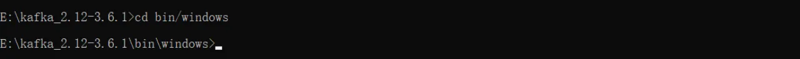
Ø DOS窗口输入指令，创建主题
# Kafka是通过**kafka-topics.bat**指令文件进行消息主题操作的。其中包含了对主题的查询，创建，删除等功能。
# 调用指令创建主题时，需要传递多个参数，而且参数的前缀为两个横线。因为参数比较多，为了演示方便，这里我们只说明必须传递的参数，其他参数后面课程中会进行讲解
# **--bootstrap-server** : 把当前的DOS窗口当成Kafka的客户端，那么进行操作前，就需要连接服务器，这里的参数就表示服务器的连接方式，因为我们在本机启动Kafka服务进程，且Kafka默认端口为9092，所以此处，后面接的参数值为**localhost:9092**，用空格隔开
# **--create** : 表示对主题的创建操作，是个操作参数，后面无需增加参数值
# **--topic** : 主题的名称，后面接的参数值一般就是见名知意的字符串名称，类似于java中的字符串类型标识符名称，当然也可以使用数字，只不过最后还是当成数字字符串使用。
# 指令
kafka-topics.bat --bootstrap-server localhost:9092 --create --topic test
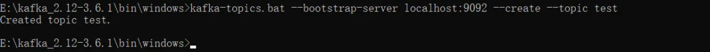
#### **1.2.2.2查询主题**
Ø DOS窗口输入指令，查看所有主题
# Kafka是通过**kafka-topics.bat**文件进行消息主题操作的。其中包含了对主题的查询，创建，删除等功能。
# **--bootstrap-server** : 把当前的DOS窗口当成Kafka的客户端，那么进行操作前，就需要连接服务器，这里的参数就表示服务器的连接方式，因为我们在本机启动Kafka服务进程，且Kafka默认端口为9092，所以此处，后面接的参数值为localhost:9092，用空格隔开
# **--list** : 表示对所有主题的查询操作，是个操作参数，后面无需增加参数值
# 指令
kafka-topics.bat --bootstrap-server localhost:9092 --list

Ø DOS窗口输入指令，查看指定主题信息
# **--bootstrap-server** : 把当前的DOS窗口当成Kafka的客户端，那么进行操作前，就需要连接服务器，这里的参数就表示服务器的连接方式，因为我们在本机启动Kafka服务进程，且Kafka默认端口为9092，所以此处，后面接的参数值为localhost:9092，用空格隔开
# **--describe** : 查看主题的详细信息
# **--topic** : 查询的主题名称
# 指令
kafka-topics.bat --bootstrap-server localhost:9092 --describe --topic test

#### **1.2.2.3修改主题**
创建主题后，可能需要对某些参数进行修改，那么就需要使用指令进行操作。
Ø DOS窗口输入指令，修改指定主题的参数
# Kafka是通过**kafka-topics.bat**文件进行消息主题操作的。其中包含了对主题的查询，创建，删除等功能。
# **--bootstrap-server** : 把当前的DOS窗口当成Kafka的客户端，那么进行操作前，就需要连接服务器，这里的参数就表示服务器的连接方式，因为我们在本机启动Kafka服务进程，且Kafka默认端口为9092，所以此处，后面接的参数值为localhost:9092，用空格隔开
# **--alter** : 表示对所有主题的查询操作，是个操作参数，后面无需增加参数值
# **--topic** : 修改的主题名称
# **--partitions** : 修改的配置参数：分区数量
# 指令
kafka-topics.bat --bootstrap-server localhost:9092 --topic test --alter --partitions 2

#### **1.2.2.4删除主题**
如果主题创建后不需要了，或创建的主题有问题，那么我们可以通过相应的指令删除主题。
Ø DOS窗口输入指令，删除指定名称的主题
# Kafka是通过**kafka-topics.bat**文件进行消息主题操作的。其中包含了对主题的查询，创建，删除等功能。
# **--bootstrap-server** : 把当前的DOS窗口当成Kafka的客户端，那么进行操作前，就需要连接服务器，这里的参数就表示服务器的连接方式，因为我们在本机启动Kafka服务进程，且Kafka默认端口为9092，所以此处，后面接的参数值为localhost:9092，用空格隔开
# **--delete**: 表示对主题的删除操作，是个操作参数，后面无需增加参数值。默认情况下，删除操作是逻辑删除，也就是说数据存储的文件依然存在，但是通过指令查询不出来。如果想要直接删除，需要在server.properties文件中设置参数delete.topic.enable=true
# **--topic** : 删除的主题名称
# 指令
kafka-topics.bat --bootstrap-server localhost:9092 --topic test --delete

**注意**：windows系统中由于权限或进程锁定的问题，删除topic会导致kafka服务节点异常关闭。

请在后续的linux系统下演示此操作。
### **1.2.3  生产数据**
消息主题创建好了，就可以通过Kafka客户端向Kafka服务器的主题中发送消息了。Kafka生产者客户端并不是一个独立的软件系统，而是一套API接口，只要通过接口能连接Kafka并发送数据的组件我们都可以称之为Kafka生产者。下面我们就演示几种不同的方式：
#### **1.2.3.1命令行操作**
Ø 打开DOS窗口，进入e:/kafka_2.12-3.6.1/bin/windows目录

Ø DOS窗口输入指令，进入生产者控制台
# Kafka是通过**kafka-console-producer.bat**文件进行消息生产者操作的。
# 调用指令时，需要传递多个参数，而且参数的前缀为两个横线，因为参数比较多。为了演示方便，这里我们只说明必须传递的参数，其他参数后面课程中会进行讲解
# **--bootstrap-server** : 把当前的DOS窗口当成Kafka的客户端，那么进行操作前，就需要连接服务器，这里的参数就表示服务器的连接方式，因为我们在本机启动Kafka服务进程，且Kafka默认端口为9092，所以此处，后面接的参数值为**localhost:9092**，用空格隔开。早期版本的Kafka也可以通过 --broker-list参数进行连接，当前版本已经不推荐使用了。
# **--topic** : 主题的名称，后面接的参数值就是之前已经创建好的主题名称。
# 指令
kafka-console-producer.bat --bootstrap-server localhost:9092 --topic test

Ø 控制台生产数据

**注意**：这里的数据需要回车后，才能真正将数据发送到Kafka服务器。
#### **1.2.3.2工具操作**
有的时候，使用命令行进行操作还是有一些麻烦，并且操作起来也不是很直观，所以我们一般会采用一些小工具进行快速访问。这里我们介绍一个kafkatool_64bit.exe工具软件。软件的安装过程比较简单，根据提示默认安装即可，这里就不进行介绍了。
Ø 安装好以后，我们打开工具

Ø 点击左上角按钮File -> Add New Connection...建立连接

Ø 点击Test按钮测试

Ø 增加连接

Ø 按照下面的步骤，生产数据

Ø 增加成功后，点击绿色箭头按钮进行查询，工具会显示当前数据

#### **1.2.3.3 Java API**
一般情况下，我们也可以通过Java程序来生产数据，所以接下来，我们就演示一下IDEA中使用Kafka Java API来生产数据：
Ø 创建Kafka项目

Ø 修改pom.xml文件，增加Maven依赖

```
<dependencies>
<dependency>
<groupId>org.apache.kafka</groupId>
<artifactId>kafka-clients</artifactId>
<version>3.6.1</version>
</dependency>
</dependencies>
```
Ø 创建 com.atguigu.kafka.test.KafkaProducerTest类

Ø 添加main方法，并增加生产者代码

```java
package com.atguigu.kafka.test;
import org.apache.kafka.clients.producer.KafkaProducer;
import org.apache.kafka.clients.producer.ProducerConfig;
import org.apache.kafka.clients.producer.ProducerRecord;
import java.util.HashMap;
import java.util.Map;
public class KafkaProducerTest {
public static void main(String[] args) {
// TODO 配置属性集合
Map<String, Object> configMap = new HashMap<>();
// TODO 配置属性：Kafka服务器集群地址
configMap.put(ProducerConfig.BOOTSTRAP_SERVERS_CONFIG, "localhost:9092");
// TODO 配置属性：Kafka生产的数据为KV对，所以在生产数据进行传输前需要分别对K,V进行对应的序列化操作
configMap.put(
ProducerConfig.KEY_SERIALIZER_CLASS_CONFIG,
"org.apache.kafka.common.serialization.StringSerializer");
configMap.put(
ProducerConfig.VALUE_SERIALIZER_CLASS_CONFIG,
"org.apache.kafka.common.serialization.StringSerializer");
// TODO 创建Kafka生产者对象，建立Kafka连接
//      构造对象时，需要传递配置参数
KafkaProducer<String, String> producer = new KafkaProducer<>(configMap);
// TODO 准备数据,定义泛型
//      构造对象时需要传递 【Topic主题名称】，【Key】，【Value】三个参数
ProducerRecord<String, String> record = new ProducerRecord<String, String>(
"test", "key1", "value1"
);
// TODO 生产（发送）数据
producer.send(record);
// TODO 关闭生产者连接
producer.close();
}
}
```

### **1.2.4  消费数据**
消息已经通过Kafka生产者客户端发送到Kafka服务器中了。那么此时，这个消息就会暂存在Kafka中，我们也就可以通过Kafka消费者客户端对服务器指定主题的消息进行消费了。
#### **1.2.4.1命令行操作**
Ø 打开DOS窗口，进入e:/kafka_2.12-3.6.1/bin/windows目录

Ø DOS窗口输入指令，进入消费者控制台
# Kafka是通过**kafka-console-consumer.bat**文件进行消息消费者操作的。
# 调用指令时，需要传递多个参数，而且参数的前缀为两个横线，因为参数比较多。为了演示方便，这里我们只说明必须传递的参数，其他参数后面课程中会进行讲解
# **--bootstrap-server** : 把当前的DOS窗口当成Kafka的客户端，那么进行操作前，就需要连接服务器，这里的参数就表示服务器的连接方式，因为我们在本机启动Kafka服务进程，且Kafka默认端口为9092，所以此处，后面接的参数值为**localhost:9092**，用空格隔开。早期版本的Kafka也可以通过 --broker-list参数进行连接，当前版本已经不推荐使用了。
# **--topic** : 主题的名称，后面接的参数值就是之前已经创建好的主题名称。其实这个参数并不是必须传递的参数，因为如果不传递这个参数的话，那么消费者会消费所有主题的消息。如果传递这个参数，那么消费者只能消费到指定主题的消息数据。
# **--from-beginning** : 从第一条数据开始消费，无参数值，是一个标记参数。默认情况下，消费者客户端连接上服务器后，是不会消费到连接之前所生产的数据的。也就意味着如果生产者客户端在消费者客户端连接前已经生产了数据，那么这部分数据消费者是无法正常消费到的。所以在实际环境中，应该是先启动消费者客户端，再启动生产者客户端，保证消费数据的完整性。增加参数后，Kafka就会从第一条数据开始消费，保证消息数据的完整性。
# 指令
kafka-console-consumer.bat --bootstrap-server localhost:9092 --topic test --from-beginning

#### **1.2.4.2 Java API**
一般情况下，我们可以通过Java程序来消费（获取）数据，所以接下来，我们就演示一下IDEA中Kafka Java API如何消费数据：
Ø 创建Maven项目并增加Kafka依赖
Ø 创建com.atguigu.kafka.test.KafkaConsumerTest类

Ø 添加main方法，并增加消费者代码


```java
package com.atguigu.kafka.test;
import org.apache.kafka.clients.consumer.ConsumerConfig;
import org.apache.kafka.clients.consumer.ConsumerRecord;
import org.apache.kafka.clients.consumer.ConsumerRecords;
import org.apache.kafka.clients.consumer.KafkaConsumer;
import java.time.Duration;
import java.util.Arrays;
import java.util.Collections;
import java.util.HashMap;
import java.util.Map;
public class KafkaConsumerTest {
public static void main(String[] args) {
// TODO 配置属性集合
Map<String, Object> configMap = new HashMap<String, Object>();
// TODO 配置属性：Kafka集群地址
configMap.put(ConsumerConfig.BOOTSTRAP_SERVERS_CONFIG, "localhost:9092");
// TODO 配置属性: Kafka传输的数据为KV对，所以需要对获取的数据分别进行反序列化
configMap.put(
ConsumerConfig.KEY_DESERIALIZER_CLASS_CONFIG,
"org.apache.kafka.common.serialization.StringDeserializer");
configMap.put(
ConsumerConfig.VALUE_DESERIALIZER_CLASS_CONFIG,
"org.apache.kafka.common.serialization.StringDeserializer");
// TODO 配置属性: 读取数据的位置 ，取值为earliest（最早），latest（最晚）
configMap.put(ConsumerConfig.AUTO_OFFSET_RESET_CONFIG,"earliest");
// TODO 配置属性: 消费者组
configMap.put("group.id", "atguigu");
// TODO 配置属性: 自动提交偏移量
configMap.put("enable.auto.commit", "true");
KafkaConsumer<String, String> consumer = new KafkaConsumer<String, String>(configMap);
// TODO 消费者订阅指定主题的数据
consumer.subscribe(Collections.singletonList("test"));
while ( true ) {
// TODO 每隔100毫秒，抓取一次数据
ConsumerRecords<String, String> records =
consumer.poll(Duration.ofMillis(100));
// TODO 打印抓取的数据
for (ConsumerRecord<String, String> record : records) {
System.out.println("K = " + record.key() + ", V = " + record.value());
}
}
}
}
```
### **1.2.5  源码关联(可选)**
将源码压缩包kafka-3.6.1-src.tgz解压缩到指定位置

Kafka3.6.1的源码需要使用JDK17和Scala2.13进行编译才能查看，所以需要进行安装
#### **1.2.5.1 安装Java17**
(1) 再资料文件夹中双击安装包jdk-17_windows-x64_bin.exe

(2) 根据安装提示安装即可。
#### **1.2.5.2 安装Scala**
(1) 进入Scala官方网站https://www.scala-lang.org/下载Scala压缩包scala-2.13.12.zip。
(2) 在IDEA中安装Scala插件

(3) 项目配置中关联Scala就可以了

#### **1.2.5.3 安装Gradle**
(1) 进入Gradle官方网站https://gradle.org/releases/下载Gradle安装包，根据自己需要选择不同版本进行下载。下载后将Gradle文件解压到相应目录
(2) 新增系统环境GRADLE_HOME，指定gradle安装路径，并将%GRADLE_HOME%\bin添加到path中
(3) Gradle安装及环境变量配置完成之后，打开Windows的cmd命令窗口，输入gradle –version

(4) 在解压缩目录中打开命令行，依次执行gradle idea命令

(5) 在命令行中执行gradle build --exclude-task test命令

(6) 使用IDE工具IDEA打开该项目目录

### **1.2.6  总结**
本章作为Kafka软件的入门章节，介绍了一些消息传输系统中的基本概念以及单机版Windows系统中Kafka软件的基本操作。如果仅从操作上，感觉Kafka和数据库的功能还是有点像的。比如：
Ø 数据库可以创建表保存数据，kafka可以创建主题保存消息。
Ø Java客户端程序可以通过JDBC访问数据库：保存数据、修改数据、查询数据，kafka可以通过生产者客户端生产数据，通过消费者客户端消费数据。
从这几点来看，确实有相像的地方，但其实两者的本质并不一样：
Ø 数据库的本质是为了更好的组织和管理数据，所以关注点是如何设计更好的数据模型用于保存数据，保证核心的业务数据不丢失，这样才能准确地对数据进行操作。
Ø Kafka的本质是为了高效地传输数据。所以软件的侧重点是如何优化传输的过程，让数据更快，更安全地进行系统间的传输。
通过以上的介绍，你会发现，两者的区别还是很大的，不能混为一谈。接下来的章节我们会给大家详细讲解Kafka在分布式环境中是如何高效地传输数据的。**

# **第2章  Kafka基础**
Kafka借鉴了JMS规范的思想，但是却并没有完全遵循JMS规范，因此从设计原理上，Kafka的内部也会有很多用于数据传输的组件对象，这些组件对象之间会形成关联，组合在一起实现高效的数据传输。所以接下来，我们就按照数据流转的过程详细讲一讲Kafka中的基础概念以及核心组件。
## **2.1 集群部署**
生产环境都是采用linux系统搭建服务器集群，但是我们的重点是在于学习kafka的基础概念和核心组件，所以这里我们搭建一个简单易用的windows集群方便大家的学习和练习。Linux集群的搭建会在第3章给大家进行讲解。
### **2.1.1 解压文件**
(1) 在磁盘根目录创建文件夹cluster，文件夹名称不要太长

(2) 将kafka安装包kafka-3.6.1-src.tgz解压缩到kafka文件夹

### **2.1.2 安装ZooKeeper**
(1) 修改文件夹名为kafka-zookeeper
因为kafka内置了ZooKeeper软件，所以此处将解压缩的文件作为ZooKeeper软件使用。

(2) 修改config/zookeeper.properties文件
```
# Licensed to the Apache Software Foundation (ASF) under one or more
# contributor license agreements.  See the NOTICE file distributed with
# this work for additional information regarding copyright ownership.
# The ASF licenses this file to You under the Apache License, Version 2.0
# (the "License"); you may not use this file except in compliance with
# the License.  You may obtain a copy of the License at
#
#    http://www.apache.org/licenses/LICENSE-2.0
#
# Unless required by applicable law or agreed to in writing, software
# distributed under the License is distributed on an "AS IS" BASIS,
# WITHOUT WARRANTIES OR CONDITIONS OF ANY KIND, either express or implied.
# See the License for the specific language governing permissions and
# limitations under the License.
# the directory where the snapshot is stored.
# **此处注意，如果文件目录不存在，会自动创建**
dataDir=E:/cluster/kafka-zookeeper/data
# the port at which the clients will connect
# **ZooKeeper默认端口为2181**
clientPort=2181
# disable the per-ip limit on the number of connections since this is a non-production config
maxClientCnxns=0
# Disable the adminserver by default to avoid port conflicts.
# Set the port to something non-conflicting if choosing to enable this
admin.enableServer=false
# admin.serverPort=8080
```
### **2.1.3 安装Kafka**
(1) 将上面解压缩的文件复制一份，改名为kafka-node-1

(2) 修改config/server.properties配置文件
```
# Licensed to the Apache Software Foundation (ASF) under one or more
# contributor license agreements.  See the NOTICE file distributed with
# this work for additional information regarding copyright ownership.
# The ASF licenses this file to You under the Apache License, Version 2.0
# (the "License"); you may not use this file except in compliance with
# the License.  You may obtain a copy of the License at
#
#    http://www.apache.org/licenses/LICENSE-2.0
#
# Unless required by applicable law or agreed to in writing, software
# distributed under the License is distributed on an "AS IS" BASIS,
# WITHOUT WARRANTIES OR CONDITIONS OF ANY KIND, either express or implied.
# See the License for the specific language governing permissions and
# limitations under the License.

#
# This configuration file is intended for use in ZK-based mode, where Apache ZooKeeper is required.
# See kafka.server.KafkaConfig for additional details and defaults
#

############################# Server Basics #############################

# The id of the broker. This must be set to a unique integer for each broker.
# **kafka节点数字标识，集群内具有唯一性**
broker.id=1

############################# Socket Server Settings #############################

# The address the socket server listens on. If not configured, the host name will be equal to the value of
# java.net.InetAddress.getCanonicalHostName(), with PLAINTEXT listener name, and port 9092.
#   FORMAT:
#     listeners = listener_name://host_name:port
#   EXAMPLE:
#     listeners = PLAINTEXT://your.host.name:9092
# **监听器 9091为本地端口，如果冲突，请重新指定**
listeners=PLAINTEXT://:9091

# Listener name, hostname and port the broker will advertise to clients.
# If not set, it uses the value for "listeners".
#advertised.listeners=PLAINTEXT://:9091

# Maps listener names to security protocols, the default is for them to be the same. See the config documentation for more details
#listener.security.protocol.map=PLAINTEXT:PLAINTEXT,SSL:SSL,SASL_PLAINTEXT:SASL_PLAINTEXT,SASL_SSL:SASL_SSL

# The number of threads that the server uses for receiving requests from the network and sending responses to the network
num.network.threads=3

# The number of threads that the server uses for processing requests, which may include disk I/O
num.io.threads=8

# The send buffer (SO_SNDBUF) used by the socket server
socket.send.buffer.bytes=102400

# The receive buffer (SO_RCVBUF) used by the socket server
socket.receive.buffer.bytes=102400

# The maximum size of a request that the socket server will accept (protection against OOM)
socket.request.max.bytes=104857600


############################# Log Basics #############################

# A comma separated list of directories under which to store log files
# **数据文件路径，如果不存在，会自动创建**
log.dirs=E:/cluster/kafka-node-1/data

# The default number of log partitions per topic. More partitions allow greater
# parallelism for consumption, but this will also result in more files across
# the brokers.
num.partitions=1

# The number of threads per data directory to be used for log recovery at startup and flushing at shutdown.
# This value is recommended to be increased for installations with data dirs located in RAID array.
num.recovery.threads.per.data.dir=1

############################# Internal Topic Settings  #############################
# The replication factor for the group metadata internal topics "__consumer_offsets" and "__transaction_state"
# For anything other than development testing, a value greater than 1 is recommended to ensure availability such as 3.
offsets.topic.replication.factor=1
transaction.state.log.replication.factor=1
transaction.state.log.min.isr=1

############################# Log Flush Policy #############################

# Messages are immediately written to the filesystem but by default we only fsync() to sync
# the OS cache lazily. The following configurations control the flush of data to disk.
# There are a few important trade-offs here:
#    1. Durability: Unflushed data may be lost if you are not using replication.
#    2. Latency: Very large flush intervals may lead to latency spikes when the flush does occur as there will be a lot of data to flush.
#    3. Throughput: The flush is generally the most expensive operation, and a small flush interval may lead to excessive seeks.
# The settings below allow one to configure the flush policy to flush data after a period of time or
# every N messages (or both). This can be done globally and overridden on a per-topic basis.

# The number of messages to accept before forcing a flush of data to disk
#log.flush.interval.messages=10000

# The maximum amount of time a message can sit in a log before we force a flush
#log.flush.interval.ms=1000

############################# Log Retention Policy #############################

# The following configurations control the disposal of log segments. The policy can
# be set to delete segments after a period of time, or after a given size has accumulated.
# A segment will be deleted whenever *either* of these criteria are met. Deletion always happens
# from the end of the log.

# The minimum age of a log file to be eligible for deletion due to age
log.retention.hours=168

# A size-based retention policy for logs. Segments are pruned from the log unless the remaining
# segments drop below log.retention.bytes. Functions independently of log.retention.hours.
#log.retention.bytes=1073741824

# The maximum size of a log segment file. When this size is reached a new log segment will be created.
#log.segment.bytes=1073741824
log.segment.bytes=190
log.flush.interval.messages=2
log.index.interval.bytes=17

# The interval at which log segments are checked to see if they can be deleted according
# to the retention policies
log.retention.check.interval.ms=300000

############################# Zookeeper #############################

# Zookeeper connection string (see zookeeper docs for details).
# This is a comma separated host:port pairs, each corresponding to a zk
# server. e.g. "127.0.0.1:3000,127.0.0.1:3001,127.0.0.1:3002".
# You can also append an optional chroot string to the urls to specify the
# root directory for all kafka znodes.
# **ZooKeeper软件连接地址，2181为默认的ZK端口号 /kafka 为ZK的管理节点**
zookeeper.connect=localhost:2181/kafka

# Timeout in ms for connecting to zookeeper
zookeeper.connection.timeout.ms=18000


############################# Group Coordinator Settings #############################

# The following configuration specifies the time, in milliseconds, that the GroupCoordinator will delay the initial consumer rebalance.
# The rebalance will be further delayed by the value of group.initial.rebalance.delay.ms as new members join the group, up to a maximum of max.poll.interval.ms.
# The default value for this is 3 seconds.
# We override this to 0 here as it makes for a better out-of-the-box experience for development and testing.
# However, in production environments the default value of 3 seconds is more suitable as this will help to avoid unnecessary, and potentially expensive, rebalances during application startup.
group.initial.rebalance.delay.ms=0
```
(3) 将kafka-node-1文件夹复制两份，改名为kafka-node-2，kafka-node-3

(4) 分别修改kafka-node-2，kafka-node-3文件夹中的配置文件server.properties
Ø 将文件内容中的broker.id=1分别改为broker.id=2，broker.id=3
Ø 将文件内容中的9091分别改为9092，9093（如果端口冲突，请重新设置）
Ø 将文件内容中的kafka-node-1分别改为kafka-node-2，kafka-node-3
### **2.1.4 封装启动脚本**
因为Kafka启动前，必须先启动ZooKeeper，并且Kafka集群中有多个节点需要启动，所以启动过程比较繁琐，这里我们将启动的指令进行封装。
(1) 在kafka-zookeeper文件夹下创建zk.cmd批处理文件

(2) 在zk.cmd文件中添加内容
# 添加启动命令
call bin/windows/zookeeper-server-start.bat config/zookeeper.properties
(3) 在kafka-node-1，kafka-node-2，kafka-node-3文件夹下分别创建kfk.cmd批处理文件

(4) 在kfk.bat文件中添加内容
# 添加启动命令
call bin/windows/kafka-server-start.bat config/server.properties
(5) 在cluster文件夹下创建cluster.cmd批处理文件，用于启动kafka集群

(6) 在cluster.cmd文件中添加内容
cd kafka-zookeeper
start zk.cmd
ping 127.0.0.1 -n 10 >nul
cd ../kafka-node-1
start kfk.cmd
cd ../kafka-node-2
start kfk.cmd
cd ../kafka-node-3
start kfk.cmd
(7) 在cluster文件夹下创建cluster-clear.cmd批处理文件，用于清理和重置kafka数据

(8) 在cluster-clear.cmd文件中添加内容
cd kafka-zookeeper
rd /s /q data
cd ../kafka-node-1
rd /s /q data
cd ../kafka-node-2
rd /s /q data
cd ../kafka-node-3
rd /s /q data
(9) 双击执行cluster.cmd文件，启动Kafka集群
集群启动命令后，会打开多个黑窗口，每一个窗口都是一个kafka服务，请不要关闭，一旦关闭，对应的kafka服务就停止了。如果启动过程报错，主要是因为zookeeper和kafka的同步问题，请先执行cluster-clear.cmd文件，再执行cluster.cmd文件即可。

## **2.2 集群启动**
### **2.2.1 相关概念**
#### **2.2.1.1 代理：Broker**
使用Kafka前，我们都会启动Kafka服务进程，这里的Kafka服务进程我们一般会称之为Kafka Broker或Kafka Server。因为Kafka是分布式消息系统，所以在实际的生产环境中，是需要多个服务进程形成集群提供消息服务的。所以每一个服务节点都是一个broker，而且在Kafka集群中，为了区分不同的服务节点，每一个broker都应该有一个不重复的全局ID，称之为broker.id，这个ID可以在kafka软件的配置文件server.properties中进行配置
############################# Server Basics #############################

# The id of the broker. This must be set to a unique integer for each broker
# 集群ID
broker.id=0
咱们的Kafka集群中每一个节点都有自己的ID，整数且唯一。

| 主机 | kafka-broker1 | kafka-broker2 | kafka-broker3 |
| --- | --- | --- | --- |
| broker.id | 1 | 2 | 3 |

#### **2.2.1.2 控制器：Controller**
Kafka是分布式消息传输系统，所以存在多个Broker服务节点，但是它的软件架构采用的是分布式系统中比较常见的主从（Master - Slave）架构，也就是说需要从多个Broker中找到一个用于管理整个Kafka集群的Master节点，这个节点，我们就称之为Controller。它是Apache Kafka的核心组件非常重要。它的主要作用是在Apache Zookeeper的帮助下管理和协调控制整个Kafka集群。

如果在运行过程中，Controller节点出现了故障，那么Kafka会依托于ZooKeeper软件选举其他的节点作为新的Controller，让Kafka集群实现高可用。

Kafka集群中Controller的基本功能：
Ø Broker管理
监听 /brokers/ids节点相关的变化：
n Broker数量增加或减少的变化
n Broker对应的数据变化
Ø Topic管理
n 新增：监听 /brokers/topics节点相关的变化
n 修改：监听 /brokers/topics节点相关的变化
n 删除：监听 /admin/delete_topics节点相关的变化
Ø Partation管理
n 监听 /admin/reassign_partitions节点相关的变化
n 监听 /isr_change_notification节点相关的变化
n 监听 /preferred_replica_election节点相关的变化
Ø 数据服务
Ø 启动分区状态机和副本状态机
### **2.2.2 启动ZooKeeper**
Kafka集群中含有多个服务节点，而分布式系统中经典的主从（Master - Slave）架构就要求从多个服务节点中找一个节点作为集群管理Master，Kafka集群中的这个Master，我们称之为集群控制器Controller

如果此时Controller节点出现故障，它就不能再管理集群功能，那么其他的Slave节点该如何是好呢？

如果从剩余的2个Slave节点中选一个节点出来作为新的集群控制器是不是一个不错的方案，我们将这个选择的过程称之为：选举（elect）。方案是不错，但是问题就在于选哪一个Slave节点呢？不同的软件实现类似的选举功能都会有一些选举算法，而Kafka是依赖于ZooKeeper软件实现Broker节点选举功能。

ZooKeeper如何实现Kafka的节点选举呢？这就要说到我们用到ZooKeeper的3个功能：
Ø 一个是在ZooKeeper软件中创建节点Node，创建一个Node时，我们会设定这个节点是持久化创建，还是临时创建。所谓的持久化创建，就是Node一旦创建后会一直存在，而临时创建，是根据当前的客户端连接创建的临时节点Node，一旦客户端连接断开，那么这个临时节点Node也会被自动删除，所以这样的节点称之为临时节点。
Ø ZooKeeper节点是不允许有重复的,所以多个客户端创建同一个节点，只能有一个创建成功。
Ø 另外一个是客户端可以在ZooKeeper的节点上增加监听器，用于监听节点的状态变化，一旦监听的节点状态发生变化，那么监听器就会触发响应，实现特定监听功能。
有了上面的三个知识点，我们这里就介绍一下Kafka是如何利用ZooKeeper实现Controller节点的选举的：
1) 第一次启动Kafka集群时，会同时启动多个Broker节点，每一个Broker节点就会连接ZooKeeper，并尝试创建一个临时节点 **/controller**
2) 因为ZooKeeper中一个节点不允许重复创建，所以多个Broker节点，最终只能有一个Broker节点可以创建成功，那么这个创建成功的Broker节点就会自动作为Kafka集群控制器节点，用于管理整个Kafka集群。
3) 没有选举成功的其他Slave节点会创建Node监听器，用于监听 **/controller**节点的状态变化。
4) 一旦Controller节点出现故障或挂掉了，那么对应的ZooKeeper客户端连接就会中断。ZooKeeper中的 **/controller** 节点就会自动被删除，而其他的那些Slave节点因为增加了监听器，所以当监听到 **/controller** 节点被删除后，就会马上向ZooKeeper发出创建 **/controller** 节点的请求，一旦创建成功，那么该Broker就变成了新的Controller节点了。
现在我们能明白启动Kafka集群之前，为什么要先启动ZooKeeper集群了吧。就是因为ZooKeeper可以协助Kafka进行集群管理。
### **2.2.3 启动Kafka**
ZooKeeper已经启动好了，那我们现在可以启动多个Kafka Broker节点构建Kafka集群了。构建的过程中，每一个Broker节点就是一个Java进程，而在这个进程中，有很多需要提前准备好，并进行初始化的内部组件对象。
#### **2.2.3.1初始化ZooKeeper**
Kafka Broker启动时，首先会先创建ZooKeeper客户端（**KafkaZkClient**），用于和ZooKeeper进行交互。客户端对象创建完成后，会通过该客户端对象向ZooKeeper发送创建Node的请求，注意，这里创建的Node都是持久化Node。


| **节点** | **类型** | **说明** |
| --- | --- | --- |
| /admin/delete_topics | 持久化节点 | 配置需要删除的topic，因为删除过程中，可能broker下线，或执行失败，那么就需要在broker重新上线后，根据当前节点继续删除操作，一旦topic所有的分区数据全部删除，那么当前节点的数据才会进行清理 |
| /brokers/ids | 持久化节点 | 服务节点ID标识，只要broker启动，那么就会在当前节点中增加子节点，brokerID不能重复 |
| /brokers/topics | 持久化节点 | 服务节点中的主题详细信息，包括分区，副本 |
| /brokers/seqid | 持久化节点 | seqid主要用于自动生产brokerId |
| /config/changes | 持久化节点 | kafka的元数据发生变化时,会向该节点下创建子节点。并写入对应信息 |
| /config/clients | 持久化节点 | 客户端配置，默认为空 |
| /config/brokers | 持久化节点 | 服务节点相关配置，默认为空 |
| /config/ips | 持久化节点 | IP配置，默认为空 |
| /config/topics | 持久化节点 | 主题配置，默认为空 |
| /config/users | 持久化节点 | 用户配置，默认为空 |
| /consumers | 持久化节点 | 消费者节点，用于记录消费者相关信息 |
| /isr_change_notification | 持久化节点 | ISR列表发生变更时候的通知，在kafka当中由于存在ISR列表变更的情况发生,为了保证ISR列表更新的及时性，定义了isr_change_notification这个节点，主要用于通知Controller来及时将ISR列表进行变更。 |
| /latest_producer_id_block | 持久化节点 | 保存PID块，主要用于能够保证生产者的任意写入请求都能够得到响应。 |
| /log_dir_event_notification | 持久化节点 | 主要用于保存当broker当中某些数据路径出现异常时候,例如磁盘损坏,文件读写失败等异常时候,向ZooKeeper当中增加一个通知序号，Controller节点监听到这个节点的变化之后，就会做出对应的处理操作 |
| /cluster/id | 持久化节点 | 主要用于保存kafka集群的唯一id信息，每个kafka集群都会给分配要给唯一id，以及对应的版本号 |

#### **2.2.3.2初始化服务**
Kafka Broker中有很多的服务对象，用于实现内部管理和外部通信操作。

##### **2.2.3.2.1 启动任务调度器**
每一个Broker在启动时都会创建内部调度器（**KafkaScheduler**）并启动，用于完成节点内部的工作任务。底层就是Java中的定时任务线程池**ScheduledThreadPoolExecutor**
##### **2.2.3.2.2 创建数据管理器**
每一个Broker在启动时都会创建数据管理器（**LogManager**），用于接收到消息后，完成后续的数据创建，查询，清理等处理。
##### **2.2.3.2.3 创建远程数据管理器**
每一个Broker在启动时都会创建远程数据管理器（RemoteLogManager），用于和其他Broker节点进行数据状态同步。
##### **2.2.3.2.4 创建副本管理器**
每一个Broker在启动时都会创建副本管理器（**ReplicaManager**），用于对主题的副本进行处理。
##### **2.2.3.2.5 创建ZK元数据缓存**
每一个Broker在启动时会将ZK的关于Kafka的元数据进行缓存，创建元数据对象（**ZkMetadataCache**）
##### **2.2.3.2.6 创建Broker通信对象**
每一个Broker在启动时会创建Broker之间的通道管理器对象（BrokerToControllerChannelManager），用于管理Broker和Controller之间的通信。
##### **2.2.3.2.7 创建网络通信对象**
每一个Broker在启动时会创建自己的网络通信对象（**SocketServer**），用于和其他Broker之间的进行通信，其中包含了Java用于NIO通信的Channel、Selector对象。

##### **2.2.3.2.8 注册Broker节点**
Broker启动时，会通过ZK客户端对象向ZK注册当前的Broker 节点ID，注册后创捷的ZK节点为临时节点。如果当前Broker的ZK客户端断开和ZK的连接，注册的节点会被删除。
#### **2.2.3.3启动控制器**
控制器（KafkaController）是每一个Broker启动时都会创建的核心对象，用于和ZK之间建立连接并申请自己为整个Kafka集群的Master管理者。如果申请成功，那么会完成管理者的初始化操作，并建立和其他Broker之间的数据通道接收各种事件，进行封装后交给事件管理器，并定义了process方法，用于真正处理各类事件。

##### **2.2.3.3.1 初始化通道管理器**
创建通道管理器（**ControllerChannelManager**），该管理器维护了Controller和集群所有Broker节点之间的网络连接，并向Broker发送控制类请求及接收响应。
##### **2.2.3.3.2 初始化事件管理器**
创建事件管理器（**ControllerEventManager**）维护了Controller和集群所有Broker节点之间的网络连接，并向Broker发送控制类请求及接收响应。
##### **2.2.3.3.3 初始化状态管理器**
创建状态管理器（**ControllerChangeHandler**）可以监听 /controller 节点的操作，一旦节点创建（ControllerChange），删除（Reelect），数据发生变化（ControllerChange），那么监听后执行相应的处理。
##### **2.2.3.3.4 启动控制器**
控制器对象启动后，会向事件管理器发送Startup事件，事件处理线程接收到事件后会通过ZK客户端向ZK申请 /controller 节点，申请成功后，执行当前节点成为Controller的一些列操作。主要是注册各类 ZooKeeper 监听器、删除日志路径变更和 ISR 副本变更通知事件、启动 Controller 通道管理器，以及启动副本状态机和分区状态机。
## **2.3 创建主题**
Topic主题是Kafka中消息的逻辑分类，但是这个分类不应该是固定的，而是应该由外部的业务场景进行定义（注意：Kafka中其实是有两个固定的，用于记录消费者偏移量和事务处理的主题），所以Kafka提供了相应的指令和客户端进行主题操作。
### **2.3.1 相关概念**
#### **2.3.1.1 主题：Topic**
Kafka是分布式消息传输系统，采用的数据传输方式为发布，订阅模式，也就是说由消息的生产者发布消息，消费者订阅消息后获取数据。为了对消费者订阅的消息进行区分，所以对消息在逻辑上进行了分类，这个分类我们称之为主题：**Topic**。消息的生产者必须将消息数据发送到某一个主题，而消费者必须从某一个主题中获取消息，并且消费者可以同时消费一个或多个主题的数据。Kafka集群中可以存放多个主题的消息数据。
为了防止主题的名称和监控指标的名称产生冲突，官方推荐主题的名称中不要同时包含下划线和点。

#### **2.3.1.2 分区：Partition**
Kafka消息传输采用发布、订阅模式，所以消息生产者必须将数据发送到一个主题，假如发送给这个主题的数据非常多，那么主题所在broker节点的负载和吞吐量就会受到极大的考验，甚至有可能因为热点问题引起broker节点故障，导致服务不可用。一个好的方案就是将一个主题从物理上分成几块，然后将不同的数据块均匀地分配到不同的broker节点上，这样就可以缓解单节点的负载问题。这个主题的分块我们称之为：分区partition。默认情况下，topic主题创建时分区数量为1，也就是一块分区，可以指定参数--partitions改变。Kafka的分区解决了单一主题topic线性扩展的问题，也解决了负载均衡的问题。
topic主题的每个分区都会用一个编号进行标记，一般是从0开始的连续整数数字。Partition分区是物理上的概念，也就意味着会以数据文件的方式真实存在。每个topic包含一个或多个partition，每个partition都是一个有序的队列。partition中每条消息都会分配一个有序的ID，称之为偏移量：Offset

#### **2.3.1.3 副本：Replication**
分布式系统出现错误是比较常见的，只要保证集群内部依然存在可用的服务节点即可，当然效率会有所降低，不过只要能保证系统可用就可以了。咱们Kafka的topic也存在类似的问题，也就是说，如果一个topic划分了多个分区partition，那么这些分区就会均匀地分布在不同的broker节点上，一旦某一个broker节点出现了问题，那么在这个节点上的分区就会出现问题，那么Topic的数据就不完整了。所以一般情况下，为了防止出现数据丢失的情况，我们会给分区数据设定多个备份，这里的备份，我们称之为：副本Replication。
Kafka支持多副本，使得主题topic可以做到更多容错性，牺牲性能与空间去换取更高的可靠性。

**注意：**这里不能将多个备份放置在同一个broker中，因为一旦出现故障，多个副本就都不能用了，那么副本的意义就没有了。
#### **2.3.1.4 副本类型：Leader & Follower**
假设我们有一份文件，一般情况下，我们对副本的理解应该是有一个正式的完整文件，然后这个文件的备份，我们称之为副本。但是在Kafka中，不是这样的，所有的文件都称之为副本，只不过会选择其中的一个文件作为主文件，称之为：Leader(主导)副本，其他的文件作为备份文件，称之为：Follower（追随）副本。在Kafka中，这里的文件就是分区，每一个分区都可以存在1个或多个副本，只有Leader副本才能进行数据的读写，Follower副本只做备份使用。

#### **2.3.1.5 日志：Log**
Kafka最开始的应用场景就是日志场景或MQ场景，更多的扮演着一个日志传输和存储系统，这是Kafka立家之本。所以Kafka接收到的消息数据最终都是存储在log日志文件中的，底层存储数据的文件的扩展名就是log。
主题创建后，会创建对应的分区数据Log日志。并打开文件连接通道，随时准备写入数据。
### **2.3.2 创建第一个主题**
创建主题Topic的方式有很多种：命令行，工具，客户端API，自动创建。在server.properties文件中配置参数auto.create.topics.enable=true时，如果访问的主题不存在，那么Kafka就会自动创建主题，这个操作不在我们的讨论范围内。由于我们学习的重点在于学习原理和基础概念，所以这里我们选择比较基础的命令行方式即可。
我们首先创建的主题，仅仅指明主题的名称即可，其他参数暂时无需设定。
#### **2.3.2.1 执行指令**

[atguigu@kafka-broker1 ~]$ cd /opt/module/kafka
[atguigu@kafka-broker1 kafka]$ bin/kafka-topics.sh --bootstrap-server kafka-broker1:9092 --create --topic first-topic
#### **2.3.2.2 ZooKeeper节点变化**
指令执行后，当前Kafka会增加一个主题，因为指令中没有配置分区和副本参数，所以当前主题分区数量为默认值1，编号为0，副本为1，编号为所在broker的ID值。为了方便集群的管理，创建topic时，会同时在ZK中增加子节点，记录主题相关配置信息：
Ø /config/topics节点中会增加first-topic节点。

Ø /brokers/topics节点中会增加first-topic节点以及相应的子节点。


| **节点** | **节点类型** | **数据名称** | **数据值** | **说明** |
| --- | --- | --- | --- | --- |
| /topics/first-topic | 持久类型 | removing_replicas | 无 | 
 |
|  |  | partitions | {"0":[3]} | 分区配置 |
|  |  | topic_id | 随机字符串 | 
 |
|  |  | adding_replicas | 无 | 
 |
|  |  | version | 3 | 
 |
| /topics/first-topic/partitions | 持久类型 | 
 | 
 | 主题分区节点，每个主题都应该设置分区，保存在该节点 |
| /topics/first-topic/partitions/0 | 持久类型 | 
 | 
 | 主题分区副本节点，因为当前主题只有一个分区，所以编号为0 |
| /topics/first-topic/partitions/0/state | 持久类型 | controller_epoch | 7 | 主题分区副本状态节点 |
|  |  | leader | 3 | Leader副本所在的broker Id |
|  |  | version | 1 | 
 |
|  |  | leader_epoch | 0 | 
 |
|  |  | isr | [3] | 副本同步列表，因为当前只有一个副本，所以副本中只有一个副本编号 |

#### **2.3.2.3 数据存储位置**
主题创建后，需要找到一个用于存储分区数据的位置，根据上面ZooKeeper存储的节点配置信息可以知道，当前主题的分区数量为1，副本数量为1，那么数据存储的位置就是副本所在的broker节点，从当前数据来看，数据存储在我们的第三台broker上。
[atguigu@kafka-broker3 ~]$ cd /opt/module/kafka/datas
[atguigu@kafka-broker3 datas]$ ll

[atguigu@kafka-broker3 datas]$ cd first-topic-0
[atguigu@kafka-broker3 first-topic-0]$ ll

路径中的00000000000000000000.log文件就是真正存储消息数据的文件，文件名称中的0表示当前文件的起始偏移量为0，index文件和timeindex文件都是数据索引文件，用于快速定位数据。只不过index文件采用偏移量的方式进行定位，而timeindex是采用时间戳的方式。
### **2.3.3 创建第二个主题**
接下来我们创建第二个主题，不过创建时，我们需要设定分区参数 --partitions，参数值为3，表示创建3个分区
#### **2.3.3.1 执行指令**

[atguigu@kafka-broker1 ~]$ cd /opt/module/kafka
[atguigu@kafka-broker1 kafka]$ bin/kafka-topics.sh --bootstrap-server kafka-broker1:9092 --create --topic second-topic **--partitions 3**
#### **2.3.3.2 ZooKeeper节点变化**
指令执行后，当前Kafka会增加一个主题，因为指令中指定了分区数量（--partitions 3），所以当前主题分区数量为3，编号为[0、1、2]，副本为1，编号为所在broker的ID值。为了方便集群的管理，创建Topic时，会同时在ZK中增加子节点，记录主题相关配置信息：
Ø /config/topics节点中会增加second-topic节点。

Ø /brokers/topics节点中会增加second-topic节点以及相应的子节点。


| **节点** | **节点类型** | **数据名称** | **数据值** | **说明** |
| --- | --- | --- | --- | --- |
| /topics/second-topic | 持久类型 | removing_replicas | 无 | 
 |
|  |  | partitions | {"2":[3],"1":[2],"0":[1]} | 分区配置 |
|  |  | topic_id | 随机字符串 | 
 |
|  |  | adding_replicas | 无 | 
 |
|  |  | version | 3 | 
 |
| /topics/second-topic/partitions | 持久类型 | 
 | 
 | 主题分区节点，每个主题都应该设置分区，保存在该节点 |
| /topics/second-topic/partitions/0 | 持久类型 | 
 | 
 | 主题分区副本节点，因为当前主题有3个分区，第一个分区编号为0 |
| /topics/second-topic/partitions/0/state | 持久类型 | controller_epoch | 7 | 主题分区副本状态节点 |
|  |  | leader | 1 | Leader副本所在的broker Id |
|  |  | version | 1 | 
 |
|  |  | leader_epoch | 0 | 
 |
|  |  | isr | [1] | 副本同步列表，因为当前只有一个副本，所以副本中只有一个副本编号 |
| /topics/second-topic/partitions/1 | 持久类型 | 
 | 
 | 主题分区副本节点，因为当前主题有3个分区，当前为第2个分区，所以编号为1 |
| /topics/second-topic/partitions/1/state | 持久类型 | controller_epoch | 7 | 主题分区副本状态节点 |
|  |  | leader | 2 | Leader副本所在的broker Id |
|  |  | version | 1 | 
 |
|  |  | leader_epoch | 0 | 
 |
|  |  | isr | [2] | 副本同步列表，因为当前只有一个副本，所以副本中只有一个副本编号 |
| /topics/second-topic/partitions/2 | 持久类型 | 
 | 
 | 主题分区副本节点，因为当前主题有3个分区，当前为第3个分区，所以编号为2 |
| /topics/second-topic/partitions/2/state | 持久类型 | controller_epoch | 7 | 主题分区副本状态节点 |
|  |  | leader | 3 | Leader副本所在的broker Id |
|  |  | version | 1 | 
 |
|  |  | leader_epoch | 0 | 
 |
|  |  | isr | [3] | 副本同步列表，因为当前只有一个副本，所以副本中只有一个副本编号 |

#### **2.3.3.3 数据存储位置**
主题创建后，需要找到一个用于存储分区数据的位置，根据上面ZooKeeper存储的节点配置信息可以知道，当前主题的分区数量为3，副本数量为1，那么数据存储的位置就是每个分区Leader副本所在的broker节点。
[atguigu@kafka-broker1 ~]$ cd /opt/module/kafka/datas
[atguigu@kafka-broker1 datas]$ ll

[atguigu@kafka-broker1 datas]$ cd second-topic-0
[atguigu@kafka-broker1 second-topic-0]$ ll

[atguigu@kafka-broker2 ~]$ cd /opt/module/kafka/datas
[atguigu@kafka-broker2 datas]$ ll

[atguigu@kafka-broker2 datas]$ cd second-topic-1
[atguigu@kafka-broker2 second-topic-1]$ ll

[atguigu@kafka-broker3 ~]$ cd /opt/module/kafka/datas
[atguigu@kafka-broker3 datas]$ ll

[atguigu@kafka-broker3 datas]$ cd second-topic-2
[atguigu@kafka-broker3 second-topic-2]$ ll

### **2.3.4 创建第三个主题**
接下来我们创建第三个主题，不过创建时，我们需要设定副本参数 --replication-factor，参数值为3，表示每个分区创建3个副本。
#### **2.3.4.1 执行指令**

[atguigu@kafka-broker1 ~]$ cd /opt/module/kafka
[atguigu@kafka-broker1 kafka]$ bin/kafka-topics.sh --bootstrap-server kafka-broker1:9092 --create --topic third-topic --partitions 3 **--replication-factor 3**
#### **2.3.4.2 ZooKeeper节点变化**
指令执行后，当前Kafka会增加一个主题，因为指令中指定了分区数量和副本数量（--replication-factor 3），所以当前主题分区数量为3，编号为[0、1、2]，副本为3，编号为[1、2、3]。为了方便集群的管理，创建Topic时，会同时在ZK中增加子节点，记录主题相关配置信息：
Ø /config/topics节点中会增加third-topic节点。

Ø /brokers/topics节点中会增加third-topic节点以及相应的子节点。


| **节点** | **节点类型** | **数据名称** | **数据值** | **说明** |
| --- | --- | --- | --- | --- |
| /topics/third-topic | 持久类型 | removing_replicas | 无 | 
 |
|  |  | partitions | {"2":[1,2,3],"1":[3,1,2],"0":[2,3,1]} | 分区配置 |
|  |  | topic_id | 随机字符串 | 
 |
|  |  | adding_replicas | 无 | 
 |
|  |  | version | 3 | 
 |
| /topics/third-topic/partitions | 持久类型 | 
 | 
 | 主题分区节点，每个主题都应该设置分区，保存在该节点 |
| /topics/third-topic/partitions/0 | 持久类型 | 
 | 
 | 主题分区副本节点，因为当前主题有3个分区，第一个分区编号为0 |
| /topics/third-topic/partitions/0/state | 持久类型 | controller_epoch | 7 | 主题分区副本状态节点 |
|  |  | leader | 2 | Leader副本所在的broker Id |
|  |  | version | 1 | 
 |
|  |  | leader_epoch | 0 | 
 |
|  |  | isr | [2,3,1] | 副本同步列表，因为当前有3个副本，所以列表中的第一个副本就是Leader副本，其他副本均为follower副本 |
| /topics/third-topic/partitions/1 | 持久类型 | 
 | 
 | 主题分区副本节点，因为当前主题有3个分区，当前为第2个分区，所以编号为1 |
| /topics/third-topic/partitions/1/state | 持久类型 | controller_epoch | 7 | 主题分区副本状态节点 |
|  |  | leader | 3 | Leader副本所在的broker Id |
|  |  | version | 1 | 
 |
|  |  | leader_epoch | 0 | 
 |
|  |  | isr | [3,1,2] | 副本同步列表，因为当前有3个副本，所以列表中的第一个副本就是Leader副本，其他副本均为follower副本 |
| /topics/third-topic/partitions/2 | 持久类型 | 
 | 
 | 主题分区副本节点，因为当前主题有3个分区，当前为第3个分区，所以编号为2 |
| /topics/third-topic/partitions/2/state | 持久类型 | controller_epoch | 7 | 主题分区副本状态节点 |
|  |  | leader | 1 | Leader副本所在的broker Id |
|  |  | version | 1 | 
 |
|  |  | leader_epoch | 0 | 
 |
|  |  | isr | [1,2,3] | 副本同步列表，因为当前有3个副本，所以列表中的第一个副本就是Leader副本，其他副本均为follower副本 |

#### **2.3.4.3 数据存储位置**
主题创建后，需要找到一个用于存储分区数据的位置，根据上面ZooKeeper存储的节点配置信息可以知道，当前主题的分区数量为3，副本数量为3，那么数据存储的位置就是每个分区副本所在的broker节点。
[atguigu@kafka-broker1 ~]$ cd /opt/module/kafka/datas
[atguigu@kafka-broker1 datas]$ ll

[atguigu@kafka-broker1 datas]$ cd third-topic-2
[atguigu@kafka-broker1 third-topic-2]$ ll

[atguigu@kafka-broker2 ~]$ cd /opt/module/kafka/datas
[atguigu@kafka-broker2 datas]$ ll

[atguigu@kafka-broker2 datas]$ cd third-topic-0
[atguigu@kafka-broker2 third-topic-0]$ ll

[atguigu@kafka-broker3 ~]$ cd /opt/module/kafka/datas
[atguigu@kafka-broker3 datas]$ ll

[atguigu@kafka-broker3 datas]$ cd third-topic-1
[atguigu@kafka-broker3 third-topic-1]$ ll

### **2.3.5 创建主题流程**
Kafka中主题、分区以及副本的概念都和数据存储相关，所以是非常重要的。前面咱们演示了一下创建主题的具体操作和现象，那么接下来，我们就通过图解来了解一下Kafka是如何创建主题，并进行分区副本分配的。
#### **2.3.5.1 命令行提交创建指令**

1) 通过命令行提交指令，指令中会包含操作类型（**--create**）、topic的名称（**--topic**）、主题分区数量（**--partitions**）、主题分区副本数量（**--replication-facotr**）、副本分配策略（**--replica-assignment**）等参数。
2) 指令会提交到客户端进行处理，客户端获取指令后，会首先对指令参数进行校验。
a. 操作类型取值：create、list、alter、describe、delete，只能存在一个。
b. 分区数量为大于1的整数。
c. 主题是否已经存在
d. 分区副本数量大于1且小于Short.MaxValue，一般取值小于等于Broker数量。
3) 将参数封装主题对象（NewTopic）。
4) 创建通信对象，设定请求标记（CREATE_TOPICS），查找Controller，通过通信对象向Controller发起创建主题的网络请求。
#### **2.3.5.2 Controller接收创建主题请求**

(1) Controller节点接收到网络请求（Acceptor），并将请求数据封装成请求对象放置在队列（requestQueue）中。
(2) 请求控制器（KafkaRequestHandler）周期性从队列中获取请求对象（BaseRequest）。
(3) 将请求对象转发给请求处理器（KafkaApis），根据请求对象的类型调用创建主题的方法。
#### **2.3.5.3 创建主题**

(1) 请求处理器（KafkaApis）校验主题参数。
Ø 如果分区数量没有设置，那么会采用Kafka启动时加载的配置项：**num.partitions（默认值为1）**
Ø 如果副本数量没有设置，那么会采用Kafka启动时记载的配置项：
**default.replication.factor（默认值为1）**
(2) 在创建主题时，如果使用了replica-assignment参数，那么就按照指定的方案来进行分区副本的创建；如果没有指定replica-assignment参数，那么就按照Kafka内部逻辑来分配，内部逻辑按照机架信息分为两种策略：【未指定机架信息】和【指定机架信息】。当前课程中采用的是【未指定机架信息】副本分配策略：
Ø 分区起始索引设置0
Ø 轮询所有分区，计算每一个分区的所有副本位置：
副本起始索引 = （分区编号 + 随机值） %  BrokerID列表长度。
其他副本索引 = 。。。随机值（基本算法为使用随机值执行多次模运算）
**##################################################################**
**#** **假设**
**#     当前分区编号 : 0**
**#     BrokerID列表 :【1，2，3，4】**
**#     副本数量 : 4**
**#     随机值（BrokerID列表长度）: 2**
**#     副本分配间隔随机值（BrokerID列表长度）: 2**
**##################################################################**
# **第一个副本索引：（分区编号 + 随机值）% BrokerID列表长度 =（0 + 2）% 4 = 2**
# 第一个副本所在BrokerID : 3

# **第二个副本索引（第一个副本索引 + （1 +（副本分配间隔 + 0）% （BrokerID列表长度 - 1））） % BrokerID列表长度 = （2 +（1+（2+0）%3））% 4 = 1**
# 第二个副本所在BrokerID：2

# **第三个副本索引：（第一个副本索引 + （1 +（副本分配间隔 + 1）% （BrokerID列表长度 - 1））） % BrokerID列表长度 = （2 +（1+（2+1）%3））% 4 = 3**
# 第三个副本所在BrokerID：4

# **第四个副本索引：（第一个副本索引 + （1 +（副本分配间隔 + 2）% （BrokerID列表长度 - 1））） % BrokerID列表长度 = （2 +（1+（2+2）%3））% 4 = 0**
# 第四个副本所在BrokerID：1

# 最终分区0的副本所在的Broker节点列表为【3，2，4，1】
# 其他分区采用同样算法
Ø 通过索引位置获取副本节点ID
Ø 保存分区以及对应的副本ID列表。
(3) 通过ZK客户端在ZK端创建节点：
Ø 在 /config/topics节点下，增加当前主题节点，节点类型为持久类型。
Ø 在 /brokers/topics节点下，增加当前主题及相关节点，节点类型为持久类型。
(4) Controller节点启动后，会在/brokers/topics节点增加监听器，一旦节点发生变化，会触发相应的功能：
Ø 获取需要新增的主题信息
Ø 更新当前Controller节点保存的主题状态数据
Ø 更新分区状态机的状态为：NewPartition
Ø 更新副本状态机的状态：NewReplica
Ø 更新分区状态机的状态为：OnlinePartition，从正常的副本列表中的获取第一个作为分区的**Leader副本**，所有的副本作为分区的同步副本列表，我们称之为**ISR( In-Sync Replica)。**在ZK路径**/brokers/topics/主题名**上增加分区节点**/partitions，**及状态**/state**节点。
Ø 更新副本状态机的状态：OnlineReplica
(5) Controller节点向主题的各个分区副本所属Broker节点发送LeaderAndIsrRequest请求，向所有的Broker发送UPDATE_METADATA请求，更新自身的缓存。
Ø Controller向分区所属的Broker发送请求
Ø Broker节点接收到请求后，根据分区状态信息，设定当前的副本为Leader或Follower，并创建底层的数据存储文件目录和空的数据文件。
文件目录名：主题名 + 分区编号

| **文件名** | **说明** |
| --- | --- |
| 0000000000000000.log | 数据文件，用于存储传输的小心 |
| 0000000000000000.index | 索引文件，用于定位数据 |
| 0000000000000000.timeindex | 时间索引文件，用于定位数据 |

## **2.4 生产消息**
Topic主题已经创建好了，接下来我们就可以向该主题生产消息了，这里我们采用Java代码通过Kafka Producer API的方式生产数据。
### **2.4.1 生产消息的基本步骤**
**（一）创建Map类型的配置对象，根据场景增加相应的配置属性：**

| **参数名** | **参数作用** | **类型** | **默认值** | **推荐值** |
| --- | --- | --- | --- | --- |
| bootstrap.servers | 集群地址，格式为：
brokerIP1:端口号,brokerIP2:端口号 | 必须 | 
 | 
 |
| key.serializer | 对生产数据Key进行序列化的类完整名称 | 必须 | 
 | Kafka提供的字符串序列化类：StringSerializer |
| value.serializer | 对生产数据Value进行序列化的类完整名称 | 必须 | 
 | Kafka提供的字符串序列化类：StringSerializer |
| interceptor.classes | 拦截器类名，多个用逗号隔开 | 可选 | 
 | 
 |
| batch.size | 数据批次字节大小。此大小会和数据最大估计值进行比较，取大值。
估值=61+21+（keySize+1+valueSize+1+1） | 可选 | 16K | 
 |
| retries | 重试次数 | 可选 | 整型最大值 | 0或整型最大值 |
| request.timeout.ms | 请求超时时间 | 可选 | 30s | 
 |
| linger.ms | 数据批次在缓冲区中停留时间 | 可选 | 
 | 
 |
| acks | 请求应答类型：all(-1), 0, 1 | 可选 | all(-1) | 根据数据场景进行设置 |
| retry.backoff.ms | 两次重试之间的时间间隔 | 可选 | 100ms | 
 |
| buffer.memory | 数据收集器缓冲区内存大小 | 可选 | 32M | 64M |
| max.in.flight.requests.per.connection | 每个节点连接的最大同时处理请求的数量 | 可选 | 5 | 小于等于5 |
| enable.idempotence | 幂等性， | 可选 | true | 根据数据场景进行设置 |
| partitioner.ignore.keys | 是否放弃使用数据key选择分区 | 可选 | false | 
 |
| partitioner.class | 分区器类名 | 可选 | null | 
 |

**（二）创建待发送数据**
在kafka中传递的数据我们称之为消息（message）或记录(record)，所以Kafka发送数据前，需要将待发送的数据封装为指定的数据模型：


相关属性必须在构建数据模型时指定，其中主题和value的值是必须要传递的。如果配置中开启了自动创建主题，那么Topic主题可以不存在。value就是我们需要真正传递的数据了，而Key可以用于数据的分区定位。
**（三）创建生产者对象，发送生产的数据：**
根据前面提供的配置信息创建生产者对象，通过这个生产者对象向Kafka服务器节点发送数据，而具体的发送是由生产者对象创建时，内部构建的多个组件实现的，多个组件的关系有点类似于生产者消费者模式。

(1) 数据生产者（**KafkaProducer**）：生产者对象，用于对我们的数据进行必要的转换和处理，将处理后的数据放入到数据收集器中，类似于生产者消费者模式下的生产者。这里我们简单介绍一下内部的数据转换处理：
l 如果配置拦截器栈（interceptor.classes），那么将数据进行拦截处理。某一个拦截器出现异常并不会影响后续的拦截器处理。
l 因为发送的数据为KV数据，所以需要根据配置信息中的序列化对象对数据中Key和Value分别进行序列化处理。
l 计算数据所发送的分区位置。
l 将数据追加到数据收集器中。
(2) 数据收集器（**RecordAccumulator**）：用于收集，转换我们产生的数据，类似于生产者消费者模式下的缓冲区。为了优化数据的传输，Kafka并不是生产一条数据就向Broker发送一条数据，而是通过合并单条消息，进行批量（批次）发送，提高吞吐量，减少带宽消耗。
l 默认情况下，一个发送批次的数据容量为16K，这个可以通过参数batch.size进行改善。
l 批次是和分区进行绑定的。也就是说发往同一个分区的数据会进行合并，形成一个批次。
l 如果当前批次能容纳数据，那么直接将数据追加到批次中即可，如果不能容纳数据，那么会产生新的批次放入到当前分区的批次队列中，这个队列使用的是Java的双端队列Deque。旧的批次关闭不再接收新的数据，等待发送
(3) 数据发送器（**Sender**）：线程对象，用于从收集器对象中获取数据，向服务节点发送。类似于生产者消费者模式下的消费者。因为是线程对象，所以启动后会不断轮询获取数据收集器中已经关闭的批次数据。对批次进行整合后再发送到Broker节点中
l 因为数据真正发送的地方是Broker节点，不是分区。所以需要将从数据收集器中收集到的批次数据按照可用Broker节点重新组合成List集合。
l 将组合后的<节点，List<批次>>的数据封装成客户端请求（请求键为：Produce）发送到网络客户端对象的缓冲区，由网络客户端对象通过网络发送给Broker节点。
l Broker节点获取客户端请求，并根据请求键进行后续的数据处理：向分区中增加数据。

### **2.4.2 生产消息的基本代码**

```
// TODO 配置属性集合
Map<String, Object> configMap = new HashMap<>();
// TODO 配置属性：Kafka服务器集群地址
configMap.put(ProducerConfig.BOOTSTRAP_SERVERS_CONFIG, "localhost:9092");
// TODO 配置属性：Kafka生产的数据为KV对，所以在生产数据进行传输前需要分别对K,V进行对应的序列化操作
configMap.put(
ProducerConfig.KEY_SERIALIZER_CLASS_CONFIG,
"org.apache.kafka.common.serialization.StringSerializer");
configMap.put(
ProducerConfig.VALUE_SERIALIZER_CLASS_CONFIG,
"org.apache.kafka.common.serialization.StringSerializer");
// TODO 创建Kafka生产者对象，建立Kafka连接
//      构造对象时，需要传递配置参数
KafkaProducer<String, String> producer = new KafkaProducer<>(configMap);
// TODO 准备数据,定义泛型
//      构造对象时需要传递 【Topic主题名称】，【Key】，【Value】三个参数
ProducerRecord<String, String> record = new ProducerRecord<String, String>(
"test", "key1", "value1"
);
// TODO 生产（发送）数据
producer.send(record);
// TODO 关闭生产者连接
producer.close();
```
### **2.4.3 发送消息**
#### **2.4.3.1拦截器**
生产者API在数据准备好发送给Kafka服务器之前，允许我们对生产的数据进行统一的处理，比如校验，整合数据等等。这些处理我们是可以通过Kafka提供的拦截器完成。因为拦截器不是生产者必须配置的功能，所以大家可以根据实际的情况自行选择使用。
但是要注意，这里的拦截器是可以配置多个的。执行时，会按照声明顺序执行完一个后，再执行下一个。并且某一个拦截器如果出现异常，只会跳出当前拦截器逻辑，并不会影响后续拦截器的处理。所以开发时，需要将拦截器的这种处理方法考虑进去。

接下来，我们来演示一下拦截器的操作：
##### **2.4.3.1.1 增加拦截器类**
(1) 实现生产者拦截器接口ProducerInterceptor
```
package com.atguigu.test;

import org.apache.kafka.clients.producer.ProducerInterceptor;
import org.apache.kafka.clients.producer.ProducerRecord;
import org.apache.kafka.clients.producer.RecordMetadata;

import java.util.Map;

/**
* TODO 自定义数据拦截器
*      1. 实现Kafka提供的生产者接口ProducerInterceptor
*      2. 定义数据泛型 <K, V>
*      3. 重写方法
*         onSend
*         onAcknowledgement
*         close
*         configure
*/
public class KafkaInterceptorMock implements ProducerInterceptor<String, String> {
@Override
public ProducerRecord<String, String> onSend(ProducerRecord<String, String> record) {
return record;
}

@Override
public void onAcknowledgement(RecordMetadata metadata, Exception exception) {
}

@Override
public void close() {
}

@Override
public void configure(Map<String, ?> configs) {
}
}
```
(2) 实现接口中的方法，根据业务功能重写具体的方法

| **方法名** | **作用** |
| --- | --- |
| onSend | 数据发送前，会执行此方法，进行数据发送前的预处理 |
| onAcknowledgement | 数据发送后，获取应答时，会执行此方法 |
| close | 生产者关闭时，会执行此方法，完成一些资源回收和释放的操作 |
| configure | 创建生产者对象的时候，会执行此方法，可以根据场景对生产者对象的配置进行统一修改或转换。 |

##### **2.4.3.1.2 配置拦截器**
```
package com.atguigu.test;

import org.apache.kafka.clients.producer.*;
import org.apache.kafka.common.serialization.StringSerializer;

import java.util.HashMap;
import java.util.Map;
import java.util.concurrent.Future;

public class ProducerInterceptorTest {
public static void main(String[] args) {
Map<String, Object> configMap = new HashMap<>();
configMap.put(ProducerConfig.BOOTSTRAP_SERVERS_CONFIG, "localhost:9092");
configMap.put( ProducerConfig.KEY_SERIALIZER_CLASS_CONFIG, StringSerializer.class.getName());
configMap.put( ProducerConfig.VALUE_SERIALIZER_CLASS_CONFIG, StringSerializer.class.getName());

configMap.put( ProducerConfig.INTERCEPTOR_CLASSES_CONFIG, KafkaInterceptorMock.class.getName());

KafkaProducer<String, String> producer = null;
try {
producer = new KafkaProducer<>(configMap);
for ( int i = 0; i < 1; i++ ) {
ProducerRecord<String, String> record = new ProducerRecord<String, String>("test", "key" + i, "value" + i);
final Future<RecordMetadata> send = producer.send(record);
}
} catch ( Exception e ) {
e.printStackTrace();
} finally {
if ( producer != null ) {
producer.close();
}
}

}
}
```
#### **2.4.3.2回调方法**
Kafka发送数据时，可以同时传递回调对象（Callback）用于对数据的发送结果进行对应处理，具体代码实现采用匿名类或Lambda表达式都可以。

```
package com.atguigu.kafka.test;

import org.apache.kafka.clients.producer.*;

import java.util.HashMap;
import java.util.Map;

public class KafkaProducerASynTest {
public static void main(String[] args) {
Map<String, Object> configMap = new HashMap<>();
configMap.put(ProducerConfig.BOOTSTRAP_SERVERS_CONFIG, "localhost:9092");
configMap.put(
ProducerConfig.KEY_SERIALIZER_CLASS_CONFIG,
"org.apache.kafka.common.serialization.StringSerializer");
configMap.put(
ProducerConfig.VALUE_SERIALIZER_CLASS_CONFIG,
"org.apache.kafka.common.serialization.StringSerializer");
KafkaProducer<String, String> producer = new KafkaProducer<>(configMap);
// TODO 循环生产数据
for ( int i = 0; i < 1; i++ ) {
// TODO 创建数据
ProducerRecord<String, String> record = new ProducerRecord<String, String>("test", "key" + i, "value" + i);
// TODO 发送数据
producer.send(record, new Callback() {
// TODO 回调对象
public void onCompletion(RecordMetadata recordMetadata, Exception e) {
// TODO 当数据发送成功后，会回调此方法
System.out.println("数据发送成功：" + recordMetadata.timestamp());
}
});
}
producer.close();
}
}
```

#### **2.4.3.3异步发送**
Kafka发送数据时，底层的实现类似于生产者消费者模式。对应的，底层会由主线程代码作为生产者向缓冲区中放数据，而数据发送线程会从缓冲区中获取数据进行发送。Broker接收到数据后进行后续处理。
如果Kafka通过主线程代码将一条数据放入到缓冲区后，无需等待数据的后续发送过程，就直接发送一下条数据的场合，我们就称之为异步发送。


```
package com.atguigu.kafka.test;

import org.apache.kafka.clients.producer.*;

import java.util.HashMap;
import java.util.Map;

public class KafkaProducerASynTest {
public static void main(String[] args) {
Map<String, Object> configMap = new HashMap<>();
configMap.put(ProducerConfig.BOOTSTRAP_SERVERS_CONFIG, "localhost:9092");
configMap.put(
ProducerConfig.KEY_SERIALIZER_CLASS_CONFIG,
"org.apache.kafka.common.serialization.StringSerializer");
configMap.put(
ProducerConfig.VALUE_SERIALIZER_CLASS_CONFIG,
"org.apache.kafka.common.serialization.StringSerializer");
KafkaProducer<String, String> producer = new KafkaProducer<>(configMap);
// TODO 循环生产数据
for ( int i = 0; i < 10; i++ ) {
// TODO 创建数据
ProducerRecord<String, String> record = new ProducerRecord<String, String>("test", "key" + i, "value" + i);
// TODO 发送数据
producer.send(record, new Callback() {
// TODO 回调对象
public void onCompletion(RecordMetadata recordMetadata, Exception e) {
// TODO 当数据发送成功后，会回调此方法
System.out.println("数据发送成功：" + recordMetadata.timestamp());
}
});
// TODO 发送当前数据
System.out.println("发送数据");
}
producer.close();
}
}
```


#### **2.4.3.4同步发送**
Kafka发送数据时，底层的实现类似于生产者消费者模式。对应的，底层会由主线程代码作为生产者向缓冲区中放数据，而数据发送线程会从缓冲区中获取数据进行发送。Broker接收到数据后进行后续处理。
如果Kafka通过主线程代码将一条数据放入到缓冲区后，需等待数据的后续发送操作的应答状态，才能发送一下条数据的场合，我们就称之为同步发送。所以这里的所谓同步，就是生产数据的线程需要等待发送线程的应答（响应）结果。
代码实现上，采用的是JDK1.5增加的JUC并发编程的Future接口的get方法实现。


```
package com.atguigu.kafka.test;

import org.apache.kafka.clients.producer.*;

import java.util.HashMap;
import java.util.Map;

public class KafkaProducerASynTest {
public static void main(String[] args) throws Exception {
Map<String, Object> configMap = new HashMap<>();
configMap.put(ProducerConfig.BOOTSTRAP_SERVERS_CONFIG, "localhost:9092");
configMap.put(
ProducerConfig.KEY_SERIALIZER_CLASS_CONFIG,
"org.apache.kafka.common.serialization.StringSerializer");
configMap.put(
ProducerConfig.VALUE_SERIALIZER_CLASS_CONFIG,
"org.apache.kafka.common.serialization.StringSerializer");
KafkaProducer<String, String> producer = new KafkaProducer<>(configMap);
// TODO 循环生产数据
for ( int i = 0; i < 10; i++ ) {
// TODO 创建数据
ProducerRecord<String, String> record = new ProducerRecord<String, String>("test", "key" + i, "value" + i);
// TODO 发送数据
producer.send(record, new Callback() {
// TODO 回调对象
public void onCompletion(RecordMetadata recordMetadata, Exception e) {
// TODO 当数据发送成功后，会回调此方法
System.out.println("数据发送成功：" + recordMetadata.timestamp());
}
})**.get()**;
// TODO 发送当前数据
System.out.println("发送数据");
}
producer.close();
}
}
```

### **2.4.4 消息分区**
#### **2.4.4.1指定分区**
Kafka中Topic是对数据逻辑上的分类，而Partition才是数据真正存储的物理位置。所以在生产数据时，如果只是指定Topic的名称，其实Kafka是不知道将数据发送到哪一个Broker节点的。我们可以在构建数据传递Topic参数的同时，也可以指定数据存储的分区编号。

```
for ( int i = 0; i < 1; i++ ) {
ProducerRecord<String, String> record = new ProducerRecord<String, String>("test", **0**, "key" + i, "value" + i);
final Future<RecordMetadata> send = producer.send(record, new Callback() {
public void onCompletion(RecordMetadata recordMetadata, Exception e) {
if ( e != null ) {
e.printStackTrace();
} else {
System.out.println("数据发送成功：" + record.key() + "," + record.value());
}
}
});
}
```
#### **2.4.4.2未指定分区**
指定分区传递数据是没有任何问题的。Kafka会进行基本简单的校验，比如是否为空，是否小于0之类的，但是你的分区是否存在就无法判断了，所以需要从Kafka中获取集群元数据信息，此时会因为长时间获取不到元数据信息而出现超时异常。所以如果不能确定分区编号范围的情况，不指定分区还是一个不错的选择。
如果不指定分区，Kafka会根据集群元数据中的主题分区来通过算法来计算分区编号并设定：
(1) 如果指定了分区，直接使用
(2) 如果指定了自己的分区器，通过分区器计算分区编号，如果有效，直接使用
(3) 如果指定了数据Key，且使用Key选择分区的场合，采用murmur2非加密散列算法（类似于hash）计算数据Key序列化后的值的散列值，然后对主题分区数量模运算取余，最后的结果就是分区编号

(4) 如果未指定数据Key，或不使用Key选择分区，那么Kafka会采用优化后的粘性分区策略进行分区选择：
Ø 没有分区数据加载状态信息时，会从分区列表中随机选择一个分区。

Ø 如果存在分区数据加载状态信息时，根据分区数据队列加载状态，通过随机数获取一个权重值

Ø 根据这个权重值在队列加载状态中进行二分查找法，查找权重值的索引值

Ø 将这个索引值加1就是当前设定的分区。

增加数据后，会根据当前粘性分区中生产的数据量进行判断，是不是需要切换其他的分区。判断地标准就是大于等于批次大小（16K）的2倍，或大于一个批次大小（16K）且需要切换。如果满足条件，下一条数据就会放置到其他分区。
#### **2.4.4.3分区器**
在某些场合中，指定的数据我们是需要根据自身的业务逻辑发往指定的分区的。所以需要自己定义分区编号规则，而不是采用Kafka自动设置就显得尤其必要了。Kafka早期版本中提供了两个分区器，不过在当前kafka版本中已经不推荐使用了。

接下来我们就说一下当前版本Kafka中如何定义我们自己的分区规则：分区器
##### **2.4.4.3.1 增加分区器类**
首先我们需要创建一个类，然后实现Kafka提供的分区类接口Partitioner，接下来重写方法。这里我们只关注partition方法即可，因为此方法的返回结果就是需要的分区编号。
```
package com.atguigu.test;

import org.apache.kafka.clients.producer.Partitioner;
import org.apache.kafka.common.Cluster;

import java.util.Map;

/**
* TODO 自定义分区器实现步骤：
*      1. 实现Partitioner接口
*      2. 重写方法
*         partition : 返回分区编号，从0开始
*         close
*         configure
*/
public class **KafkaPartitionerMock **implements Partitioner {
/**
* 分区算法 - 根据业务自行定义即可
* @param topic The topic name
* @param key The key to partition on (or null if no key)
* @param keyBytes The serialized key to partition on( or null if no key)
* @param value The value to partition on or null
* @param valueBytes The serialized value to partition on or null
* @param cluster The current cluster metadata
* @return 分区编号，从0开始
*/
@Override
public int partition(String topic, Object key, byte[] keyBytes, Object value, byte[] valueBytes, Cluster cluster) {
return 0;
}

@Override
public void close() {

}

@Override
public void configure(Map<String, ?> configs) {

}
}
```
##### **2.4.4.3.2 配置分区器**
```
package com.atguigu.test;

import org.apache.kafka.clients.producer.*;
import org.apache.kafka.common.serialization.StringSerializer;

import java.util.HashMap;
import java.util.Map;
import java.util.concurrent.Future;

public class ProducerPartitionTest {
public static void main(String[] args) {
Map<String, Object> configMap = new HashMap<>();
configMap.put(ProducerConfig.BOOTSTRAP_SERVERS_CONFIG, "localhost:9092");
configMap.put( ProducerConfig.KEY_SERIALIZER_CLASS_CONFIG, StringSerializer.class.getName());
configMap.put( ProducerConfig.VALUE_SERIALIZER_CLASS_CONFIG, StringSerializer.class.getName());
configMap.put( ProducerConfig.PARTITIONER_CLASS_CONFIG, **KafkaPartitionerMock**.class.getName());

KafkaProducer<String, String> producer = null;
try {
producer = new KafkaProducer<>(configMap);
for ( int i = 0; i < 1; i++ ) {
ProducerRecord<String, String> record = new ProducerRecord<String, String>("test", "key" + i, "value" + i);
final Future<RecordMetadata> send = producer.send(record, new Callback() {
public void onCompletion(RecordMetadata recordMetadata, Exception e) {
if ( e != null ) {
e.printStackTrace();
} else {
System.out.println("数据发送成功：" + record.key() + "," + record.value());
}
}
});
}
} catch ( Exception e ) {
e.printStackTrace();
} finally {
if ( producer != null ) {
producer.close();
}
}

}
}
```
### **2.4.5 消息可靠性**
对于生产者发送的数据，我们有的时候是不关心数据是否已经发送成功的，我们只要发送就可以了。在这种场景中，消息可能会因为某些故障或问题导致丢失，我们将这种情况称之为消息不可靠。虽然消息数据可能会丢失，但是在某些需要高吞吐，低可靠的系统场景中，这种方式也是可以接受的，甚至是必须的。
但是在更多的场景中，我们是需要确定数据是否已经发送成功了且Kafka正确接收到数据的，也就是要保证数据不丢失，这就是所谓的消息可靠性保证。
而这个确定的过程一般是通过Kafka给我们返回的响应确认结果（Acknowledgement）来决定的，这里的响应确认结果我们也可以简称为ACK应答。根据场景，Kafka提供了3种应答处理，可以通过配置对象进行配置

#### **2.4.5.1ACK = 0**
当生产数据时，生产者对象将数据通过网络客户端将数据发送到网络数据流中的时候，Kafka就对当前的数据请求进行了响应（确认应答），如果是同步发送数据，此时就可以发送下一条数据了。如果是异步发送数据，回调方法就会被触发。

通过图形，明显可以看出，这种应答方式，数据已经走网络给Kafka发送了，但这其实并不能保证Kafka能正确地接收到数据，在传输过程中如果网络出现了问题，那么数据就丢失了。也就是说这种应答确认的方式，数据的可靠性是无法保证的。不过相反，因为无需等待Kafka服务节点的确认，通信效率倒是比较高的，也就是系统吞吐量会非常高。
#### **2.4.5.2ACK = 1**
当生产数据时，Kafka Leader副本将数据接收到并写入到了日志文件后，就会对当前的数据请求进行响应（确认应答），如果是同步发送数据，此时就可以发送下一条数据了。如果是异步发送数据，回调方法就会被触发。

通过图形，可以看出，这种应答方式，数据已经存储到了分区Leader副本中，那么数据相对来讲就比较安全了，也就是可靠性比较高。之所以说相对来讲比较安全，就是因为现在只有一个节点存储了数据，而数据并没有来得及进行备份到follower副本，那么一旦当前存储数据的broker节点出现了故障，数据也依然会丢失。
#### **2.4.5.3ACK = -1(默认)**
当生产数据时，Kafka Leader副本和Follower副本都已经将数据接收到并写入到了日志文件后，再对当前的数据请求进行响应（确认应答），如果是同步发送数据，此时就可以发送下一条数据了。如果是异步发送数据，回调方法就会被触发。

通过图形，可以看出，这种应答方式，数据已经同时存储到了分区Leader副本和follower副本中，那么数据已经非常安全了，可靠性也是最高的。此时，如果Leader副本出现了故障，那么follower副本能够开始起作用，因为数据已经存储了，所以数据不会丢失。
不过这里需要注意，如果假设我们的分区有5个follower副本，编号为1，2，3，4，5

但是此时只有3个副本处于和Leader副本之间处于数据同步状态，那么此时分区就存在一个同步副本列表，我们称之为In Syn Replica，简称为ISR。此时，Kafka只要保证ISR中所有的4个副本接收到了数据，就可以对数据请求进行响应了。无需5个副本全部收到数据。

### **2.4.6 消息去重 & 有序**
#### **2.4.6.1数据重试**
由于网络或服务节点的故障，Kafka在传输数据时，可能会导致数据丢失，所以我们才会设置ACK应答机制，尽可能提高数据的可靠性。但其实在某些场景中，数据的丢失并不是真正地丢失，而是“虚假丢失”，比如咱们将ACK应答设置为1，也就是说一旦Leader副本将数据写入文件后，Kafka就可以对请求进行响应了。

此时，如果假设由于网络故障的原因，Kafka并没有成功将ACK应答信息发送给Producer，那么此时对于Producer来讲，以为kafka没有收到数据，所以就会一直等待响应，一旦超过某个时间阈值，就会发生超时错误，也就是说在Kafka Producer眼里，数据已经丢了

所以在这种情况下，kafka Producer会尝试对超时的请求数据进行重试(**retry**)操作。通过重试操作尝试将数据再次发送给Kafka。

如果此时发送成功，那么Kafka就又收到了数据，而这两条数据是一样的，也就是说，导致了数据的重复。

#### **2.4.6.2数据乱序**
数据重试(**retry**)功能除了可能会导致数据重复以外，还可能会导致数据乱序。假设我们需要将编号为1，2，3的三条连续数据发送给Kafka。每条数据会对应于一个连接请求

此时，如果第一个数据的请求出现了故障，而第二个数据和第三个数据的请求正常，那么Broker就收到了第二个数据和第三个数据，并进行了应答。

为了保证数据的可靠性，此时，Kafka Producer会将第一条数据重新放回到缓冲区的第一个。进行重试操作

如果重试成功，Broker收到第一条数据，你会发现。数据的顺序已经被打乱了。

#### **2.4.6.3数据幂等性**
为了解决Kafka传输数据时，所产生的数据重复和乱序问题，Kafka引入了幂等性操作，所谓的幂等性，就是Producer同样的一条数据，无论向Kafka发送多少次，kafka都只会存储一条。注意，这里的同样的一条数据，指的不是内容一致的数据，而是指的不断重试的数据。
默认幂等性是不起作用的，所以如果想要使用幂等性操作，只需要在生产者对象的配置中开启幂等性配置即可

| **配置项** | **配置值** | **说明** |
| --- | --- | --- |
| **enable.idempotence** | true | 开启幂等性 |
| **max.in.flight.requests.per.connection** | 小于等于5 | 每个连接的在途请求数，不能大于5，取值范围为[1,5] |
| **acks** | all(-1) | 确认应答，固定值，不能修改 |
| **retries** | >0 | 重试次数，推荐使用Int最大值 |

kafka是如何实现数据的幂等性操作呢，我们这里简单说一下流程：
(1) 开启幂等性后，为了保证数据不会重复，那么就需要给每一个请求批次的数据增加唯一性标识，kafka中，这个标识采用的是连续的序列号数字sequencenum，但是不同的生产者Producer可能序列号是一样的，所以仅仅靠seqnum还无法唯一标记数据，所以还需要同时对生产者进行区分，所以Kafka采用申请生产者ID（producerid）的方式对生产者进行区分。这样，在发送数据前，我们就需要提前申请producerid以及序列号sequencenum

(2) Broker中会给每一个分区记录生产者的生产状态：采用队列的方式缓存最近的5个批次数据。队列中的数据按照seqnum进行升序排列。这里的数字5是经过压力测试，均衡空间效率和时间效率所得到的值，所以为固定值，无法配置且不能修改。

(3) 如果Borker当前新的请求批次数据在缓存的5个旧的批次中存在相同的，如果有相同的，那么说明有重复，当前批次数据不做任何处理。

(4) 如果Broker当前的请求批次数据在缓存中没有相同的，那么判断当前新的请求批次的序列号是否为缓存的最后一个批次的序列号加1，如果是，说明是连续的，顺序没乱。那么继续，如果不是，那么说明数据已经乱了，发生异常。

(5) Broker根据异常返回响应，通知Producer进行重试。Producer重试前，需要在缓冲区中将数据重新排序，保证正确的顺序后。再进行重试即可。
(6) 如果请求批次不重复，且有序，那么更新缓冲区中的批次数据。将当前的批次放置再队列的结尾，将队列的第一个移除，保证队列中缓冲的数据最多5个。

从上面的流程可以看出，Kafka的幂等性是通过消耗时间和性能的方式提升了数据传输的有序和去重，在一些对数据敏感的业务中是十分重要的。但是通过原理，咱们也能明白，这种幂等性还是有缺陷的：
Ø 幂等性的producer仅做到单分区上的幂等性，即单分区消息有序不重复，多分区无法保证幂等性。
Ø 只能保持生产者单个会话的幂等性，无法实现跨会话的幂等性，也就是说如果一个producer挂掉再重启，那么重启前和重启后的producer对象会被当成两个独立的生产者，从而获取两个不同的独立的生产者ID，导致broker端无法获取之前的状态信息，所以无法实现跨会话的幂等。要想解决这个问题，可以采用后续的事务功能。
#### **2.4.6.4数据事务**
对于幂等性的缺陷，kafka可以采用事务的方式解决跨会话的幂等性。基本的原理就是通过事务功能管理生产者ID，保证事务开启后，生产者对象总能获取一致的生产者ID。
为了实现事务，Kafka引入了事务协调器（TransactionCoodinator）负责事务的处理，所有的事务逻辑包括分派PID等都是由TransactionCoodinator负责实施的。TransactionCoodinator 会将事务状态持久化到该主题中。
事务基本的实现思路就是通过配置的事务ID，将生产者ID进行绑定，然后存储在Kafka专门管理事务的内部主题 **__transaction_state**中，而内部主题的操作是由事务协调器（TransactionCoodinator）对象完成的，这个协调器对象有点类似于咱们数据发送时的那个副本Leader。其实这种设计是很巧妙的，因为kafka将事务ID和生产者ID看成了消息数据，然后将数据发送到一个内部主题中。这样，使用事务处理的流程和咱们自己发送数据的流程是很像的。接下来，我们就把这两个流程简单做一个对比。
##### **2.4.6.4.1 普通数据发送流程**

##### **2.4.6.4.2 事务数据发送流程**

通过两张图大家可以看到，基本的事务操作和数据操作是很像的，不过要注意，我们这里只是简单对比了数据发送的过程，其实它们的区别还在于数据发送后的提交过程。普通的数据操作，只要数据写入了日志，那么对于消费者来讲。数据就可以读取到了，但是事务操作中，如果数据写入了日志，但是没有提交的话，其实数据默认情况下也是不能被消费者看到的。只有提交后才能看见数据。
##### **2.4.6.4.3 事务提交流程**
Kafka中的事务是分布式事务，所以采用的也是二阶段提交
Ø 第一个阶段提交事务协调器会告诉生产者事务已经提交了，所以也称之预提交操作，事务协调器会修改事务为预提交状态

Ø 第二个阶段提交事务协调器会向分区Leader节点中发送数据标记，通知Broker事务已经提交，然后事务协调器会修改事务为完成提交状态


特殊情况下，事务已经提交成功，但还是读取不到数据，那是因为当前提交成功只是一阶段提交成功，事务协调器会继续向各个Partition发送marker信息，此操作会无限重试，直至成功。
但是不同的Broker可能无法全部同时接收到marker信息，此时有的Broker上的数据还是无法访问，这也是正常的，因为kafka的事务不能保证强一致性，只能保证最终数据的一致性，无法保证中间的数据是一致的。不过对于常规的场景这里已经够用了，事务协调器会不遗余力的重试，直至成功。
##### **2.4.6.4.4 事务操作代码**
```
package com.atguigu.test;

import org.apache.kafka.clients.producer.*;
import org.apache.kafka.common.serialization.StringSerializer;

import java.util.HashMap;
import java.util.Map;
import java.util.concurrent.Future;

public class ProducerTransactionTest {
public static void main(String[] args) {
Map<String, Object> configMap = new HashMap<>();
configMap.put(ProducerConfig.BOOTSTRAP_SERVERS_CONFIG, "localhost:9092");
configMap.put( ProducerConfig.KEY_SERIALIZER_CLASS_CONFIG, StringSerializer.class.getName());
configMap.put( ProducerConfig.VALUE_SERIALIZER_CLASS_CONFIG, StringSerializer.class.getName());
// TODO 配置幂等性
configMap.put( ProducerConfig.ENABLE_IDEMPOTENCE_CONFIG, true);
// TODO 配置事务ID
configMap.put( ProducerConfig.TRANSACTIONAL_ID_CONFIG, "my-tx-id");
// TODO 配置事务超时时间
configMap.put( ProducerConfig.TRANSACTION_TIMEOUT_CONFIG, 5);
// TODO 创建生产者对象
KafkaProducer<String, String> producer = new KafkaProducer<>(configMap);
// TODO 初始化事务
producer.initTransactions();
try {
// TODO 启动事务
producer.beginTransaction();
// TODO 生产数据
for ( int i = 0; i < 10; i++ ) {
ProducerRecord<String, String> record = new ProducerRecord<String, String>("test", "key" + i, "value" + i);
final Future<RecordMetadata> send = producer.send(record);
}
// TODO 提交事务
producer.commitTransaction();
} catch ( Exception e ) {
e.printStackTrace();
// TODO 终止事务
producer.abortTransaction();
}
// TODO 关闭生产者对象
producer.close();

}
}
```
#### **2.4.6.5数据传输语义**
| 传输语义 | 说明 | 例子 |
| --- | --- | --- |
| at most once | **最多一次**：不管是否能接收到，数据最多只传一次。这样数据可能会丢失， | Socket， ACK=0 |
| at least once | **最少一次**：消息不会丢失，如果接收不到，那么就继续发，所以会发送多次，直到收到为止，有可能出现数据重复 | ACK=1 |
| Exactly once | **精准一次**：消息只会一次，不会丢，也不会重复。 | 幂等+事务+ACK=-1 |

## **2.5 存储消息**
数据已经由生产者Producer发送给Kafka集群，当Kafka接收到数据后，会将数据写入本地文件中。

### **2.5.1 存储组件**
**Ø KafkaApis **: Kafka应用接口组件，当Kafka Producer向Kafka Broker发送数据请求后，Kafka Broker接收请求，会使用Apis组件进行请求类型的判断，然后选择相应的方法进行处理。
**Ø ReplicaManager **: 副本管理器组件，用于提供主题副本的相关功能，在数据的存储前进行ACK校验和事务检查，并提供数据请求的响应处理
**Ø Partition **: 分区对象，主要包含分区状态变换的监控，分区上下线的处理等功能，在数据存储是主要用于对分区副本数量的相关校验，并提供追加数据的功能
**Ø UnifiedLog **: 同一日志管理组件，用于管理数据日志文件的新增，删除等功能，并提供数据日志文件偏移量的相关处理。
**Ø LocalLog **: 本地日志组件，管理整个分区副本的数据日志文件。假设当前主题分区中有3个日志文件，那么3个文件都会在组件中进行管理和操作。
**Ø LogSegment **: 文件段组件，对应具体的某一个数据日志文件，假设当前主题分区中有3个日志文件，那么3个文件每一个都会对应一个LogSegment组件，并打开文件的数据管道FileChannel。数据存储时，就是采用组件中的FileChannel实现日志数据的追加
**Ø LogConfig**: 日志配置对象，常用的数据存储配置

| **参数名** | **参数作用** | **类型** | **默认值** | **推荐值** |
| --- | --- | --- | --- | --- |
| min.insync.replicas | 最小同步副本数量 | 推荐 | 1 | 2 |
| log.segment.bytes | 文件段字节数据大小限制 | 可选 | 1G =
1024*1024*1024 byte | 
 |
| log.roll.hours | 文件段强制滚动时间阈值 | 可选 | 7天 =
24 * 7 * 60 * 60 * 1000L ms | 
 |
| log.flush.interval.messages | 满足刷写日志文件的数据条数 | 可选 | Long.MaxValue | 不推荐 |
| log.flush.interval.ms | 满足刷写日志文件的时间周期 | 可选 | Long.MaxValue | 不推荐 |
| log.index.interval.bytes | 刷写索引文件的字节数 | 可选 | 4 * 1024 | 
 |
| replica.lag.time.max.ms | 副本延迟同步时间 | 可选 | 30s | 
 |

### **2.5.2 数据存储**
Kafka Broker节点从获取到生产者的数据请求到数据存储到文件的过程相对比较简单，只是中间会进行一些基本的数据检查和校验。所以接下来我们就将数据存储的基本流程介绍一下：
#### **2.5.2.1 ACKS校验**
Producer将数据发送给Kafka Broker时，会告知Broker当前生产者的数据生产场景，从而要求Kafka对数据请求进行应答响应确认数据的接收情况，Producer获取应答后可以进行后续的处理。这个数据生产场景主要考虑的就是数据的可靠性和数据发送的吞吐量。由此，Kafka将生产场景划分为3种不同的场景：
**Ø ACKS = 0**: Producer端将数据发送到网络输出流中，此时Kafka就会进行响应。在这个场景中，数据的应答是非常快的，但是因为仅仅将数据发送到网络输出流中，所以是无法保证kafka broker节点能够接收到消息，假设此时网络出现抖动不稳定导致数据丢失，而由于Kafka已经做出了确认收到的应答，所以此时Producer端就不会再次发送数据，而导致数据真正地丢失了。所以此种场景，数据的发送是不可靠的。
**Ø ACKS = 1**: Producer端将数据发送到Broker中，并保存到当前节点的数据日志文件中，Kafka就会进行确认收到数据的响应。因为数据已经保存到了文件中，也就是进行了持久化，那么相对于ACKS=0，数据就更加可靠。但是也要注意，因为Kafka是分布式的，所以集群的运行和管理是非常复杂的，难免当前Broker节点出现问题而宕掉，那么此时，消费者就消费不到我们存储的数据了，此时，数据我们还是会认为丢失了。
**Ø ACKS = -1（all）**: Kafka在管理分区时，会了数据的可靠性和更高的吞吐量，提供了多个副本，而多个副本之间，会选出一个副本作为数据的读写副本，称之为Leader领导副本，而其他副本称之Follower追随副本。**普通场景中**，所有的这些节点都是需要保存数据的。而Kafka会优先将Leader副本的数据进行保存，保存成功后，再由Follower副本向Leader副本拉取数据，进行数据同步。一旦所有的这些副本数据同步完毕后，Kafka再对Producer进行收到数据的确认。此时ACKS应答就是-1（all）。明显此种场景，多个副本本地文件都保存了数据，那么数据就更加可靠，但是相对，应答时间更长，导致Kafka吞吐量降低。
基于上面的三种生产数据的场景，在存储数据前，需要校验生产者需要的应答场景是否合法有效。
#### **2.5.2.2内部主题校验**
Producer向Kafka Broker发送数据时，是必须指定主题Topic的，但是这个主题的名称不能是kafka的内部主题名称。Kafka为了管理的需要，创建了2个内部主题，一个是用于事务处理的__transaction_state内部主题，还有一个是用于处理消费者偏移量的__consumer_offsets内部主题。生产者是无法对这两个主题生产数据的，所以在存储数据之前，需要对主题名称进行校验有效性校验。
#### **2.5.2.3 ACKS应答及副本数量关系校验**
Kafka为了数据可靠性更高一些，需要分区的所有副本都能够存储数据，但是分布式环境中难免会出现某个副本节点出现故障，暂时不能同步数据。在Kafka中，能够进行数据同步的所有副本，我们称之为In Sync Replicas，简称ISR列表。
当生产者Producer要求的数据ACKS应答为-1的时候，那么就必须保证能够同步数据的所有副本能够将数据保存成功后，再进行数据的确认应答。但是一种特殊情况就是，如果当前ISR列表中只有一个Broker存在，那么此时只要这一个Broker数据保存成功了，那么就产生确认应答了，数据依然是不可靠的，那么就失去了设置ACK=all的意义了，所以此时还需要对ISR列表中的副本数量进行约束，至少不能少于2个。这个数量是可以通过配置文件配置的。参数名为：min.insync.replicas。默认值为1（不推荐）
所以存储数据前，也需要对ACK应答和最小分区副本数量的关系进行校验。
#### **2.5.2.4 日志文件滚动判断**
数据存储到文件中，如果数据文件太大，对于查询性能是会有很大影响的，所以副本数据文件并不是一个完整的大的数据文件，而是根据某些条件分成很多的小文件，每个小文件我们称之为文件段。其中的一个条件就是文件大小，参数名为：log.segment.bytes。默认值为1G。如果当前日志段剩余容量可能无法容纳新消息集合，因此有必要创建一个新的日志段来保存待写入的所有消息。此时日志文件就需要滚动生产新的。
除了文件大小外，还有时间间隔，如果文件段第一批数据有时间戳，那么当前批次数据的时间戳和第一批数据的时间戳间隔大于滚动阈值，那么日志文件也会滚动生产新的。如果文件段第一批数据没有时间戳，那么就用当前时间戳和文件创建时间戳进行比对，如果大于滚动阈值，那么日志文件也会滚动生产新的。这个阈值参数名为：log.roll.hours，默认为7天。如果时间到达，但是文件不满1G，依然会滚动生产新的数据文件。
如果索引文件或时间索引文件满了，或者索引文件无法存放当前索引数据了，那么日志文件也会滚动生产新的。
基于以上的原则，需要在保存数据前进行判断。
#### **2.5.2.5 请求数据重复性校验**
因为Kafka允许生产者进行数据重试操作，所以因为一些特殊的情况，就会导致数据请求被Kafka重复获取导致数据重复，所以为了数据的幂等性操作，需要在Broker端对数据进行重复性校验。这里的重复性校验只能对同一个主题分区的5个在途请求中数据进行校验，所以需要在生产者端进行相关配置。
#### **2.5.2.6 请求数据序列号校验**
因为Kafka允许生产者进行数据重试操作，所以因为一些特殊的情况，就会导致数据请求被Kafka重复获取导致数据顺序发生改变从而引起数据乱序。为了防止数据乱序，需要在Broker端对数据的序列号进行连续性（插入数据序列号和Broker缓冲的最后一个数据的序列号差值为1）校验。
#### **2.5.2.7 数据存储**
将数据通过LogSegment中FileChannel对象。将数据写入日志文件，写入完成后，更新当前日志文件的数据偏移量。
### **2.5.3 存储文件格式**
我们已经将数据存储到了日志文件中，当然除了日志文件还有其他的一些文件，所以接下来我们就了解一下这些文件：
#### **2.5.3.1 数据日志文件**
Kafka系统早期设计的目的就是日志数据的采集和传输，所以数据是使用log文件进行保存的。我们所说的数据文件就是以.log作为扩展名的日志文件。文件名长度为20位长度的数字字符串，数字含义为当前日志文件的第一批数据的基础偏移量，也就是文件中保存的第一条数据偏移量。字符串数字位数不够的，前面补0。

我们的常规数据主要分为两部分：批次头 + 数据体
##### **2.5.3.1.1 批次头**
| **数据项** | **含义** | **长度** |
| --- | --- | --- |
| **BASE_OFFSET_OFFSET** | 基础偏移量偏移量 | 8 |
| **LENGTH_OFFSET** | 长度偏移量 | 4 |
| **PARTITION_LEADER_EPOCH_OFFSET** | Leaader分区纪元偏移量 | 4 |
| **MAGIC_OFFSET** | 魔数偏移量 | 1 |
| **ATTRIBUTES_OFFSET** | 属性偏移量 | 2 |
| **BASE_TIMESTAMP_OFFSET** | 基础时间戳偏移量 | 8 |
| **MAX_TIMESTAMP_OFFSET** | 最大时间戳偏移量 | 8 |
| **LAST_OFFSET_DELTA_OFFSET** | 最后偏移量偏移量 | 4 |
| **PRODUCER_ID_OFFSET** | 生产者ID偏移量 | 8 |
| **PRODUCER_EPOCH_OFFSET** | 生产者纪元偏移量 | 2 |
| **BASE_SEQUENCE_OFFSET** | 基础序列号偏移量 | 4 |
| **RECORDS_COUNT_OFFSET** | 记录数量偏移量 | 4 |
| **CRC_OFFSET** | CRC校验偏移量 | 4 |

批次头总的字节数为：61 byte
##### **2.5.3.1.2 数据体**
| **数据项** | **含义** | **长度** |
| --- | --- | --- |
| **size** | 固定值 | 1 |
| **offsetDelta** | 固定值 | 1 |
| **timestampDelta** | 时间戳 | 1 |
| **keySize** | Key字节长度 | 1（动态） |
| **keySize(Varint)** | Key变量压缩长度算法需要大小 | 1（动态） |
| **valueSize** | value字节长度 | 1（动态） |
| **valueSize(Varint)** | Value变量压缩长度算法需要大小 | 1（动态） |
| **Headers** | 数组固定长度 | 1（动态） |
| **sizeInBytes** | 上面长度之和的压缩长度算法需要大小 | 1 |

表中的后5个值为动态值，需要根据数据的中key，value变化计算得到。此处以数据key=key1，value=value1为例。
**# 压缩长度算法：**
**中间值1 = (算法参数 << 1) ^ (算法参数 >> 31));**
**中间值2 = Integer.numberOfLeadingZeros(中间值1);**
**结果    = (38 - 中间值2) / 7 + 中间值2 / 32;**

假设当前key为：key1，调用算法时，参数为key.length = 4
中间值1 = (4<<1) ^ (4>>31) = 8
中间值2 = Integer.numberOfLeadingZeros(8) = 28
结果     = (38-28)/7 + 28/32 = 1 + 0 = 1
所以如果key取值为key1,那么key的变长长度就是1
按照上面的计算公式可以计算出，如果我们发送的数据是一条为（key1，value1）的数据， 那么Kafka当前会向日志文件增加的数据大小为：
# 追加数据字节计算
批次头 = 61
数据体 = 1 + 1 + 1 + 4 + 1 + 6 + 1 + 1 + 1 = 17
总的字节大小为61 + 17 = 78

如果我们发送的数据是两条为（key1，value1），（key2，value2）的数据， 那么Kafka当前会向日志文件增加的数据大小为：
# 追加数据字节计算
第一条数据：
批次头 = 61
数据体 = 1 + 1 + 1 + 4 + 1 + 6 + 1 + 1 + 1 = 17
第二条数据：
# 因为字节少，没有满足批次要求，所以两条数据是在一批中的，那么批次头不会重新计算，直接增加数据体即可
数据体 = 1 + 1 + 1 + 4 + 1 + 6 + 1 + 1 + 1 = 17
总的字节大小为61 + 17 + 17 = 95

##### **2.5.3.1.3 数据含义**


| **数据项** | **含义** |
| --- | --- |
| baseOffset | 当前batch中第一条消息的位移 |
| lastOffset | 最新消息的位移相对于第一条消息的唯一增量 |
| count | 当前batch有的数据数量，kafka在进行消息遍历的时候，可以通过该字段快速的跳跃到下一个batch进行数据读取 |
| partitionLeaderEpoch | 记录了当前消息所在分区的 leader 的服务器版本（纪元），主要用于进行一些数据版本的校验和转换工作 |
| crc | 当前整个batch的数据crc校验码，主要用于对数据进行差错校验的 |
| compresscode | 数据压缩格式，主要有GZIP、LZ4、Snappy、zstd四种 |
| baseSequence | 当前批次中的基础序列号 |
| lastSequence | 当前批次中的最后一个序列号 |
| producerId | 生产者ID |
| producerEpoch | 记录了当前消息所在分区的Producer的服务器版本（纪元） |
| isTransactional | 是否开启事务 |
| magic | 魔数（Kafka服务程序协议版本号） |
| CreateTime（data） | 数据创建的时间戳 |
| isControl | 控制类数据（produce的数据为false，事务Marker为true） |
| compresscodec | 压缩格式，默认无 |
| isvalid | 数据是否有效 |
| offset | 数据偏移量，从0开始 |
| key | 数据key |
| payload | 数据value |
| sequence | 当前批次中数据的序列号 |
| CreateTime（header） | 当前批次中最后一条数据的创建时间戳 |

#### **2.5.3.2 数据索引文件**
Kafka的基础设置中，数据日志文件到达1G才会滚动生产新的文件。那么从1G文件中想要快速获取我们想要的数据，效率还是比较低的。通过前面的介绍，如果我们能知道数据在文件中的位置（position），那么定位数据就会快很多，问题在于我们如何才能在知道这个位置呢。
Kafka在存储数据时，都会保存数据的偏移量信息，而偏移量是从0开始计算的。简单理解就是数据的保存顺序。比如第一条保存的数据，那么偏移量就是0，第二条保存的数据偏移量就是1，但是这个偏移量只是告诉我们数据的保存顺序，却无法定位数据，不过需要注意的是，每条数据的大小是可以确定的（参考上一个小节的内容）。既然可以确定，那么数据存放在文件的位置起始也就是确定了，所以Kafka在保存数据时，其实是可以同时保存位置的，那么我们在访问数据时，只要通过偏移量其实就可以快速定位日志文件的数据了。

不过这依然有问题，就是数据量太多了，对应的偏移量也太多了，并且主题分区的数据文件会有很多，那我们是如何知道数据在哪一个文件中呢？为了定位方便Kafka在提供日志文件保存数据的同时，还提供了用于数据定位的索引文件，索引文件中保存的就是逻辑偏移量和数据物理存储位置（偏移量）的对应关系。并且还记得吗?每个数据日志文件的名称就是当前文件中数据䣌起始偏移量，所以通过偏移量就可以快速选取文件以及定位数据的位置从而快速找到数据。这种感觉就有点像Java的HashMap通过Key可以快速找到Value的感觉一样，如果不知道Key，那么从HashMap中获取Value是不是就特别慢。道理是一样的。
Kafka的数据索引文件都保存了什么呢？咱们来看一下：

通过图片可以看到，索引文件中保存的就是逻辑偏移量和物理偏移量位置的关系。

有了这个索引文件，那么我们根据数据的顺序获取数据就非常的方便和高效了。不过，相信大家也注意到了，那就是索引文件中的offset并不连续。那如果我想获取offset等于3的数据怎么办？其实也不难，因为offset等于3不就是offset等于2的一下条吗？那我使用offset等于2的数据的position + size不就定位了offset等于3的位置了吗，当然了我举得例子有点过于简单了，不过本质确实差的不多，kafka在查询定位时其实采用的就是二分查找法。
不过，为什么Kafka的索引文件是不连续的呢，那是因为如果每条数据如果都把偏移量的定位保存下来，数据量也不小，还有就是，如果索引数据丢了几条，其实并不会太影响查询效率，比如咱们之前举得offset等于3的定位过程。因为Kafka底层实现时，采用的是虚拟内存映射技术mmap，将内存和文件进行双向映射，操作内存数据就等同于操作文件，所以效率是非常高的，但是因为是基于内存的操作，所以并不稳定，容易丢数据，因此Kafka的索引文件中的索引信息是不连续的，而且为了效率，kafka默认情况下，4kb的日志数据才会记录一次索引，但是这个是可以进行配置修改的，参数为log.index.interval.bytes，默认值为4096。所以我们有的时候会将kafka的不连续索引数据称之为稀疏索引。
#### **2.5.3.3 数据时间索引文件**
某些场景中，我们不想根据顺序（偏移量）获取Kafka的数据，而是想根据时间来获取的数据。这个时候，可没有对应的偏移量来定位数据，那么查找的效率就非常低了，因为kafka还提供了时间索引文件，咱们来看看它的内容是什么

通过图片，大家可以看到，这个时间索引文件起始就是将时间戳和偏移量对应起来了，那么此时通过时间戳就可以找到偏移量，再通过偏移量找到定位信息，再通过定位信息找到数据不就非常方便了吗。
#### **2.5.3.4 查看文件内容**
如果我们想要查看文件的内容，直接看是看不了，需要采用特殊的之类
# 进入bin/windows目录
cd bin/windows
# 执行查看文件的指令
kafka-run-class.bat kafka.tools.DumpLogSegments --files ../../data/kafka/test-0/00000000000000000000.log --print-data-log
### **2.5.4 数据刷写**
在Linux系统中，当我们把数据写入文件系统之后，其实数据在操作系统的PageCache（页缓冲）里面，并没有刷到磁盘上。如果操作系统挂了，数据就丢失了。一方面，应用程序可以调用fsync这个系统调用来强制刷盘，另一方面，操作系统有后台线程，定时刷盘。频繁调用fsync会影响性能，需要在性能和可靠性之间进行权衡。实际上，Kafka提供了参数进行数据的刷写
Ø log.flush.interval.messages ：达到消息数量时，会将数据flush到日志文件中。
Ø log.flush.interval.ms ：间隔多少时间(ms)，执行一次强制的flush操作。
Ø flush.scheduler.interval.ms：所有日志刷新到磁盘的频率
log.flush.interval.messages和log.flush.interval.ms无论哪个达到，都会flush。官方不建议通过上述的三个参数来强制写盘，数据的可靠性应该通过replica来保证，而强制flush数据到磁盘会对整体性能产生影响。
### **2.5.5 副本同步**
Kafka中，分区的某个副本会被指定为 Leader，负责响应客户端的读写请求。分区中的其他副本自动成为 Follower，主动拉取（同步）Leader 副本中的数据，写入自己本地日志，确保所有副本上的数据是一致的。

#### **2.5.6.1 启动数据同步线程**
Kafka创建主题时，会根据副本分配策略向指定的Broker节点发出请求，将不同的副本节点设定为Leader或Follower。一旦某一个Broker节点设定为Follower节点，那么Follower节点会启动数据同步线程ReplicaFetcherThread，从Leader副本节点同步数据。
线程运行后，会不断重复两个操作：截断（truncate）和抓取（fetch）。
Ø 截断：为了保证分区副本的数据一致性，当分区存在Leader Epoch值时，会将副本的本地日志截断到Leader Epoch对应的最新位移处.如果分区不存在对应的 Leader Epoch 记录，那么依然使用原来的高水位机制，将日志调整到高水位值处。
Ø 抓取：向Leader同步最新的数据。
#### **2.5.6.2 生成数据同步请求**
启动线程后，需要周期地向Leader节点发送FETCH请求，用于从Leader获取数据。

等待Leader节点的响应的过程中，会阻塞当前同步数据线程。
#### **2.5.6.3 处理数据响应**
当Leader副本返回响应数据时，其中会包含多个分区数据，当前副本会遍历每一个分区，将分区数据写入数据文件中。

#### **2.5.6.4 更新数据偏移量**
当Leader副本返回响应数据时，除了包含多个分区数据外，还包含了和偏移量相关的数据HW和LSO，副本需要根据场景对Leader返回的不同偏移量进行更新。
##### **2.5.6.4.1 Offset**
Kafka的每个分区的数据都是有序的，所谓的数据偏移量，指的就是Kafka在保存数据时，用于快速定位数据的标识，类似于Java中数组的索引，从0开始。

Kafka的数据文件以及数据访问中包含了大量和偏移量的相关的操作。
##### **2.5.6.4.2 LSO**
起始偏移量（Log Start Offset），每个分区副本都有起始偏移量，用于表示副本数据的起始偏移位置，初始值为0。
LSO一般情况下是无需更新的，但是如果数据过期，或用户手动删除数据时，Leader的Log Start Offset可能发生变化，Follower副本的日志需要和Leader保持严格的一致，因此，如果Leader的该值发生变化，Follower自然也要发生变化保持一致。
##### **2.5.6.4.3 LEO**
日志末端位移（Log End Offset），表示下一条待写入消息的offset，每个分区副本都会记录自己的LEO。对于Follower副本而言，它能读取到Leader副本 LEO 值以下的所有消息。
##### **2.5.6.4.1 HW**
高水位值（High Watermark），定义了消息可见性，标识了一个特定的消息偏移量（offset），消费者只能拉取到这个水位offset之前的消息，同时这个偏移量还可以帮助Kafka完成副本数据同步操作。
### **2.5.6 数据一致性**
#### **2.5.6.1数据一致性**
Kafka的设计目标是：高吞吐、高并发、高性能。为了做到以上三点，它必须设计成分布式的，多台机器可以同时提供读写，并且需要为数据的存储做冗余备份。

图中的主题有3个分区，每个分区有3个副本，这样数据可以冗余存储，提高了数据的可用性。并且3个副本有两种角色，Leader和Follower，Follower副本会同步Leader副本的数据。
一旦Leader副本挂了，Follower副本可以选举成为新的Leader副本， 这样就提升了分区可用性，但是相对的，在提升了分区可用性的同时，也就牺牲了数据的一致性。
我们来看这样的一个场景：一个分区有3个副本，一个Leader和两个Follower。Leader副本作为数据的读写副本，所以生产者的数据都会发送给leader副本，而两个follower副本会周期性地同步leader副本的数据，但是因为网络，资源等因素的制约，同步数据的过程是有一定延迟的，所以3个副本之间的数据可能是不同的。具体如下图所示：

此时，假设leader副本因为意外原因宕掉了，那么Kafka为了提高分区可用性，此时会选择2个follower副本中的一个作为Leader对外提供数据服务。此时我们就会发现，对于消费者而言，之前leader副本能访问的数据是D，但是重新选择leader副本后，能访问的数据就变成了C，这样消费者就会认为数据丢失了，也就是所谓的数据不一致了。

为了提升数据的一致性，Kafka引入了高水位（HW ：High Watermark）机制，Kafka在不同的副本之间维护了一个水位线的机制（其实也是一个偏移量的概念），消费者只能读取到水位线以下的的数据。**这就是所谓的木桶理论：木桶中容纳水的高度，只能是水桶中最短的那块木板的高度**。这里将整个分区看成一个木桶，其中的数据看成水，而每一个副本就是木桶上的一块木板，那么这个分区（木桶）可以被消费者消费的数据（容纳的水）其实就是数据最少的那个副本的最后数据位置（木板高度）。
也就是说，消费者一开始在消费Leader的时候，虽然Leader副本中已经有a、b、c、d 4条数据，但是由于高水位线的限制，所以也只能消费到a、b这两条数据。

这样即使leader挂掉了，但是对于消费者来讲，消费到的数据其实还是一样的，因为它能看到的数据是一样的，也就是说，消费者不会认为数据不一致。

不过也要注意，因为follower要求和leader的日志数据严格保持一致，所以就需要根据现在Leader的数据偏移量值对其他的副本进行数据截断（truncate）操作。

#### **2.5.6.2 HW在副本之间的传递**
HW高水位线会随着follower的数据同步操作，而不断上涨，也就是说，follower同步的数据越多，那么水位线也就越高，那么消费者能访问的数据也就越多。接下来，我们就看一看，follower在同步数据时HW的变化。
首先，初始状态下，Leader和Follower都没有数据，所以和偏移量相关的值都是初始值0，而由于Leader需要管理follower，所以也包含着follower的相关偏移量（LEO）数据。

生产者向Leader发送两条数据，Leader收到数据后，会更新自身的偏移量信息。
**Leader副本偏移量更新：**
LEO=LEO+2=2

接下来，Follower开始同步Leader的数据，同步数据时，会将自身的LEO值作为参数传递给Leader。此时，Leader会将数据传递给Follower，且同时Leader会根据所有副本的LEO值更新HW。

**Leader副本偏移量更新：**
HW = Math.max[HW, min(LeaderLEO，F1-LEO，F2-LEO)]=0

由于两个Follower的数据拉取速率不一致，所以Follower-1抓取了2条数据，而Follower-2抓取了1条数据。Follower再收到数据后，会将数据写入文件，并更新自身的偏移量信息。
**Follower-1副本偏移量更新：**
LEO=LEO+2=2
HW = Math.min[LeaderHW, LEO]=0
**Follower-2副本偏移量更新：**
LEO=LEO+1=1
HW = Math.min[LeaderHW, LEO]=0

接下来Leader收到了生产者的数据C，那么此时会根据相同的方式更新自身的偏移量信息
**Leader副本偏移量更新：**
LEO=LEO+1=3

follower接着向Leader发送Fetch请求，同样会将最新的LEO作为参数传递给Leader。Leader收到请求后，会更新自身的偏移量信息。
**Leader副本偏移量更新：**
HW = Math.max[HW, min(LeaderLEO，F1-LEO，F2-LEO)]=0


此时，Leader会将数据发送给Follower，同时也会将HW一起发送。


Follower收到数据后，会将数据写入文件，并更新自身偏移量信息
**Follower-1副本偏移量更新：**
LEO=LEO+1=3
HW = Math.min[LeaderHW, LEO]=1
**Follower-2副本偏移量更新：**
LEO=LEO+1=2
HW = Math.min[LeaderHW, LEO]=1


因为Follower会不断重复Fetch数据的过程，所以前面的操作会不断地重复。最终，follower副本和Leader副本的数据和偏移量是保持一致的。

上面演示了副本列表ISR中Follower副本和Leader副本之间HW偏移量的变化过程，但特殊情况是例外的。比如当前副本列表ISR中，只剩下了Leader一个副本的场合下，是不需要等待其他副本的，直接推高HW即可。
#### **2.5.6.3 ISR（In-Sync Replicas）伸缩**
在Kafka中，一个Topic（主题）包含多个Partition（分区），Topic是逻辑概念，而Partition是物理分组。一个Partition包含多个Replica（副本），副本有两种类型Leader Replica/Follower Replica，Replica之间是一个Leader副本对应多个Follower副本。注意：分区数可以大于节点数，但副本数不能大于节点数。因为副本需要分布在不同的节点上，才能达到备份的目的。
Kafka的分区副本中只有Leader副本具有数据写入的功能，而Follower副本需要不断向Leader发出申请，进行数据的同步。这里所有同步的副本会形成一个列表，我们称之为同步副本列表（**In-Sync Replicas**），也可以简称**ISR**，除了**ISR**以外，还有已分配的副本列表（**Assigned Replicas**），简称**AR。**这里的AR其实不仅仅包含ISR，还包含了没有同步的副本列表（**Out-of-Sync Replicas**），简称**OSR**
生产者Producer生产数据时，ACKS应答机制如果设置为all（-1），那此时就需要保证同步副本列表ISR中的所有副本全部接收完毕后，Kafka才会进行确认应答。
数据存储时，只有ISR中的所有副本LEO数据都更新了，才有可能推高HW偏移量的值。这就可以看出，ISR在Kafka集群的管理中是非常重要的。
在Broker节点中，有一个副本管理器组件（ReplicaManager），除了读写副本、管理分区和副本的功能之外，还有一个重要的功能，那就是管理ISR。这里的管理主要体现在两个方面：
Ø 周期性地查看 ISR 中的副本集合是否需要收缩。这里的收缩是指，把ISR副本集合中那些与Leader差距过大的副本移除的过程。

相对的，有收缩，就会有扩大，在Follower抓取数据时，判断副本状态，满足扩大ISR条件后，就可以提交分区变更请求。完成ISR列表的变更。
Ø 向集群Broker传播ISR的变更。ISR发生变化（包含Shrink和Expand）都会执行传播逻辑。ReplicaManager每间隔2500毫秒就会根据条件，将ISR变化的结果传递给集群的其他Broker。

## **2.6 消费消息**
数据已经存储到了Kafka的数据文件中，接下来应用程序就可以使用Kafka Consumer API 向Kafka订阅主题，并从订阅的主题上接收消息了。
### **2.6.1 消费消息的基本步骤**
**（一）建Map类型的配置对象，根据场景增加相应的配置属性：**

| **参数名** | **参数作用** | **类型** | **默认值** | **推荐值** |
| --- | --- | --- | --- | --- |
| bootstrap.servers | 集群地址，格式为：
brokerIP1:端口号,brokerIP2:端口号 | 必须 | 
 | 
 |
| key.deserializer | 对数据Key进行反序列化的类完整名称 | 必须 | 
 | Kafka提供的字符串反序列化类：StringSerializer |
| value.deserializer | 对数据Value进行反序列化的类完整名称 | 必须 | 
 | Kafka提供的字符串反序列化类：ValueSerializer |
| group.id | 消费者组ID，用于标识完整的消费场景，一个组中可以包含多个不同的消费者对象。 | 必须 | 
 | 
 |
| auto.offset.reset | 
 | 
 | 
 | 
 |
| group.instance.id | 消费者实例ID，如果指定，那么在消费者组中使用此ID作为memberId前缀 | 可选 | 
 | 
 |
| partition.assignment.strategy | 分区分配策略 | 可选 | 
 | 
 |
| enable.auto.commit | 启用偏移量自动提交 | 可选 | true | 
 |
| auto.commit.interval.ms | 自动提交周期 | 可选 | 5000ms | 
 |
| fetch.max.bytes | 消费者获取服务器端一批消息最大的字节数。如果服务器端一批次的数据大于该值（50m）仍然可以拉取回来这批数据，因此，这不是一个绝对最大值。一批次的大小受message.max.bytes （broker config）or max.message.bytes （topic config）影响 | 可选 | 52428800（50 m） | 
 |
| offsets.topic.num.partitions | 偏移量消费主题分区数 | 可选 | 50 | 
 |

**（二）创建消费者对象**
根据配置创建消费者对象KafkaConsumer，向Kafka订阅（subscribe）主题消息，并向Kafka发送请求（poll）获取数据。
**（三）获取数据**
Kafka会根据消费者发送的参数，返回数据对象ConsumerRecord。返回的数据对象中包括指定的数据。

| **数据项** | **数据含义** |
| --- | --- |
| topic | 主题名称 |
| partition | 分区号 |
| offset | 偏移量 |
| timestamp | 数据时间戳 |
| key | 数据key |
| value | 数据value |


**（四）关闭消费者**
消费者消费完数据后，需要将对象关闭用以释放资源。一般情况下，消费者无需关闭。
### **2.6.2 消费消息的基本代码**

```
package com.atguigu.test;
import org.apache.kafka.clients.consumer.ConsumerConfig;
import org.apache.kafka.clients.consumer.ConsumerRecord;
import org.apache.kafka.clients.consumer.ConsumerRecords;
import org.apache.kafka.clients.consumer.KafkaConsumer;
import org.apache.kafka.common.TopicPartition;
import org.apache.kafka.common.serialization.StringDeserializer;
import java.time.Duration;
import java.util.Collections;
import java.util.HashMap;
import java.util.Map;
import java.util.Set;
public class KafkaConsumerTest {
public static void main(String[] args) {
// TODO 创建消费者配置参数集合
Map<String, Object> paramMap = new HashMap<>();
paramMap.put(ConsumerConfig.BOOTSTRAP_SERVERS_CONFIG, "localhost:9092");
paramMap.put(ConsumerConfig.KEY_DESERIALIZER_CLASS_CONFIG, StringDeserializer.class.getName());
paramMap.put(ConsumerConfig.VALUE_DESERIALIZER_CLASS_CONFIG, StringDeserializer.class.getName());
paramMap.put(ConsumerConfig.GROUP_ID_CONFIG, "test");

// TODO 通过配置，创建消费者对象
KafkaConsumer<String, String> consumer = new KafkaConsumer<String, String>(paramMap);
// TODO 订阅主题
consumer.subscribe(Collections.singletonList("test"));
// TODO 消费数据
final ConsumerRecords<String, String> poll = consumer.poll(Duration.ofMillis(100));
// TODO 遍历数据
for (ConsumerRecord<String, String> record : poll) {
System.out.println( record.value() );
}
// TODO 关闭消费者
consumer.close();
}
}
```
### **2.6.3 消费消息的基本原理**
从数据处理的角度来讲，消费者和生产者的处理逻辑都相对比较简单。
Producer生产者的基本数据处理逻辑就是向Kafka发送数据，并获取Kafka的数据接收确认响应。

而消费者的基本数据处理逻辑就是向Kafka请求数据，并获取Kafka返回的数据。

逻辑确实很简单，但是Kafka为了能够构建高吞吐，高可靠性，高并发的分布式消息传输系统，所以在很多细节上进行了扩展和改善：比如生产者可以指定分区，可以异步和同步发送数据，可以进行幂等性操作和事务处理。对应的，消费者功能和处理细节也进行了扩展和改善。
#### **2.6.3.1消费者组**
##### **2.6.3.1.1 消费数据的方式：push & pull**
Kafka的主题如果就一个分区的话，那么在硬件配置相同的情况下，消费者Consumer消费主题数据的方式没有什么太大的差别。

不过，Kafka为了能够构建高吞吐，高可靠性，高并发的分布式消息传输系统，它的主题是允许多个分区的，那么就会发现不同的消费数据的方式区别还是很大的。
l 如果数据由Kafka进行推送（push），那么多个分区的数据同时推送给消费者进行处理，明显一个消费者的消费能力是有限的，那么消费者无法快速处理数据，就会导致数据的积压，从而导致网络，存储等资源造成极大的压力，影响吞吐量和数据传输效率。

l 如果kafka的分区数据在内部可以存储的时间更长一些，再由消费者根据自己的消费能力向kafka申请（拉取）数据，那么整个数据处理的通道就会更顺畅一些。Kafka的Consumer就采用的这种拉取数据的方式。

##### **2.6.3.1.2 消费者组Consumer Group**
消费者可以根据自身的消费能力主动拉取Kafka的数据，但是毕竟自身的消费能力有限，如果主题分区的数据过多，那么消费的时间就会很长。对于kafka来讲，数据就需要长时间的进行存储，那么对Kafka集群资源的压力就非常大。
如果希望提高消费者的消费能力，并且减少kafka集群的存储资源压力。所以有必要对消费者进行横向伸缩，从而提高消息消费速率。

不过这么做有一个问题，就是每一个消费者是独立，那么一个消费者就不能消费主题中的全部数据，简单来讲，就是对于某一个消费者个体来讲，主题中的部分数据是没有消费到的，也就会认为数据丢了，这个该如何解决呢？那如果我们将这多个消费者当成一个整体，是不是就可以了呢？这就是所谓的消费者组 Consumer Group。在kafka中，每个消费者都对应一个消费组，消费者可以是一个线程，一个进程，一个服务实例，如果kafka想要消费消息，那么需要指定消费那个topic的消息以及自己的消费组id(groupId)。

#### **2.6.3.2调度（协调）器Coordinator**
消费者想要拉取数据，首先必须要加入到一个组中，成为消费组中的一员，同样道理，如果消费者出现了问题，也应该从消费者组中剥离。而这种加入组和退出组的处理，都应该由专门的管理组件进行处理，这个组件在kafka中，我们称之为消费者组调度器（协调）（Group Coordinator）
Group Coordinator是Broker上的一个组件，用于管理和调度消费者组的成员、状态、分区分配、偏移量等信息。每个Broker都有一个Group Coordinator对象，负责管理多个消费者组，但每个消费者组只有一个Group Coordinator

#### **2.6.3.3消费者分配策略Assignor**
消费者想要拉取主题分区的数据，首先必须要加入到一个组中。

但是一个组中有多个消费者的话，那么每一个消费者该如何消费呢，是不是像图中一样的消费策略呢？如果是的话，那假设消费者组中只有2个消费者或有4个消费者，和分区的数量不匹配，怎么办？所以这里，我们需要给大家介绍一下，Kafka中基本的消费者组中的消费者和分区之间的分配规则：
Ø 同一个消费者组的消费者都订阅同一个主题，所以消费者组中的多个消费者可以共同消费一个主题中的所有数据。
Ø 为了避免数据被重复消费，所以主题一个分区的数据只能被组中的一个消费者消费，也就是说不能两个消费者同时消费一个分区的数据。但是反过来，一个消费者是可以消费多个分区数据的。

Ø 消费者组中的消费者数量最好不要超出主题分区的数据，就会导致多出的消费者是无法消费数据的，造成了资源的浪费。

消费者中的每个消费者到底消费哪一个主题分区，这个分配策略其实是由消费者的Leader决定的，这个Leader我们称之为群主。群主是多个消费者中，第一个加入组中的消费者，其他消费者我们称之为Follower，称呼上有点类似与分区的Leader和Follower。

当消费者加入群组的时候，会发送一个JoinGroup请求。群主负责给每一个消费者分配分区。
每个消费者只知道自己的分配信息，只有群主知道群组内所有消费者的分配信息。
**指定分配策略的基本流程**：
(1) 第一个消费者设定group.id为test，向当前负载最小的节点发送请求查找消费调度器

(2) 找到消费调度器后，消费者向调度器节点发出JOIN_GROUP请求，加入消费者组。

(3) 当前消费者当选为群主后，根据消费者配置中分配策略设计分区分配方案，并将分配好的方案告知调度器

(4) 此时第二个消费者设定group.id为test，申请加入消费者组

(5) 加入成功后，kafka将消费者组状态切换到准备rebalance，关闭和消费者的所有链接，等待它们重新加入。客户端重新申请加入，kafka从消费者组中挑选一个作为leader，其它的作为follower。（**步骤和之前相同，我们假设还是之前的消费者为Leader**）

(6) Leader会按照分配策略对分区进行重分配，并将方案发送给调度器，由调度器通知所有的成员新的分配方案。组成员会按照新的方案重新消费数据

Kafka提供的分区分配策略常用的有4个：
**Ø RoundRobinAssignor（轮询分配策略）**
每个消费者组中的消费者都会含有一个自动生产的UUID作为memberid。

轮询策略中会将每个消费者按照memberid进行排序，所有member消费的主题分区根据主题名称进行排序。

将主题分区轮询分配给对应的订阅用户，注意未订阅当前轮询主题的消费者会跳过。


从图中可以看出，轮询分配策略是存在缺点的，并不是那么的均衡，如果test1-2分区能够分配给消费者ccc是不是就完美了。
**Ø RangeAssignor（**范围分配策略**）**
按照每个topic的partition数计算出每个消费者应该分配的分区数量，然后分配，分配的原则就是一个主题的分区尽可能的平均分，如果不能平均分，那就按顺序向前补齐即可。
**#所谓按顺序向前补齐就是：**
**假设【1,2,3,4,5】5个分区分给2个消费者：**
5 / 2 = 2, 5 % 2 = 1 **=>** 剩余的一个补在第一个中[2+1][2] **=>** 结果为[1,2,3][4,5]

**假设【1,2,3,4,5】5个分区分到3个消费者:**
5 / 3 = 1, 5 % 3 = 2 **=>** 剩余的两个补在第一个和第二个中[1+1][1+1][1] => 结果为[1,2][3,4][5]


**缺点**：Range分配策略针对单个Topic的情况下显得比较均衡，但是假如Topic多的话, member排序靠前的可能会比member排序靠后的负载多很多。是不是也不够理想。

还有就是如果新增或移除消费者成员，那么会导致每个消费者都需要去建立新的分区节点的连接，更新本地的分区缓存，效率比较低。

**Ø StickyAssignor（粘性分区）**
在第一次分配后，每个组成员都保留分配给自己的分区信息。如果有消费者加入或退出，那么在进行分区再分配时（一般情况下，消费者退出45s后，才会进行再分配，因为需要考虑可能又恢复的情况），尽可能保证消费者原有的分区不变，重新对加入或退出消费者的分区进行分配。


从图中可以看出，粘性分区分配策略分配的会更加均匀和高效一些。
**Ø CooperativeStickyAssignor**
前面的三种分配策略再进行重分配时使用的是EAGER协议，会让当前的所有消费者放弃当前分区，关闭连接，资源清理，重新加入组和等待分配策略。明显效率是比较低的，所以从Kafka2.4版本开始，在粘性分配策略的基础上，优化了重分配的过程，使用的是COOPERATIVE协议，特点就是在整个再分配的过程中从图中可以看出，粘性分区分配策略分配的会更加均匀和高效一些，COOPERATIVE协议将一次全局重平衡，改成每次小规模重平衡，直至最终收敛平衡的过程。
Kafka消费者默认的分区分配就是**RangeAssignor，CooperativeStickyAssignor**
#### **2.6.3.4偏移量offset**
偏移量offset是消费者消费数据的一个非常重要的属性。默认情况下，消费者如果不指定消费主题数据的偏移量，那么消费者启动消费时，无论当前主题之前存储了多少历史数据，消费者只能从连接成功后当前主题最新的数据偏移位置读取，而无法读取之前的任何数据，如果想要获取之前的数据，就需要设定配置参数或指定数据偏移量。
##### **2.6.3.4.1 起始偏移量**
在消费者的配置中，我们可以增加偏移量相关参数auto.offset.reset，用于从最开始获取主题数据，

```
package com.atguigu.test;

import org.apache.kafka.clients.consumer.*;
import org.apache.kafka.common.serialization.StringDeserializer;

import java.time.Duration;
import java.util.Arrays;
import java.util.HashMap;
import java.util.Map;

public class KafkaConsumerTest {
public static void main(String[] args) {

// TODO 创建消费者配置参数集合
Map<String, Object> paramMap = new HashMap<>();
paramMap.put(ConsumerConfig.BOOTSTRAP_SERVERS_CONFIG, "localhost:9092");
paramMap.put(**ConsumerConfig.AUTO_OFFSET_RESET_CONFIG**, "**earliest**");
paramMap.put(ConsumerConfig.KEY_DESERIALIZER_CLASS_CONFIG, StringDeserializer.class.getName());
paramMap.put(ConsumerConfig.VALUE_DESERIALIZER_CLASS_CONFIG, StringDeserializer.class.getName());
paramMap.put(ConsumerConfig.GROUP_ID_CONFIG, "test");

// TODO 通过配置，创建消费者对象
KafkaConsumer<String, String> consumer = new KafkaConsumer<String, String>(paramMap);
// TODO 订阅主题
consumer.subscribe(Arrays.asList("test"));

while ( true ) {
// TODO 消费数据
final ConsumerRecords<String, String> poll = consumer.poll(Duration.ofMillis(100));

// TODO 遍历数据
for (ConsumerRecord<String, String> record : poll) {
System.out.println( record );
}
}
}
}
```
参数取值有3个：

Ø earliest：对于同一个消费者组，从头开始消费。就是说如果这个topic有历史消息存在，现在新启动了一个消费者组，且auto.offset.reset=earliest，那将会从头开始消费（未提交偏移量的场合）。

Ø latest：对于同一个消费者组，消费者只能消费到连接topic后，新产生的数据（未提交偏移量的场合）。

Ø none：生产环境不使用
##### **2.6.3.4.3 指定偏移量消费**
除了从最开始的偏移量或最后的偏移量读取数据以外，Kafka还支持从指定的偏移量的位置开始消费数据。

```
package com.atguigu.test;

import org.apache.kafka.clients.consumer.ConsumerConfig;
import org.apache.kafka.clients.consumer.ConsumerRecord;
import org.apache.kafka.clients.consumer.ConsumerRecords;
import org.apache.kafka.clients.consumer.KafkaConsumer;
import org.apache.kafka.common.TopicPartition;
import org.apache.kafka.common.serialization.StringDeserializer;

import java.time.Duration;
import java.util.Collections;
import java.util.HashMap;
import java.util.Map;
import java.util.Set;

public class KafkaConsumerOffsetTest {
public static void main(String[] args) {

Map<String, Object> paramMap = new HashMap<>();
paramMap.put(ConsumerConfig.BOOTSTRAP_SERVERS_CONFIG, "localhost:9092");
paramMap.put(ConsumerConfig.KEY_DESERIALIZER_CLASS_CONFIG, StringDeserializer.class.getName());
paramMap.put(ConsumerConfig.VALUE_DESERIALIZER_CLASS_CONFIG, StringDeserializer.class.getName());
paramMap.put(ConsumerConfig.GROUP_ID_CONFIG, "test");

KafkaConsumer<String, String> c = new KafkaConsumer<String, String>(paramMap);

**// TODO 订阅主题**
**c.subscribe(Collections.singletonList("test"));**
**// TODO 拉取数据，获取基本集群信息**
**c.poll(Duration.ofMillis(100));**
**// TODO 根据集群的基本信息配置需要消费的主题及偏移量**
**final Set<TopicPartition> assignment = c.assignment();**
**for (TopicPartition topicPartition : assignment) {**
**if ( topicPartition.topic().equals("test") ) {**
**c.seek(topicPartition, 0);**
**}**
**}**
// TODO 拉取数据
while (true) {
final ConsumerRecords<String, String> poll = c.poll(Duration.ofMillis(100));
for (ConsumerRecord<String, String> record : poll) {
System.out.println( record.value() );
}
}
}
}
```
##### **2.6.3.4.4 偏移量提交**
生产环境中，消费者可能因为某些原因或故障重新启动消费，那么如果不知道之前消费数据的位置，重启后再消费，就可能重复消费（earliest）或漏消费（latest）。所以Kafka提供了保存消费者偏移量的功能，而这个功能需要由消费者进行提交操作。这样消费者重启后就可以根据之前提交的偏移量进行消费了。注意，一旦消费者提交了偏移量，那么kafka会优先使用提交的偏移量进行消费。此时，auto.offset.reset参数是不起作用的。
**Ø 自动提交**
所谓的自动提交就是消费者消费完数据后，无需告知kafka当前消费数据的偏移量，而是由消费者客户端API周期性地将消费的偏移量提交到Kafka中。这个周期默认为5000ms，可以通过配置进行修改。

```
package com.atguigu.test;

import org.apache.kafka.clients.consumer.*;
import org.apache.kafka.common.serialization.StringDeserializer;

import java.time.Duration;
import java.util.Arrays;
import java.util.HashMap;
import java.util.Map;

public class KafkaConsumerCommitAutoTest {
public static void main(String[] args) {

// TODO 创建消费者配置参数集合
Map<String, Object> paramMap = new HashMap<>();
paramMap.put(ConsumerConfig.BOOTSTRAP_SERVERS_CONFIG, "localhost:9092");
// TODO 启用自动提交消费偏移量，默认取值为true
paramMap.put(ConsumerConfig.ENABLE_AUTO_COMMIT_CONFIG, true);
// TODO 设置自动提交offset的时间周期为1000ms，默认5000ms
paramMap.put(ConsumerConfig.AUTO_COMMIT_INTERVAL_MS_CONFIG, 1000);
paramMap.put(ConsumerConfig.KEY_DESERIALIZER_CLASS_CONFIG, StringDeserializer.class.getName());
paramMap.put(ConsumerConfig.VALUE_DESERIALIZER_CLASS_CONFIG, StringDeserializer.class.getName());
paramMap.put(ConsumerConfig.GROUP_ID_CONFIG, "test");

// TODO 通过配置，创建消费者对象
KafkaConsumer<String, String> consumer = new KafkaConsumer<String, String>(paramMap);
// TODO 订阅主题
consumer.subscribe(Arrays.asList("test"));

while ( true ) {
// TODO 消费数据
final ConsumerRecords<String, String> poll = consumer.poll(Duration.ofMillis(100));

// TODO 遍历数据
for (ConsumerRecord<String, String> record : poll) {
System.out.println( record );
}
}
}
}
```
**Ø 手动提交**
基于时间周期的偏移量提交，是我们无法控制的，一旦参数设置的不合理，或单位时间内数据量消费的很多，却没有来及的自动提交，那么数据就会重复消费。所以Kafka也支持消费偏移量的手动提交，也就是说当消费者消费完数据后，自行通过API进行提交。不过为了考虑效率和安全，kafka同时提供了异步提交和同步提交两种方式供我们选择。注意：需要禁用自动提交auto.offset.reset=false，才能开启手动提交
**l 异步提交**：向Kafka发送偏移量offset提交请求后，就可以直接消费下一批数据，因为无需等待kafka的提交确认，所以无法知道当前的偏移量一定提交成功，所以安全性比较低，但相对，消费性能会提高

```
package com.atguigu.test;

import org.apache.kafka.clients.consumer.ConsumerConfig;
import org.apache.kafka.clients.consumer.ConsumerRecord;
import org.apache.kafka.clients.consumer.ConsumerRecords;
import org.apache.kafka.clients.consumer.KafkaConsumer;
import org.apache.kafka.common.serialization.StringDeserializer;

import java.time.Duration;
import java.util.Arrays;
import java.util.HashMap;
import java.util.Map;

public class KafkaConsumerCommitASyncTest {
public static void main(String[] args) {

// TODO 创建消费者配置参数集合
Map<String, Object> paramMap = new HashMap<>();
paramMap.put(ConsumerConfig.BOOTSTRAP_SERVERS_CONFIG, "localhost:9092");
**// TODO 禁用自动提交消费偏移量，默认取值为true**
**paramMap.put(ConsumerConfig.ENABLE_AUTO_COMMIT_CONFIG, false);**
paramMap.put(ConsumerConfig.KEY_DESERIALIZER_CLASS_CONFIG, StringDeserializer.class.getName());
paramMap.put(ConsumerConfig.VALUE_DESERIALIZER_CLASS_CONFIG, StringDeserializer.class.getName());
paramMap.put(ConsumerConfig.GROUP_ID_CONFIG, "test");
// TODO 通过配置，创建消费者对象
KafkaConsumer<String, String> consumer = new KafkaConsumer<String, String>(paramMap);
// TODO 订阅主题
consumer.subscribe(Arrays.asList("test"));
while ( true ) {
// TODO 消费数据
final ConsumerRecords<String, String> poll = consumer.poll(Duration.ofMillis(100));
// TODO 遍历处理数据
for (ConsumerRecord<String, String> record : poll) {
System.out.println( record );
}
**// TODO 异步提交偏移量**
**//     此处需要注意，需要在拉取数据完成处理后再提交**
**//     否则提前提交了，但数据处理失败，下一次消费数据就拉取不到了**
**consumer.commitAsync();**
}
}
}
```
**l 同步提交**：必须等待Kafka完成offset提交请求的响应后，才可以消费下一批数据，一旦提交失败，会进行重试处理，尽可能保证偏移量提交成功，但是依然可能因为以外情况导致提交请求失败。此种方式消费效率比较低，但是安全性高。

```
package com.atguigu.test;

import org.apache.kafka.clients.consumer.ConsumerConfig;
import org.apache.kafka.clients.consumer.ConsumerRecord;
import org.apache.kafka.clients.consumer.ConsumerRecords;
import org.apache.kafka.clients.consumer.KafkaConsumer;
import org.apache.kafka.common.serialization.StringDeserializer;

import java.time.Duration;
import java.util.Arrays;
import java.util.HashMap;
import java.util.Map;

public class KafkaConsumerCommitSyncTest {
public static void main(String[] args) {

// TODO 创建消费者配置参数集合
Map<String, Object> paramMap = new HashMap<>();
paramMap.put(ConsumerConfig.BOOTSTRAP_SERVERS_CONFIG, "localhost:9092");
// TODO 禁用自动提交消费偏移量，默认取值为true
paramMap.put(ConsumerConfig.ENABLE_AUTO_COMMIT_CONFIG, false);
paramMap.put(ConsumerConfig.KEY_DESERIALIZER_CLASS_CONFIG, StringDeserializer.class.getName());
paramMap.put(ConsumerConfig.VALUE_DESERIALIZER_CLASS_CONFIG, StringDeserializer.class.getName());
paramMap.put(ConsumerConfig.GROUP_ID_CONFIG, "test");
// TODO 通过配置，创建消费者对象
KafkaConsumer<String, String> consumer = new KafkaConsumer<String, String>(paramMap);
// TODO 订阅主题
consumer.subscribe(Arrays.asList("test"));
while ( true ) {
// TODO 消费数据
final ConsumerRecords<String, String> poll = consumer.poll(Duration.ofMillis(100));
// TODO 遍历处理数据
for (ConsumerRecord<String, String> record : poll) {
System.out.println( record );
}
**// TODO 同步提交偏移量**
**//     此处需要注意，需要在拉取数据完成处理后再提交**
**//     否则提前提交了，但数据处理失败，下一次消费数据就拉取不到了**
**consumer.commitSync();**
}
}
}
```
#### **2.6.3.5消费者事务**
无论偏移量使用自动提交还是，手动提交，特殊场景中数据都有可能会出现重复消费。

如果提前提交偏移量，再处理业务，又可能出现数据丢失的情况。

对于单独的Consumer来讲，事务保证会比较弱，尤其是无法保证提交的信息被精确消费，主要原因就是消费者可以通过偏移量访问信息，而不同的数据文件生命周期不同，同一事务的信息可能会因为重启导致被删除的情况。所以一般情况下，想要完成kafka消费者端的事务处理，需要将数据消费过程和偏移量提交过程进行原子性绑定，也就是说数据处理完了，必须要保证偏移量正确提交，才可以做下一步的操作，如果偏移量提交失败，那么数据就恢复成处理之前的效果。
对于生产者事务而言，消费者消费的数据也会受到限制。默认情况下，消费者只能消费到生产者提交的数据，也就是未提交完成的数据，消费者是看不到的。如果想要消费到未提交的数据，需要更高消费事务隔离级别

```
package com.atguigu.test;

import org.apache.kafka.clients.consumer.ConsumerConfig;
import org.apache.kafka.clients.consumer.ConsumerRecord;
import org.apache.kafka.clients.consumer.ConsumerRecords;
import org.apache.kafka.clients.consumer.KafkaConsumer;
import org.apache.kafka.common.TopicPartition;
import org.apache.kafka.common.serialization.StringDeserializer;

import java.time.Duration;
import java.util.*;

public class KafkaConsumerTransactionTest {
public static void main(String[] args) {
Map<String, Object> paramMap = new HashMap<>();
paramMap.put(ConsumerConfig.BOOTSTRAP_SERVERS_CONFIG, "localhost:9092");
paramMap.put(ConsumerConfig.KEY_DESERIALIZER_CLASS_CONFIG, StringDeserializer.class.getName());
paramMap.put(ConsumerConfig.VALUE_DESERIALIZER_CLASS_CONFIG, StringDeserializer.class.getName());
**// TODO 隔离级别：已提交读，读取已经提交事务成功的数据（默认）**
**//paramMap.put(ConsumerConfig.ISOLATION_LEVEL_CONFIG, "read_committed");**
**// TODO 隔离级别：未提交读，读取已经提交事务成功和未提交事务成功的数据**
**paramMap.put(ConsumerConfig.ISOLATION_LEVEL_CONFIG, "read_uncommitted");**
paramMap.put(ConsumerConfig.GROUP_ID_CONFIG, "test");
KafkaConsumer<String, String> c = new KafkaConsumer<String, String>(paramMap);
c.subscribe(Collections.singletonList("test"));
while (true) {
final ConsumerRecords<String, String> poll = c.poll(Duration.ofMillis(100));
for (ConsumerRecord<String, String> record : poll) {
System.out.println( record.value() );
}
}
}
}
```
#### **2.6.3.6偏移量的保存**
由于消费者在消费消息的时候可能会由于各种原因而断开消费，当重新启动消费者时我们需要让它接着上次消费的位置offset继续消费，因此消费者需要实时的记录自己以及消费的位置。
0.90版本之前，这个信息是记录在zookeeper内的，在0.90之后的版本，offset保存在__consumer_offsets这个topic内。
每个consumer会定期将自己消费分区的offset提交给kafka内部topic：__consumer_offsets，提交过去的时候，key是consumerGroupId+topic+分区号

value就是当前offset的值，kafka会定期清理topic里的消息，最后就保留最新的那条数据。

因为__consumer_offsets可能会接收高并发的请求，kafka默认给其分配50个分区(可以通过offsets.topic.num.partitions设置)，均匀分配到Kafka集群的多个Broker中。Kafka采用hash(consumerGroupId) % __consumer_offsets主题的分区数来计算我们的偏移量提交到哪一个分区。因为偏移量也是保存到主题中的，所以保存的过程和生产者生产数据的过程基本相同。
#### **2.6.3.7消费数据**
消费者消费数据时，一般情况下，只是设定了订阅的主题名称，那是如何消费到数据的呢。我们这里说一下服务端拉取数据的基本流程。

(1) 服务端获取到用户拉取数据的请求
Kafka消费客户端会向Broker发送拉取数据的请求FetchRequest，服务端Broker获取到请求后根据请求标记FETCH交给应用处理接口KafkaApis进行处理。
(2) 通过副本管理器拉取数据
副本管理器需要确定当前拉取数据的分区，然后进行数据的读取操作
(3) 判定首选副本
2.4版本前，数据读写的分区都是Leader分区，从2.4版本后，kafka支持Follower副本进行读取。主要原因就是跨机房或者说跨数据中心的场景，为了节约流量资源，可以从当前机房或数据中心的副本中获取数据。这个副本称之未首选副本。
(4) 拉取分区数据
Kafka的底层读取数据是采用日志段LogSegment对象进行操作的。
(5) 零拷贝
为了提高数据读取效率，Kafka的底层采用nio提供的FileChannel零拷贝技术，直接从操作系统内核中进行数据传输，提高数据拉取的效率。
# **第3章  Kafka进阶**
## **3.1 Controller选举**
Controller，是Apache Kafka的核心组件。它的主要作用是在Apache Zookeeper的帮助下管理和协调控制整个Kafka集群。
集群中的任意一台Broker都能充当Controller的角色，但是，在整个集群运行过程中，只能有一个Broker成为Controller。也就是说，每个正常运行的Kafka集群，在任何时刻都有且只有一个Controller。

最先在Zookeeper上创建临时节点/controller成功的Broker就是Controller。Controller重度依赖Zookeeper，依赖zookeepr保存元数据，依赖zookeeper进行服务发现。Controller大量使用Watch功能实现对集群的协调管理。如果此时，作为Controller的Broker节点宕掉了。那么zookeeper的临时节点/controller就会因为会话超时而自动删除。而监控这个节点的Broker就会收到通知而向ZooKeeper发出创建/controller节点的申请，一旦创建成功，那么创建成功的Broker节点就成为了新的Controller。

有一种特殊的情况，就是Controller节点并没有宕掉，而是因为网络的抖动，不稳定，导致和ZooKeeper之间的会话超时，那么此时，整个Kafka集群就会认为之前的Controller已经下线（退出）从而选举出新的Controller，而之前的Controller的网络又恢复了，以为自己还是Controller了，继续管理整个集群，那么此时，整个Kafka集群就有两个controller进行管理，那么其他的broker就懵了，不知道听谁的了，这种情况，我们称之为脑裂现象，为了解决这个问题，Kafka通过一个任期（epoch:纪元）的概念来解决，也就是说，每一个Broker当选Controller时，会告诉当前Broker是第几任Controller，一旦重新选举时，这个任期会自动增1，那么不同任期的Controller的epoch值是不同的，那么旧的controller一旦发现集群中有新任controller的时候，那么它就会完成退出操作（清空缓存，中断和broker的连接，并重新加载最新的缓存），让自己重新变成一个普通的Broker。
## **3.2 Broker上线下线**
Controller 在初始化时，会利用 ZK 的 watch 机制注册很多不同类型的监听器，当监听的事件被触发时，Controller 就会触发相应的操作。Controller 在初始化时，会注册多种类型的监听器，主要有以下几种：
Ø 监听 /admin/reassign_partitions 节点，用于分区副本迁移的监听
Ø 监听 /isr_change_notification 节点，用于 Partition ISR 变动的监听
Ø 监听 /admin/preferred_replica_election 节点，用于需要进行 Partition 最优 leader 选举的监听
Ø 监听 /brokers/topics 节点，用于 Topic 新建的监听
Ø 监听 /brokers/topics/TOPIC_NAME 节点，用于 Topic Partition 扩容的监听
Ø 监听 /admin/delete_topics 节点，用于 Topic 删除的监听
Ø 监听 /brokers/ids 节点，用于 Broker 上下线的监听。
每台 Broker 在上线时，都会与ZK建立一个建立一个session，并在 /brokers/ids下注册一个节点，节点名字就是broker id，这个节点是临时节点，该节点内部会有这个 Broker 的详细节点信息。Controller会监听/brokers/ids这个路径下的所有子节点，如果有新的节点出现，那么就代表有新的Broker上线，如果有节点消失，就代表有broker下线，Controller会进行相应的处理，Kafka就是利用ZK的这种watch机制及临时节点的特性来完成集群 Broker的上下线。无论Controller监听到的哪一种节点的变化，都会进行相应的处理，同步整个集群元数据
## **3.3 数据偏移量定位**
分区是一个逻辑工作单元，其中记录被顺序附加分区上 （kafka只能保证分区消息的有序性，而不能保证消息的全局有序性）。但是分区不是存储单元，分区进一步划分为Segment （段），这些段是文件系统上的实际文件。为了获得更好的性能和可维护性，可以创建多个段，而不是从一个巨大的分区中读取，消费者现在可以更快地从较小的段文件中读取。创建具有分区名称的目录，并将该分区的所有段作为各种文件进行维护。在理想情况下，数据流量分摊到各个Parition中，实现了负载均衡的效果。在分区日志文件中，你会发现很多类型的文件，比如： .index、.timeindex、.log等
每个数据日志文件会对用一个LogSegment对象，并且都有一个基准偏移量，表示当前 LogSegment 中第一条消息的偏移量offset。

偏移量是一个 64 位的长整形数，固定是20位数字，长度未达到，用 0 进行填补，索引文件和日志文件都由该作为文件名命名规则：
**00000000000000000000.index**：索引文件，记录偏移量映射到 .log 文件的字节偏移量，此映射用于从任何特定偏移量读取记录
**0000000000000000000.timeindex**：时间戳索引文件，此文件包含时间戳到记录偏移量的映射，该映射使用.index文件在内部映射到记录的字节偏移量。这有助于从特定时间戳访问记录
**00000000000000000000.log**：此文件包含实际记录，并将记录保持到特定偏移量,文件名描述了添加到此文件的起始偏移量，如果日志文件名为  00000000000000000004.log ，则当前日志文件的第一条数据偏移量就是4（偏移量从 0 开始）

多个数据日志文件在操作时，只有最新的日志文件处于活动状态，拥有文件写入和读取权限，其他的日志文件只有只读的权限。
偏移量索引文件用于记录消息偏移量与物理地址之间的映射关系。时间戳索引文件则根据时间戳查找对应的偏移量。Kafka 中的索引文件是以稀疏索引的方式构造消息的索引，并不保证每一个消息在索引文件中都有对应的索引项。每当写入一定量的消息时，偏移量索引文件和时间戳索引文件分别增加一个偏移量索引项和时间戳索引项。通过修改 log.index.interval.bytes的值，改变索引项的密度。
数据位置索引保存在index文件中，log日志默认每写入4K（log.index.interval.bytes设定的），会写入一条索引信息到index文件中，因此索引文件是稀疏索引，它不会为每条日志都建立索引信息，索引文件的数据结构则是由相对offset（4byte）+position（4byte）组成，由于保存的是相对第一个消息的相对offset，只需要4byte就可以，节省空间，实际查找后还需要计算回实际的offset，这对用户是不可见的。
如果消费者想要消费某一个偏移量的数据，那么Kafka会通过Kafka 中存在一个  ConcurrentSkipListMap（跳跃表）定位到00000000000000000000.index索引文件 ，通过二分法在偏移量索引文件中找到不大于指定偏移量的最大索引项，然后从日志分段文件中的物理位置开始顺序查找偏移量为指定值的消息。
## **3.4 Topic删除**
kafka删除topic消息的三种方式：
Ø 方法一：快速配置删除法（确保topic数据不要了）
n kafka启动之前，在server.properties配置delete.topic.enable=true
n 执行命令bin/kafka-topics.sh --delete --topic test --zookeeper zk:2181或者使用kafka-manager集群管理工具删除
注意：如果kafka启动之前没有配置delete.topic.enable=true，topic只会标记为marked for deletion，加上配置，重启kafka，之前的topick就真正删除了。
Ø 方法二：设置删除策略（确保topic数据不要了）
请参考日志清理和压缩
Ø 方法三：手动删除法（不推荐）（确保topic数据不要了）
前提：不允许更改server.properties配置
n 删除zk下面topic（test）
启动bin/zkCli.sh
ls /brokers/topics
rmr /brokers/topics/test
ls /brokers/topics
查topic是否删除：bin/kafka-topics.sh --list --zookeeper zk:2181
删除各broker下topic数据
## **3.5 日志清理和压缩**
Kafka软件的目的本质是用于传输数据，而不是存储数据，但是为了均衡生产数据速率和消费者的消费速率，所以可以将数据保存到日志文件中进行存储。默认的数据日志保存时间为7天，可以通过调整如下参数修改保存时间：
l log.retention.hours：小时（默认：7天，最低优先级）
l log.retention.minutes，分钟
l log.retention.ms，毫秒（最高优先级）
l log.retention.check.interval.ms，负责设置检查周期，默认5分钟。
日志一旦超过了设置的时间，Kafka中提供了两种日志清理策略：delete和compact。
**Ø delete**：将过期数据删除
l log.cleanup.policy = delete（所有数据启用删除策略）
（1）基于时间：默认打开。以segment中所有记录中的最大时间戳作为该文件时间戳。
（2）基于大小：默认关闭。超过设置的所有日志总大小，删除最早的segment。
log.retention.bytes，默认等于-1，表示无穷大。
**思考：**如果一个segment中有一部分数据过期，一部分没有过期，怎么处理？

**Ø compact：日志压缩**
基本思路就是将相同key的数据，只保留最后一个
l log.cleanup.policy = compact（所有数据启用压缩策略）

**注意：因为数据会丢失，所以这种策略只适用保存数据最新状态的特殊场景。**
## **3.7 页缓存**
页缓存是操作系统实现的一种主要的磁盘缓存，以此用来减少对磁盘I/O的操作。具体来说，就是把磁盘中的数据缓存到内存中，把对磁盘的访问变为对内存的访问。为了弥补性能上的差异 ，现代操作系统越来越多地将内存作为磁盘缓存，甚至会将所有可用的内存用于磁盘缓存，这样当内存回收时也几乎没有性能损失，所有对于磁盘的读写也将经由统一的缓存。
当一个进程准备读取磁盘上的文件内容时，操作系统会先查看待读取的数据所在的页（page）是否在页缓存（page cache）中，如果存在（命中）则直接返回数据，从而避免了对物理磁盘I/O操作；如果没有命中，则操作系统会向磁盘发起读取请示并将读取的数据页写入页缓存，之后再将数据返回进程。同样，如果一个进程需要将数据写入磁盘，那么操作系统也会检测数据对应的页是否在页缓存中，如果不存在，则会先在页缓存中添加相应的页，最后将数据写入对应的页。被修改过后的页也就变成了脏页，操作系统会在合适的时间把脏页中的数据写入磁盘，以操作数据的一致性。
对一个进程页言，它会在进程内部缓存处理所需的数据，然而这些数据有可能还缓存在操作系统的页缓存中，因此同一份数据有可能被缓存了2次。并且，除非使用Direct I/O的方式，否则页缓存很难被禁止。
Kafka中大量使用了页缓存，这是Kafka实现高吞吐的重要因此之一。虽然消息都是先被写入页缓存，然后由操作系统负责具体的刷盘任务，但在Kafka中同样提供了同步刷盘及间断性强制刷盘（fsync）的功能，这些功能可以通过log.flush.interval.message、log.flush.interval.ms等参数来控制。同步刷盘可以提高消息的可靠性，防止由于机器掉电等异常造成处于页缓存而没有及时写入磁盘的消息丢失。不过一般不建议这么做，刷盘任务就应交由操作系统去调配，消息的可靠性应该由多副本机制来保障，而不是由同步刷盘这种严重影响性能的行为来保障。
## **3.8 零拷贝**
kafka的高性能是多方面协同的结果，包括宏观架构、分布式partition存储、ISR数据同步、以及“无所不用其极”的高效利用磁盘/操作系统特性。其中零拷贝并不是不需要拷贝，通常是说在IO读写过程中减少不必要的拷贝次数。
这里我们要说明是，内核在执行操作时同一时间点只会做一件事，比如Java写文件这个操作，为了提高效率，这个操作是分为3步：第一步java将数据写入自己的缓冲区，第二步java需要写入数据的磁盘页可能就在当前的页缓存（Page Cache）中，所以java需要将自己的缓冲区的数据写入操作系统的页缓存（Page Cache）中。第三步操作系统会在页缓存数据满了后，将数据实际刷写到磁盘文件中。

在这个过程，Java Application数据的写入和页缓存的数据刷写对于操作系统来讲是不一样的，可以简单理解为，页缓存的数据刷写属于内核的内部操作，而是用于启动的应用程序的数据操作属于内核的外部操作，权限会受到一定的限制。所以内核在执行不同操作时，就需要将不同的操作环境加载到执行空间中，也就是说，当java想要将数据写入页缓存时，就需要调用用户应用程序的操作，这就是用户态操作。当需要将页缓存数据写入文件时，就需要中断用户用用程序操作，而重新加载内部操作的运行环境，这就是内核态操作。可以想象，如果存在大量的用户态和内核态的切换操作，IO性能就会急剧下降。所以就存在零拷贝操作，减少用户态和内核态的切换，提高效率。Kafka消费者消费数据以及Follower副本同步数据就采用的是零拷贝技术。

## **3.9 顺写日志**
Kafka 中消息是以topic进行分类的，生产者生产消息，消费者消费消息，都是面向 topic的。在Kafka中，一个topic可以分为多个partition，一个partition分为多个segment，每个 segment对应三个文件：.index文件、.log文件、.timeindex文件。
topic 是逻辑上的概念，而patition是物理上的概念，每个patition对应一个log文件，而log文件中存储的就是producer生产的数据，patition生产的数据会被不断的添加到log文件的末端，且每条数据都有自己的offset。


Kafka底层采用的是FileChannel.wrtieTo进行数据的写入，写的时候并不是直接写入文件，而是写入ByteBuffer，然后当缓冲区满了，再将数据顺序写入文件，无需定位文件中的某一个位置进行写入，那么就减少了磁盘查询，数据定位的过程。所以性能要比随机写入，效率高得多。
官网有数据表明，同样的磁盘，顺序写能到600M/s，而随机写只有100K/s。这与磁盘的机械结构有关，顺序写之所以快，是因为其省去了大量磁头寻址的时间。

## **3.10 Linux集群部署**
Kafka从早期的消息传输系统转型为开源分布式事件流处理平台系统，所以很多核心组件，核心操作都是基于分布式多节点的，所以我们这里把分布式软件环境安装一下。
### **3.10.1 集群规划**
| **服务节点** | **kafka-broker1** | **kafka-broker2** | **kafka-broker3** |
| --- | --- | --- | --- |
| **服务进程** | QuorumPeerMain | QuorumPeerMain | QuorumPeerMain |
|  | Kafka | Kafka | Kafka |


### **3.10.2 安装虚拟机**
生产环境中，我们会使用多台服务器搭建Kafka集群系统，但是对于学习来讲，准备多台独立的服务器还是比较困难的，所以我们这里采用虚拟机的方式进行学习。
#### **3.10.2.1 VMware安装（略）**
VMware可以使用户在一台计算机上同时运行多个操作系统，还可以像Windows应用程序一样来回切换。用户可以如同操作真实安装的系统一样操作虚拟机系统，甚至可以在一台计算机上将几个虚拟机系统连接为一个局域网或者连接到互联网。课程中使用的虚拟机都是基于VMware软件环境运行的，所以需要在本机安装VMware软件，具体的安装过程请参考课程资料中的《02-尚硅谷技术之模板虚拟机环境准备.docx》
#### **3.10.2.2模板机安装（略）**
为了让大家学习的重心放在技术本身，而不是环境上，我们将基础的虚拟机环境进行了封装，形成了模板机，这样大家直接下载使用即可。

| **模板机属性** | **模板机属性值** |
| --- | --- |
| **IP地址** | 192.168.10.100 |
| **主机名称** | hadoop100 |
| **内存（虚拟）** | 4G |
| **硬盘（虚拟）** | 50G |
| **登录账号(全小写)** | root |
| **密码** | 000000 |

#### **3.10.2.3克隆虚拟机**
(1) 在VMware软件中打开虚拟机

在打开的窗口中选择你下载的模板机

(2) 利用模板机hadoop100，克隆三台虚拟机：kafka-broker1、kafka-broker2、kafka-broker2。克隆时，要先关闭hadoop100。
a. 在模板机上点击右键选择管理 -> 克隆

b. 选择创建完整克隆

c. 填写虚拟机名称以及存储的位置，点击完成即可。


(3) 启动三台克隆机，分别修改克隆机IP，以下以kafka-broker2举例说明
a. 使用root用户登录，密码为000000
b. 启动终端窗口，修改克隆虚拟机的静态IP
# 修改IP文件
vim /etc/sysconfig/network-scripts/ifcfg-ens33
改成
DEVICE=ens33
TYPE=Ethernet
ONBOOT=yes
BOOTPROTO=static
NAME="ens33"
IPADDR=192.168.10.102
PREFIX=24
GATEWAY=192.168.10.2
DNS1=192.168.10.2
c. 查看Linux虚拟机的虚拟网络编辑器，编辑->虚拟网络编辑器->VMnet8


d. 查看Windows系统适配器VMware Network Adapter VMnet8的IP地址

e. 保证Linux系统ifcfg-ens33文件中IP地址、虚拟网络编辑器地址和Windows系统VM8网络IP地址相同。
(4) 修改克隆机主机名，以下以kafka-broker1举例说明
a. 使用root用户登录
b. 修改主机名
# 修改主机名
vim /etc/hostname

kafka-broker1
c. 配置Linux克隆机主机名称映射hosts文件，打开/etc/hosts
# 修改主机名称映射
vim /etc/hosts
添加如下内容:
192.168.10.101 kafka-broker1
192.168.10.102 kafka-broker2
192.168.10.103 kafka-broker3
192.168.10.104 kafka-broker4
(5) 重启克隆机kafka-broker1
# 重启
reboot
(6) 修改windows的主机映射文件（hosts文件）
a. 如果操作系统是window7，进入C:\windows\system32\drivers\etc路径, 直接修改host文件，添加如下内容：
192.168.10.101 kafka-broker1
192.168.10.102 kafka-broker2
192.168.10.103 kafka-broker3
192.168.10.104 kafka-broker4
b. 如果操作系统是window10，先将C:\windows\system32\drivers\etc路径下的host文件拷贝到桌面后，添加如下内容，添加完成后，覆盖回原目录即可。
192.168.10.101 kafka-broker1
192.168.10.102 kafka-broker2
192.168.10.103 kafka-broker3
192.168.10.104 kafka-broker4
#### **3.10.2.4分发脚本**
在分布式环境中，一般都需要在多个服务器节点安装软件形成服务集群。但是在每个服务器中单独安装软件的过程是非常麻烦的，所以我们可以采用在单一的服务器节点中安装软件，一般安装成功后，将安装好的软件分发（复制）到其他服务器节点的方式，这种方式非常方便且实用的，但是需要注意的是，软件分发完成后，需要根据软件要求修改每个服务器节点自己的配置内容。
我们这里启动第一台克隆的虚拟机。使用虚拟机远程工具访问。这里的工具没有任何的要求，只要可以正常访问就可以。如果大家没有安装过，咱们的课程资料中有一个MobaXterm_Installer_v20.2.zip工具，大家可以安装使用。安装过程比较简单，默认安装即可。
(1) 通过远程工具连接虚拟机

点击左上角的session按钮，弹出配置窗口，点击SSH按钮

分别创建3个虚拟机的连接。第一次登录要求输入密码，密码为000000.
(2) 在kafka-broker1虚拟机中创建xsync分发脚本文件，用于向多个虚拟机同步文件。
# 进入/root目录
cd /root

# 创建bin目录
mkdir bin

# 进入/root/bin目录
cd bin

# 创建xsync文件
vim xsync
(3) 然后增加文件内容
```
#!/bin/bash

#1. 判断参数个数
if [ $# -lt 1 ]
then
echo Not Enough Arguement!
exit;
fi

#2. 遍历集群所有机器
for host in kafka-broker1 kafka-broker2 kafka-broker3
do
echo ====================  $host  ====================
#3. 遍历所有目录，挨个发送
for file in $@
do
#4 判断文件是否存在
if [ -e $file ]
then
#5. 获取父目录
pdir=$(cd -P $(dirname $file); pwd)
#6. 获取当前文件的名称
fname=$(basename $file)
ssh $host "mkdir -p $pdir"
rsync -av $pdir/$fname $host:$pdir
else
echo $file does not exists!
fi
done
done
```
(4) 修改xsync文件权限
# 进入/root/bin目录
cd /root/bin
# 修改权限
chmod 777 xsync
#### **3.10.2.5 SSH无密登录配置**
分发文件时，需要通过脚本切换主机进行指令操作，切换主机时，是需要输入密码的，每一次都输入就显得有点麻烦，所以这里以虚拟机kafka-broker1为例配置SSH免密登录(**其他节点执行同样步骤即可**)，配置完成后，脚本执行时就不需要输入密码了。
a. 生成公钥和私钥
# 生产公钥和私钥
ssh-keygen -t rsa
然后敲（三个回车），就会生成两个文件id_rsa（私钥）、id_rsa.pub（公钥）
b. 将公钥拷贝到要免密登录的目标机器上，拷贝过程需要输入目标机器密码
# ssh-copy-id 目标机器
ssh-copy-id kafka-broker1
ssh-copy-id kafka-broker2
ssh-copy-id kafka-broker3
### **3.10.3 安装JDK1.8**
#### **3.10.3.1卸载现有JDK**
**# 不同节点都要执行操作**
rpm -qa | grep -i java | xargs -n1 sudo rpm -e --nodeps
#### **3.10.3.2上传Java压缩包**
将jdk-8u212-linux-x64.tar.gz文件上传到虚拟机的/opt/software目录中

#### **3.10.3.3解压Java压缩包**
# 进入/opt/software目录
cd /opt/software/
# 解压缩文件到指定目录
tar -zxvf jdk-8u212-linux-x64.tar.gz -C /opt/module/
# 进入/opt/module目录
cd /opt/module
# 改名
mv jdk1.8.0_212/ java
#### **3.10.3.4配置Java环境变量**
(1) 新建 /etc/profile.d/my_env.sh文件
vim /etc/profile.d/my_env.sh
(2) 添加内容
```
#JAVA_HOME
export JAVA_HOME=/opt/module/java
export PATH=$PATH:$JAVA_HOME/bin
```
(3) 让环境变量生效
source /etc/profile.d/my_env.sh
#### **3.10.3.5安装测试**
java -version

#### **3.10.3.6分发软件**
# 分发环境变量文件
xsync /etc/profile.d/my_env.sh
# 进入/opt/module路径
cd /opt/module
# 调用分发脚本将本机得Java安装包分发到其他两台机器
xsync java
**# 在每个节点让环境变量生效**
### **3.10.4 安装ZooKeeper**
#### **3.10.4.1上传ZooKeeper压缩包**
将apache-zookeeper-3.7.1-bin.tar.gz文件上传到三台虚拟机的/opt/software目录中
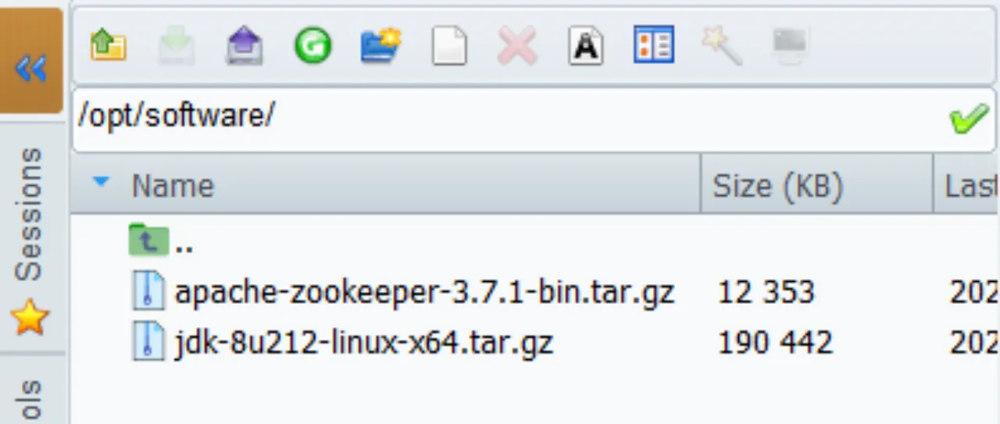
#### **3.10.4.2解压ZooKeeper压缩包**
# 进入到/opt/software目录中
cd /opt/software/
# 解压缩文件到指定目录
tar -zxvf apache-zookeeper-3.7.1-bin.tar.gz -C /opt/module/
# 进入/opt/module目录
cd /opt/module
# 文件目录改名
mv apache-zookeeper-3.7.1-bin/ zookeeper
#### **3.10.4.3配置服务器编号**
(1) 在/opt/module/zookeeper/目录下创建zkData
# 进入/opt/module/zookeeper目录
cd /opt/module/zookeeper
# 创建zkData文件目录
mkdir zkData
(2) 创建myid文件
# 进入/opt/module/zookeeper/zkData目录
cd /opt/module/zookeeper/zkData
# 创建myid文件
vim myid
(3) 在文件中增加内容
1
#### **3.10.4.4修改配置文件**
(1) 重命名/opt/module/zookeeper/conf目录下的zoo_sample.cfg文件为zoo.cfg文件
# 进入cd /opt/module/zookeeper/conf文件目录
cd /opt/module/zookeeper/conf
# 修改文件名称
mv zoo_sample.cfg zoo.cfg
# 修改文件内容
vim zoo.cfg
(2) 修改zoo.cfg文件
```
**# 以下内容为修改内容**
dataDir=/opt/module/zookeeper/zkData

**# 以下内容为新增内容**
####################### cluster ##########################
# server.A=B:C:D
#
# A是一个数字，表示这个是第几号服务器
# B是A服务器的主机名
# C是A服务器与集群中的主服务器（Leader）交换信息的端口
# D是A服务器用于主服务器（Leader）选举的端口
#########################################################
server.1=kafka-broker1:2888:3888
server.2=kafka-broker2:2888:3888
server.3=kafka-broker3:2888:3888
```
#### **3.10.4.5启动ZooKeeper**
**# 在每个节点下执行如下操作**
# 进入zookeeper目录
cd /opt/module/zookeeper
# 启动ZK服务
bin/zkServer.sh start
#### **3.10.4.6关闭ZooKeeper**
**# 在每个节点下执行如下操作**
# 进入zookeeper目录
cd /opt/module/zookeeper
# 关闭ZK服务
bin/zkServer.sh stop
#### **3.10.4.7查看ZooKeeper状态**
**# 在每个节点下执行如下操作**
# 进入zookeeper目录
cd /opt/module/zookeeper
# 查看ZK服务状态
bin/zkServer.sh status
#### **3.10.4.8分发软件**
# 进入/opt/module路径
cd /opt/module
# 调用分发脚本将本机得ZooKeeper安装包分发到其他两台机器
xsync zookeeper

**# 分别将不同虚拟机/opt/module/zookeeper/zkData目录下myid文件进行修改**
vim /opt/module/zookeeper/zkData/myid

**# kafka-broker1:1**
**# kafka-broker2:2**
**# kafka-broker3:3**
#### **3.10.4.9启停脚本**
ZooKeeper软件的启动和停止比较简单，但是每一次如果都在不同服务器节点执行相应指令，也会有点麻烦，所以我们这里将指令封装成脚本文件，方便我们的调用。
(5) 在虚拟机kafka-broker1的/root/bin目录下创建zk.sh脚本文件
在/root/bin这个目录下存放的脚本，root用户可以在系统任何地方直接执行
# 进入/root/bin目录
cd /root/bin
# 创建zk.sh脚本文件
vim zk.sh
在脚本中增加内容:
```
#!/bin/bash

case $1 in
"start"){
for i in kafka-broker1 kafka-broker2 kafka-broker3
do
echo ---------- zookeeper $i 启动 ------------
ssh $i "/opt/module/zookeeper/bin/zkServer.sh start"
done
};;
"stop"){
for i in kafka-broker1 kafka-broker2 kafka-broker3
do
echo ---------- zookeeper $i 停止 ------------    
ssh $i "/opt/module/zookeeper/bin/zkServer.sh stop"
done
};;
"status"){
for i in kafka-broker1 kafka-broker2 kafka-broker3
do
echo ---------- zookeeper $i 状态 ------------    
ssh $i "/opt/module/zookeeper/bin/zkServer.sh status"
done
};;
esac
```
(6) 增加脚本文件权限
# 给zk.sh文件授权
chmod 777 zk.sh
(7) 脚本调用方式
# 启动ZK服务
zk.sh start
# 查看ZK服务状态
zk.sh status
# 停止ZK服务
zk.sh stop
#### **3.10.4.10客户端工具安装**
我们可以通过ZooKeeper软件自带命令行客户端对保存的信息进行访问，也可以采用一些工具软件进行访问，这里我们给大家介绍一个ZooKeeper的客户端工具prettyZoo。
(1) 软件安装
安装的过程非常简单，直接点击课程资料中的prettyZoo-win.msi安装包默认安装即可。
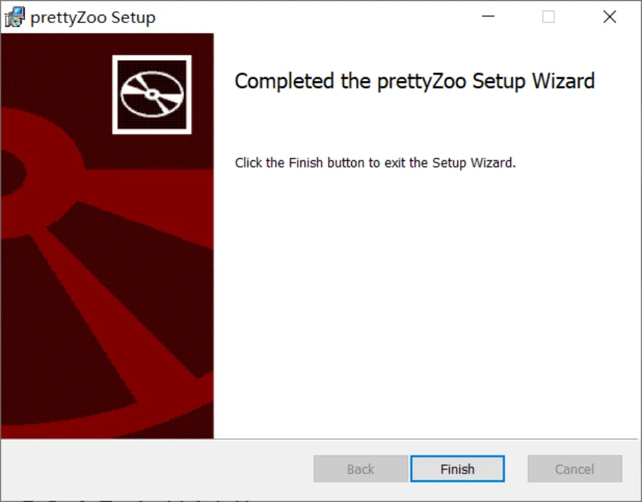
(2) 连接ZooKeeper
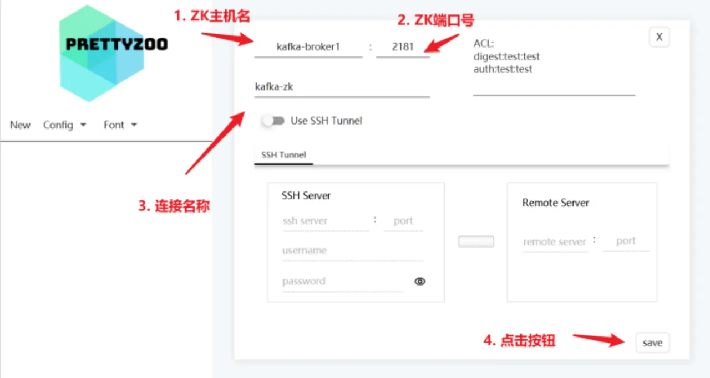
(3) 查看ZooKeeper节点信息
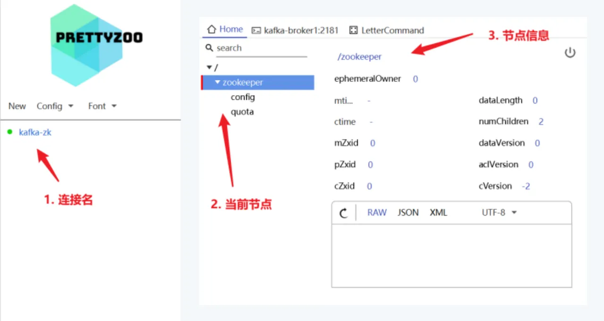
### **3.10.5 安装Kafka**
#### **3.10.5.1上传Kafka压缩包**
将kafka_2.12-3.6.1.tgz文件上传到三台虚拟机的/opt/software目录中
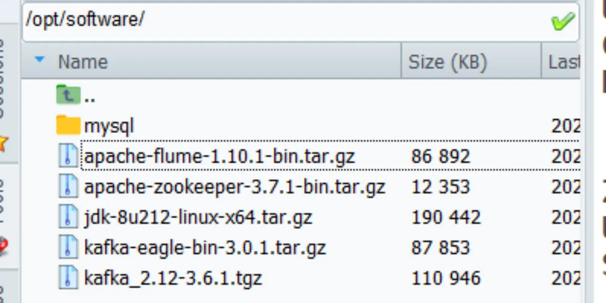
#### **3.10.5.2解压Kafka压缩包**
# 进入/opt/software目录
cd /opt/software

# 解压缩文件到指定目录
tar -zxvf kafka_2.12-3.6.1.tgz -C /opt/module/

# 进入/opt/module目录
cd /opt/module

# 修改文件目录名称
mv kafka_2.12-3.6.1/ kafka
#### **3.10.5.3修改配置文件**
# 进入cd /opt/module/kafka/config文件目录
cd /opt/module/kafka/config
# 修改配置文件
vim server.properties
输入以下内容：
#broker的全局唯一编号，每个服务节点不能重复，只能是数字。
**broker.id=1**
```
#broker对外暴露的IP和端口 （每个节点单独配置）
advertised.listeners=PLAINTEXT://**kafka-broker1**:9092
#处理网络请求的线程数量
num.network.threads=3
#用来处理磁盘IO的线程数量
num.io.threads=8
#发送套接字的缓冲区大小
socket.send.buffer.bytes=102400
#接收套接字的缓冲区大小
socket.receive.buffer.bytes=102400
#请求套接字的缓冲区大小
socket.request.max.bytes=104857600
#kafka运行日志(数据)存放的路径，路径不需要提前创建，kafka自动帮你创建，可以配置多个磁盘路径，路径与路径之间可以用"，"分隔
**log.dirs=/opt/module/kafka/datas**
#topic在当前broker上的分区个数
num.partitions=1
#用来恢复和清理data下数据的线程数量
num.recovery.threads.per.data.dir=1
# 每个topic创建时的副本数，默认时1个副本
offsets.topic.replication.factor=1
#segment文件保留的最长时间，超时将被删除
log.retention.hours=168
#每个segment文件的大小，默认最大1G
log.segment.bytes=1073741824
# 检查过期数据的时间，默认5分钟检查一次是否数据过期
log.retention.check.interval.ms=300000
```
#配置连接Zookeeper集群地址（在zk根目录下创建/kafka，方便管理）
**zookeeper.connect=kafka-broker1:2181,kafka-broker2:2181,kafka-broker3:2181/kafka**
#### **3.10.5.4分发kafka软件**
# 进入 /opt/module目录
cd /opt/module

# 执行分发指令
xsync kafka

**# 按照上面的配置文件内容，在每一个Kafka节点进行配置，请注意配置文件中红色字体内容**
vim /opt/module/kafka/config/server.properties
#### **3.10.5.5配置环境变量**
(1) 修改 /etc/profile.d/my_env.sh文件
vim /etc/profile.d/my_env.sh
(2) 添加内容
```
#KAFKA_HOME
export KAFKA_HOME=/opt/module/kafka
export PATH=$PATH:$KAFKA_HOME/bin
```
(3) 让环境变量生效
source /etc/profile.d/my_env.sh
(4) 分发环境变量，并让环境变量生效
xsync /etc/profile.d/my_env.sh

**# 每个节点执行刷新操作**
source /etc/profile.d/my_env.sh
#### **3.10.5.6启动Kafka**
启动前请先启动ZooKeeper服务
# 进入/opt/module/kafka目录
cd /opt/module/kafka
# 执行启动指令
bin/kafka-server-start.sh -daemon config/server.properties
#### **3.10.5.7关闭Kafka**
# 进入/opt/module/kafka目录
cd /opt/module/kafka
# 执行关闭指令
bin/kafka-server-stop.sh
#### **3.10.5.8启停脚本**
(1) 在虚拟机kafka-broker1的/root/bin目录下创建kfk.sh脚本文件，对kafka服务的启动停止等指令进行封装
# 进入/root/bin目录
cd /root/bin
# 创建kfk.sh脚本文件
vim kfk.sh
在脚本中增加内容:
```
#! /bin/bash

case $1 in
"start"){
for i in kafka-broker1 kafka-broker2 kafka-broker3
do
echo " --------启动 $i Kafka-------"
ssh $i "/opt/module/kafka/bin/kafka-server-start.sh -daemon /opt/module/kafka/config/server.properties"
done
};;
"stop"){
for i in kafka-broker1 kafka-broker2 kafka-broker3
do
echo " --------停止 $i Kafka-------"
ssh $i "/opt/module/kafka/bin/kafka-server-stop.sh "
done
};;
esac
```
(2) 增加脚本文件权限
# 给文件授权
chmod 777 kfk.sh
(3) 脚本调用方式
# 启动kafka
kfk.sh start
# 停止Kafka
kfk.sh stop
**注意**：停止Kafka集群时，一定要等Kafka所有节点进程全部停止后再停止ZooKeeper集群。因为Zookeeper集群当中记录着Kafka集群相关信息，Zookeeper集群一旦先停止，Kafka集群就没有办法再获取停止进程的信息，只能手动杀死Kafka进程了。
(4) 联合脚本
因为Kafka启动前，需要先启动ZooKeeper，关闭时，又需要将所有Kafka全部关闭后，才能关闭ZooKeeper，这样，操作起来感觉比较麻烦，所以可以将之前的2个脚本再做一次封装。
a. 在虚拟机kafka-broker1的/root/bin目录下创建xcall脚本文件
# 进入/root/bin目录
cd /root/bin
# 创建xcall文件
vim xcall
在脚本中增加内容:
```
#! /bin/bash

for i in kafka-broker1 kafka-broker2 kafka-broker3
do
echo --------- $i ----------
ssh $i "$*"
done
```
b. 增加脚本文件权限
# 进入/root/bin目录
cd /root/bin

# 增加权限
chmod 777 xcall
c. 在虚拟机kafka-broker1的/root/bin目录下创建cluster.sh脚本文件
# 进入/root/bin目录
cd /root/bin

# 创建cluster.sh脚本文件
vim cluster.sh
在脚本中增加内容:
```
#!/bin/bash

case $1 in
"start"){
echo ================== 启动 Kafka集群 ==================

#启动 Zookeeper集群
zk.sh start

#启动 Kafka采集集群
kfk.sh start

};;
"stop"){
echo ================== 停止 Kafka集群 ==================

#停止 Kafka采集集群
kfk.sh stop

#循环直至 Kafka 集群进程全部停止
kafka_count=$(xcall jps | grep Kafka | wc -l)
while [ $kafka_count -gt 0 ]
do
sleep 1
kafka_count=$(xcall | grep Kafka | wc -l)
echo "当前未停止的 Kafka 进程数为 $kafka_count"
done

#停止 Zookeeper集群
zk.sh stop
};;
esac
```
d. 增加脚本文件权限
# 进入/root/bin目录
cd /root/bin

# 增加权限
chmod 777 cluster.sh
e. 脚本调用方式
# 集群启动
cluster.sh start
# 集群关闭
cluster.sh stop
### **3.10.6 测试集群**
#### **3.10.6.1启动Kafka集群**
因为已经将ZooKeeper和Kafka的启动封装为脚本，所以可以分别调用脚本启动或调用集群脚本启动
# 启动集群
cluster.sh start
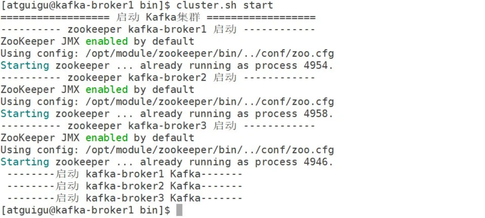
输入指令查看进程
# xcall 后面跟着linux指令操作，可以同时对多个服务器节点同时执行相同指令
xcall jps
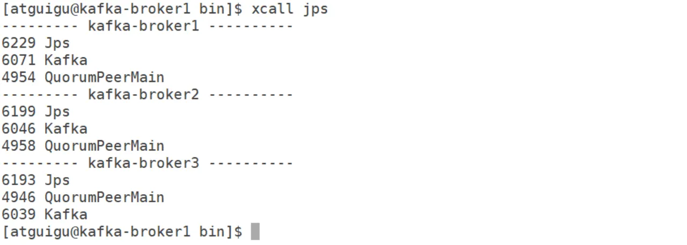
#### **3.10.6.2查看Kafka状态**
使用客户端工具访问kafka
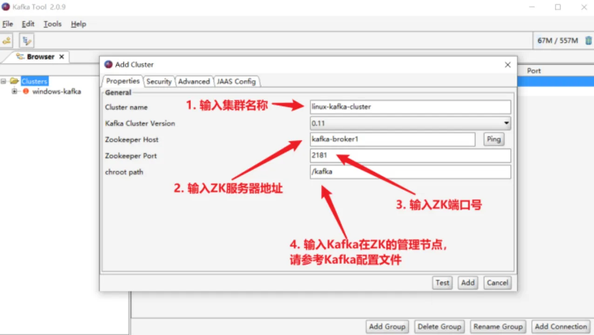
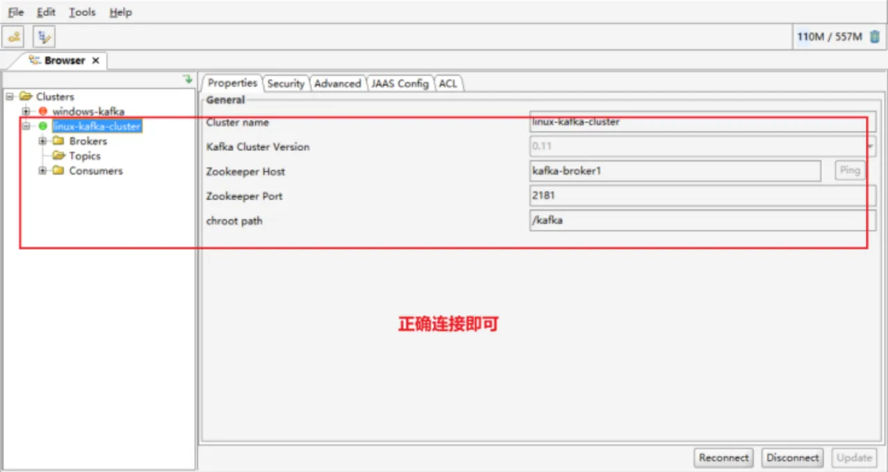
#### **3.10.6.3关闭Kafka集群**
# 关闭集群
cluster.sh stop

# 查看进程
xcall jps
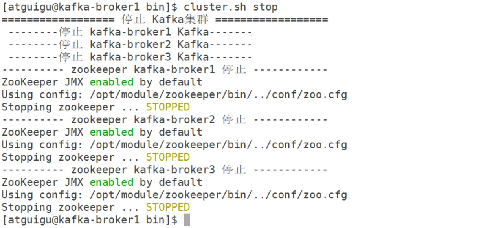
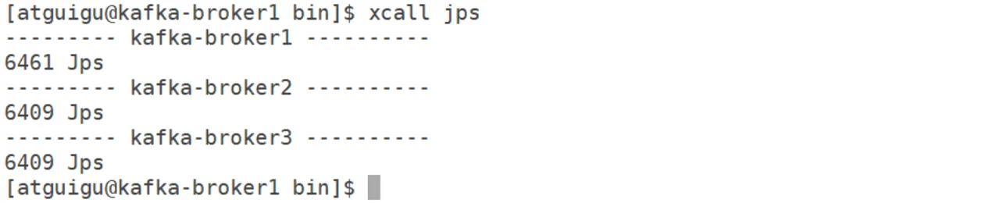
## **3.11 Kafka-Eagle监控**
Kafka-Eagle框架可以监控Kafka集群的整体运行情况，在生产环境中经常使用。
### **3.11.1 MySQL环境准备**
Kafka-Eagle的安装依赖于MySQL，MySQL主要用来存储可视化展示的数据。如果集群中之前安装过MySQL可以跳过该步骤。
#### **3.11.1.1安装包准备**
将资料里mysql文件夹及里面所有内容上传到虚拟机/opt/software/mysql目录下
# 文件清单
install_mysql.sh
mysql-community-client-8.0.31-1.el7.x86_64.rpm
mysql-community-client-plugins-8.0.31-1.el7.x86_64.rpm
mysql-community-common-8.0.31-1.el7.x86_64.rpm
mysql-community-icu-data-files-8.0.31-1.el7.x86_64.rpm
mysql-community-libs-8.0.31-1.el7.x86_64.rpm
mysql-community-libs-compat-8.0.31-1.el7.x86_64.rpm
mysql-community-server-8.0.31-1.el7.x86_64.rpm
mysql-connector-j-8.0.31.jar
#### **3.11.1.2执行mysql安装**
# 进入/opt/software/mysql目录
cd /opt/software/mysql
# 执行install_mysql.sh
sh install_mysql.sh
**# 安装得过程略慢，请耐心等候**
#### **3.11.1.3 mysql的基本配置**
#!/bin/bash
set -x
[ "$(whoami)" = "root" ] || exit 1
[ "$(ls *.rpm | wc -l)" = "7" ] || exit 1
test -f mysql-community-client-8.0.31-1.el7.x86_64.rpm && \
test -f mysql-community-client-plugins-8.0.31-1.el7.x86_64.rpm && \
test -f mysql-community-common-8.0.31-1.el7.x86_64.rpm && \
test -f mysql-community-icu-data-files-8.0.31-1.el7.x86_64.rpm && \
test -f mysql-community-libs-8.0.31-1.el7.x86_64.rpm && \
test -f mysql-community-libs-compat-8.0.31-1.el7.x86_64.rpm && \
test -f mysql-community-server-8.0.31-1.el7.x86_64.rpm || exit 1

# 卸载MySQL
systemctl stop mysql mysqld 2>/dev/null
rpm -qa | grep -i 'mysql\|mariadb' | xargs -n1 rpm -e --nodeps 2>/dev/null
rm -rf /var/lib/mysql /var/log/mysqld.log /usr/lib64/mysql /etc/my.cnf /usr/my.cnf

set -e
# 安装并启动MySQL
yum install -y *.rpm >/dev/null 2>&1
systemctl start mysqld

#更改密码级别并重启MySQL
sed -i '/\[mysqld\]/avalidate_password.length=4\nvalidate_password.policy=0' /etc/my.cnf
systemctl restart mysqld

# 更改MySQL配置
tpass=$(cat /var/log/mysqld.log | grep "temporary password" | awk '{print $NF}')
cat << EOF | mysql -uroot -p"${tpass}" --connect-expired-password >/dev/null 2>&1
set password='000000';
update mysql.user set host='%' where user='root';
alter user 'root'@'%' identified with mysql_native_password by '000000';
flush privileges;
EOF
安装成功后，Mysql的root用户的密码被修改为000000，请连接mysql客户端后，确认root用户的密码插件为下图所示内容。
select user,host,plugin from mysql.user;
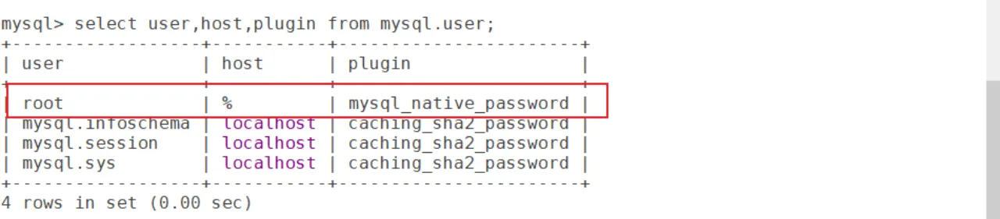
如果插件与截图不同，请登录MySQL客户端后重试下列SQL，否则无法远程登录
update mysql.user set host='%' where user='root';
alter user 'root'@'%' identified with mysql_native_password by '000000';
flush privileges;

exit;
**# 退出后，请重新登录后进行确认**
### **3.11.2 修改Kafka集群配置**
修改/opt/module/kafka/bin/kafka-server-start.sh脚本文件中的内容
```
if [ "x$KAFKA_HEAP_OPTS" = "x" ]; then
export KAFKA_HEAP_OPTS="-server -Xms2G -Xmx2G -XX:PermSize=128m -XX:+UseG1GC -XX:MaxGCPauseMillis=200 -XX:ParallelGCThreads=8 -XX:ConcGCThreads=5 -XX:InitiatingHeapOccupancyPercent=70"
export JMX_PORT="9999"
#export KAFKA_HEAP_OPTS="-Xmx1G -Xms1G"
fi
```
**注意：每个节点都要进行修改。**
# 分发修改后得文件
xsync /opt/module/kafka/bin/kafka-server-start.sh
### **3.11.3 Kafka-Eagle安装**
#### **3.11.3.1安装包准备**
将kafka-eagle-bin-3.0.1.tar.gz上传到虚拟机/opt/software目录下，并解压缩
# 进入到software文件目录
cd /opt/software
# 解压缩文件
tar -zxvf kafka-eagle-bin-3.0.1.tar.gz
# 进入解压缩目录，目录中包含efak-web-3.0.1-bin.tar.gz
cd /opt/software/kafka-eagle-bin-3.0.1

# 解压缩efal压缩文件
tar -zxvf efak-web-3.0.1-bin.tar.gz -C /opt/module/
# 修改名称
cd /opt/module
mv efak-web-3.0.1 efak
#### **3.11.3.2修改配置文件**
修改/opt/module/efak/conf/system-config.properties文件
```
######################################
# multi zookeeper & kafka cluster list
# Settings prefixed with 'kafka.eagle.' will be deprecated, use 'efak.' instead
######################################
**efak.zk.cluster.alias=cluster1**
**cluster1.zk.list=kafka-broker1:2181,kafka-broker2:2181,kafka-broker3:2181/kafka**

######################################
# zookeeper enable acl
######################################
cluster1.zk.acl.enable=false
cluster1.zk.acl.schema=digest
cluster1.zk.acl.username=test
cluster1.zk.acl.password=test

######################################
# broker size online list
######################################
cluster1.efak.broker.size=20

######################################
# zk client thread limit
######################################
kafka.zk.limit.size=32
######################################
# EFAK webui port
######################################
efak.webui.port=8048

######################################
# kafka jmx acl and ssl authenticate
######################################
cluster1.efak.jmx.acl=false
cluster1.efak.jmx.user=keadmin
cluster1.efak.jmx.password=keadmin123
cluster1.efak.jmx.ssl=false
cluster1.efak.jmx.truststore.location=/data/ssl/certificates/kafka.truststore
cluster1.efak.jmx.truststore.password=ke123456

######################################
# kafka offset storage
######################################
cluster1.efak.offset.storage=kafka


######################################
# kafka jmx uri
######################################
cluster1.efak.jmx.uri=service:jmx:rmi:///jndi/rmi://%s/jmxrmi

######################################
# kafka metrics, 15 days by default
######################################
efak.metrics.charts=true
efak.metrics.retain=15

######################################
# kafka sql topic records max
######################################
efak.sql.topic.records.max=5000
efak.sql.topic.preview.records.max=10

######################################
# delete kafka topic token
######################################
efak.topic.token=keadmin

######################################
# kafka sasl authenticate
######################################
cluster1.efak.sasl.enable=false
cluster1.efak.sasl.protocol=SASL_PLAINTEXT
cluster1.efak.sasl.mechanism=SCRAM-SHA-256
cluster1.efak.sasl.jaas.config=org.apache.kafka.common.security.scram.ScramLoginModule required username="kafka" password="kafka-eagle";
cluster1.efak.sasl.client.id=
cluster1.efak.blacklist.topics=
cluster1.efak.sasl.cgroup.enable=false
cluster1.efak.sasl.cgroup.topics=
cluster2.efak.sasl.enable=false
cluster2.efak.sasl.protocol=SASL_PLAINTEXT
cluster2.efak.sasl.mechanism=PLAIN
cluster2.efak.sasl.jaas.config=org.apache.kafka.common.security.plain.PlainLoginModule required username="kafka" password="kafka-eagle";
cluster2.efak.sasl.client.id=
cluster2.efak.blacklist.topics=
cluster2.efak.sasl.cgroup.enable=false
cluster2.efak.sasl.cgroup.topics=

######################################
# kafka ssl authenticate
######################################
cluster3.efak.ssl.enable=false
cluster3.efak.ssl.protocol=SSL
cluster3.efak.ssl.truststore.location=
cluster3.efak.ssl.truststore.password=
cluster3.efak.ssl.keystore.location=
cluster3.efak.ssl.keystore.password=
cluster3.efak.ssl.key.password=
cluster3.efak.ssl.endpoint.identification.algorithm=https
cluster3.efak.blacklist.topics=
cluster3.efak.ssl.cgroup.enable=false
cluster3.efak.ssl.cgroup.topics=
######################################
# kafka sqlite jdbc driver address
######################################
# 配置mysql连接
**efak.driver=com.mysql.jdbc.Driver**
**efak.url=jdbc:mysql://kafka-broker1:3306/ke?useUnicode=true&characterEncoding=UTF-8&zeroDateTimeBehavior=convertToNull**
**efak.username=root**
**efak.password=000000**
######################################
# kafka mysql jdbc driver address
######################################
#efak.driver=com.mysql.cj.jdbc.Driver
#efak.url=jdbc:mysql://kafka-broker1:3306/ke?useUnicode=true&characterEncoding=UTF-8&zeroDateTimeBehavior=convertToNull
#efak.username=root
#efak.password=123456
```
#### **3.11.3.3添加环境变量**
创建/etc/profile.d/my_env.sh脚本文件
#创建脚本文件
vim /etc/profile.d/my_env.sh
# 增加如下内容
```
# kafkaEFAK
export KE_HOME=/opt/module/efak
export PATH=$PATH:$KE_HOME/bin
```
# 刷新环境变量
source /etc/profile.d/my_env.sh
#### **3.11.3.4启动集群**
1) 启动ZooKeeper，Kafka集群
# 启动集群
cluster.sh start
2) 启动efak
# 进入efak文件目录
cd /opt/module/efak
# 启动efak
bin/ke.sh start
# 停止efak
bin/ke.sh stop
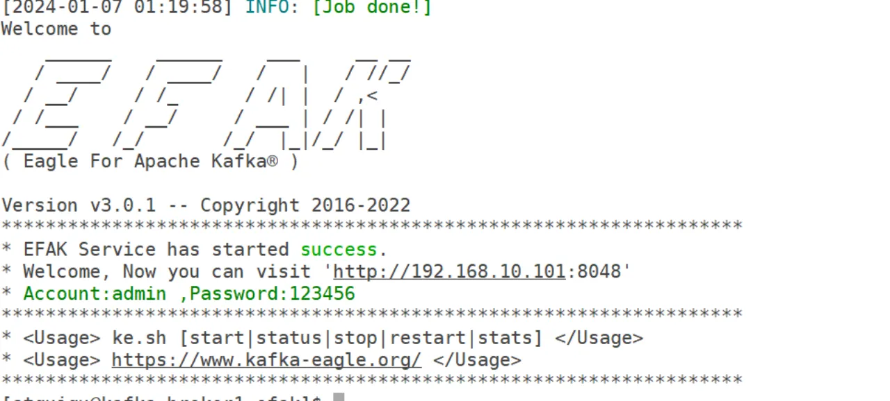
#### **3.11.3.5登录页面查看监控数据**
[http://kafka-broker1:8048/](http://kafka-broker1:8048/)
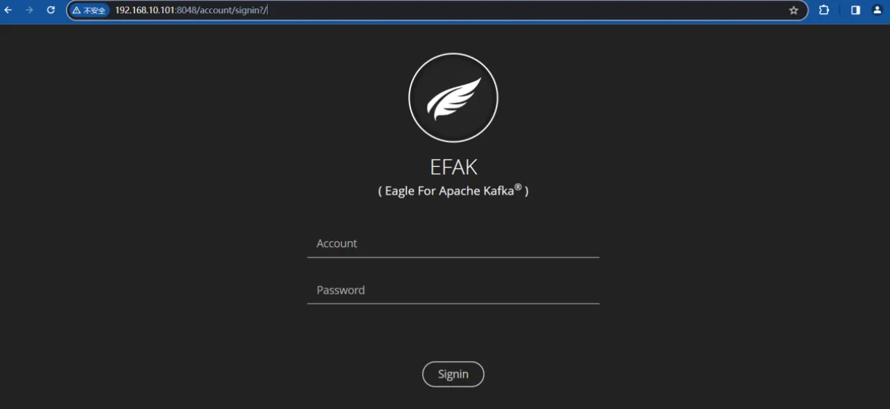
账号为admin,密码为123456
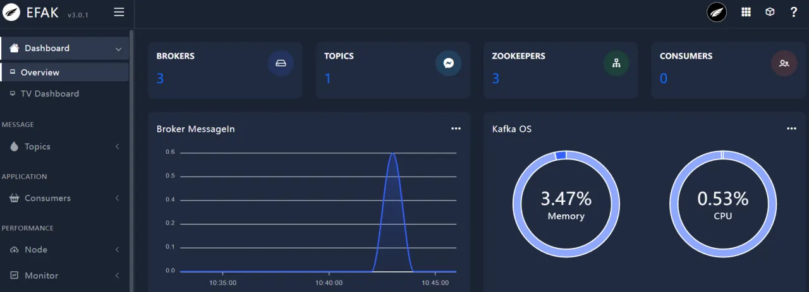
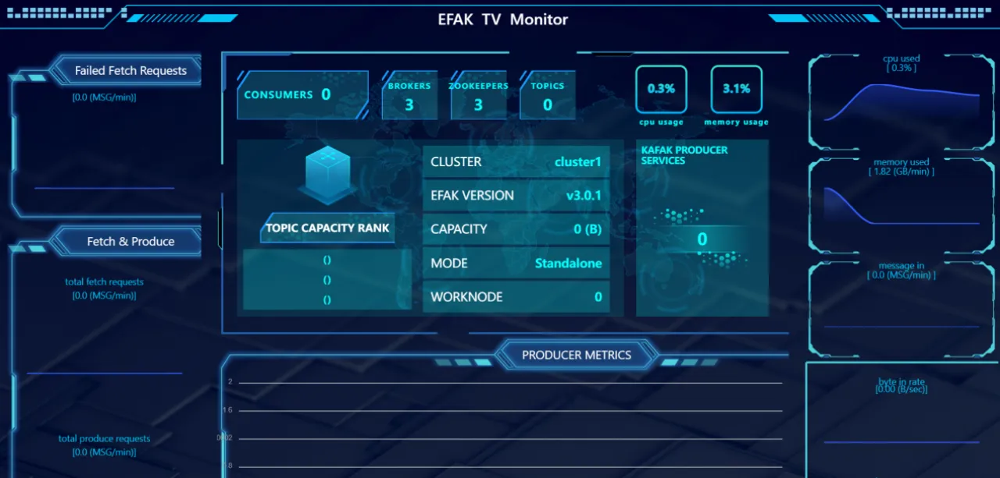
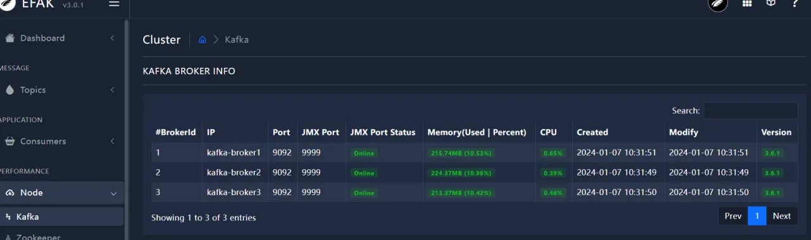
## **3.12 KRaft模式**
Kafka作为一种高吞吐量的分布式发布订阅消息系统，在消息应用中广泛使用，尤其在需要实时数据处理和应用程序活动跟踪的场景，kafka已成为首选服务。在Kafka2.8之前，Kafka强依赖zookeeper来负责集群元数据的管理，这也导致当Zookeeper集群性能发生抖动时，Kafka的性能也会收到很大的影响。2.8版本之后，kafka开始提供KRaft（Kafka Raft，依赖Java 8+ ）模式，开始去除对zookeeper的依赖。最新的3.6.1版本中，Kafka依然兼容zookeeper Controller，但Kafka Raft元数据模式，已经可以在不依赖zookeeper的情况下独立启动Kafka了。官方预计会在Kafka 4.0中移除ZooKeeper，让我们拭目以待。
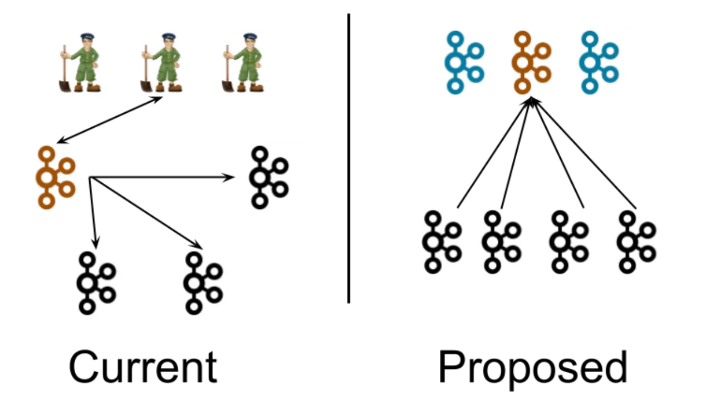
### **3.12.1 kraft模式的优势**
Ø 更简单的部署和管理——通过只安装和管理一个应用程序，无需安装更多的软件，简化软件的安装部署。这也使得在边缘的小型设备中更容易利用 Kafka。
Ø 提高可扩展性——KRaft 的恢复时间比 ZooKeeper 快一个数量级。这使我们能够有效地扩展到单个集群中的数百万个分区。ZooKeeper 的有效限制是数万
Ø 更有效的元数据传播——基于日志、事件驱动的元数据传播可以提高 Kafka 的许多核心功能的性能。另外它还支持元数据主题的快照。
Ø 由于不依赖zookeeper，集群扩展时不再受到zookeeper读写能力限制；
Ø controller不再动态选举，而是由配置文件规定。这样我们可以有针对性的加强controller节点的配置，而不是像以前一样对随机controller节点的高负载束手无策。
### **3.12.2 Kafka-KRaft集群部署**
#### **3.12.2.1在三个节点解压kafka压缩包**
# 进入software目录
cd /opt/software
# 解压缩文件
tar -zxvf kafka_2.12-3.6.1.tgz -C /opt/module/
# 修改名称
mv /opt/module/kafka_2.12-3.6.1/ /opt/module/kafka-kraft
#### **3.12.2.2修改config/kraft/server.properties配置文件**
```
#kafka的角色（controller相当于主机、broker节点相当于从机，主机类似zk功能）
process.roles=broker, controller
#节点ID
node.id=1
#controller服务协议别名
controller.listener.names=CONTROLLER
#全Controller列表
controller.quorum.voters=1@kafka-broker1:9093,2@kafka-broker2:9093,3@kafka-broker3:9093
#不同服务器绑定的端口
listeners=PLAINTEXT://:9092,CONTROLLER://:9093
#broker服务协议别名
inter.broker.listener.name=PLAINTEXT
#broker对外暴露的地址
advertised.listeners=PLAINTEXT://kafka-broker1:9092
#协议别名到安全协议的映射
listener.security.protocol.map=CONTROLLER:PLAINTEXT,PLAINTEXT:PLAINTEXT,SSL:SSL,SASL_PLAINTEXT:SASL_PLAINTEXT,SASL_SSL:SASL_SSL
#kafka数据存储目录
log.dirs=/opt/module/kafka-kraft/datas
```
#### **3.12.2.3修改不同节点的配置**
# 分发软件
xsync /opt/module/kafka-kraft
# 不同节点需要对node.id相应改变，值需要和controller.quorum.voters对应
# 不同节点需要根据各自的主机名称，修改相应的advertised.listeners地址。
#### **3.12.2.4初始化集群数据目录**
Ø 首先在每个部署节点生成存储目录唯一ID
# 进入kafka目录
cd /opt/module/kafka-kraft
# 生产存储ID
bin/kafka-storage.sh random-uuid
**J7s9e8PPTKOO47PxzI39VA**
Ø 用生成的ID格式化每一个kafka数据存储目录
bin/kafka-storage.sh format -t **J7s9e8PPTKOO47PxzI39VA** -c /opt/module/kafka-kraft/config/kraft/server.properties
#### **3.12.2.5启停Kafka集群**
# 进入到/opt/module/kafka-kraft目录
cd /opt/module/kafka-kraft

# **执行启动脚本**
bin/kafka-server-start.sh -daemon config/kraft/server.properties
# **执行停止命令**
bin/kafka-server-stop.sh
#### **3.12.2.6启停脚本封装**
Ø 在/root/bin目录下创建脚本文件kfk2.sh，并增加内容
```
#! /bin/bash
case $1 in
"start"){
for i in kafka-broker1 kafka-broker2 kafka-broker3
do
echo " --------启动 $i kafka-kraft -------"
ssh $i "/opt/module/kafka-kraft/bin/kafka-server-start.sh -daemon /opt/module/kafka-kraft/config/kraft/server.properties"
done
};;
"stop"){
for i in kafka-broker1 kafka-broker2 kafka-broker3
do
echo " --------停止 $i kafka-kraft -------"
ssh $i "/opt/module/kafka-kraft/bin/kafka-server-stop.sh "
done
};;
esac
Ø 添加执行权限
# 添加权限
chmod 777 kfk2.sh
Ø 启动和停止集群
# 启动集群
kfk2.sh start
# 停止集群
kfk2.sh stop
**
```
# **第4章  Kafka集成**
## **4.1 大数据应用场景**
### **4.1.1 Flume集成**
Flume也是日志采集器，类似于ELK中的LogStash软件功能。早期设计的功能就是通过Flume采集过来数据，然后将数据写入HDFS分布式文件存储系统，不过，随着功能的扩展，现在也可以把采集的数据写入到kafka当中，作为实时数据使用。

#### **4.1.1.1安装Flume**
##### **4.1.1.1.1安装地址**
Flume官网地址：http://flume.apache.org/
文档查看地址：http://flume.apache.org/FlumeUserGuide.html
下载地址：[http://archive.apache.org/dist/flume/](http://archive.apache.org/dist/flume/)
##### **4.1.1.1.2安装部署**
1) 将压缩包apache-flume-1.10.1-bin.tar.gz上传到linux系统的/opt/software目录下
2) 将软件压缩包解压缩到/opt/module目录中，并修改名称
# 解压缩文件
tar -zxf /opt/software/apache-flume-1.10.1-bin.tar.gz -C /opt/module/
# 修改名称
mv /opt/module/apache-flume-1.10.1-bin /opt/module/flume
3) 生产环境中，可以设置flume的堆内存为4G或以上。
修改/opt/module/flume/conf/flume-env.sh文件，配置如下参数（虚拟机环境暂不配置）
# 修改JVM配置
export JAVA_OPTS="-Xms4096m -Xmx4096m -Dcom.sun.management.jmxremote"
#### **4.1.1.2 增加集成配置**
##### **4.1.1.2.1 flume采集数据到Kafka的配置**
1) 在linux系统解压缩后的flume软件目录中，创建job目录
# 进入flume软件目录
cd /opt/module/flume
# 创建job目录
mkdir job
2) 创建配置文件：file_to_kafka.conf
# 进入job目录
cd /opt/module/flume/job
# 创建文件
vim file_to_kafka.conf
3) 增加文件内容
```
# 定义组件
a1.sources = r1
a1.channels = c1

# 配置source
a1.sources.r1.type = TAILDIR
a1.sources.r1.filegroups = f1
# 日志（数据）文件
a1.sources.r1.filegroups.f1 = /opt/module/data/test.log
a1.sources.r1.positionFile = /opt/module/flume/taildir_position.json

# 配置channel
# 采用Kafka Channel，省去了Sink，提高了效率
a1.channels.c1.type = org.apache.flume.channel.kafka.KafkaChannel
a1.channels.c1.kafka.bootstrap.servers = kafka-broker1:9092,kafka-broker2:9092,kafka-broker3:9092
a1.channels.c1.kafka.topic = test
a1.channels.c1.parseAsFlumeEvent = false

# 组装
a1.sources.r1.channels = c1
```
### **4.1.1.3 集成测试**
##### **4.1.1.3.1 启动Zookeeper、Kafka集群**

##### **4.1.1.3.2 执行flume操作采集数据到Kafka**
# 进入flume
cd /opt/module/flume
# 执行
bin/flume-ng agent -n a1 -c conf/ -f job/file_to_kafka.conf
### **4.1.2 SparkStreaming集成**
Spark是分布式计算引擎，是一款非常强大的离线分布式计算框架，其中的SparkStreaming模块用于准实时数据处理，其中就可以将Kafka作为数据源进行处理。
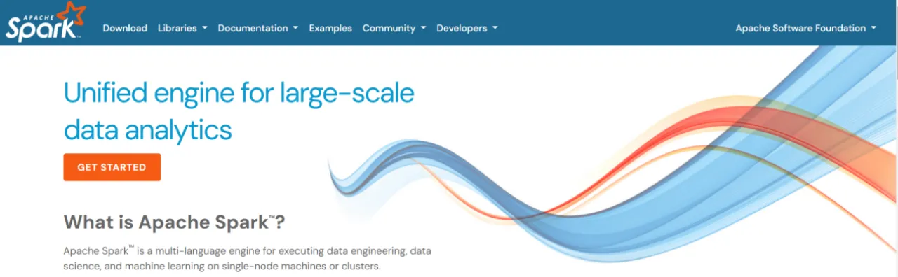
#### **4.1.2.1 编写功能代码**
##### **4.1.2.1.1 修改pom.xml文件，增加依赖**
```
<dependency>
<groupId>org.apache.spark</groupId>
<artifactId>spark-core_2.12</artifactId>
<version>3.3.1</version>
</dependency>
<dependency>
<groupId>org.apache.spark</groupId>
<artifactId>spark-streaming_2.12</artifactId>
<version>3.3.1</version>
</dependency>
<dependency>
<groupId>org.apache.spark</groupId>
<artifactId>spark-streaming-kafka-0-10_2.12</artifactId>
<version>3.3.1</version>
</dependency>
```
##### **4.1.2.1.2 编写功能代码**
```
package com.atguigu.kafka.test;

import org.apache.kafka.clients.consumer.ConsumerConfig;
import org.apache.kafka.clients.consumer.ConsumerRecord;
import org.apache.spark.SparkConf;
import org.apache.spark.api.java.function.Function;
import org.apache.spark.storage.StorageLevel;
import org.apache.spark.streaming.Duration;
import org.apache.spark.streaming.api.java.JavaInputDStream;
import org.apache.spark.streaming.api.java.JavaPairDStream;
import org.apache.spark.streaming.api.java.JavaReceiverInputDStream;
import org.apache.spark.streaming.api.java.JavaStreamingContext;
import org.apache.spark.streaming.kafka010.ConsumerStrategies;
import org.apache.spark.streaming.kafka010.KafkaUtils;
import org.apache.spark.streaming.kafka010.LocationStrategies;
import scala.Tuple2;

import java.util.*;

public class Kafka4SparkStreamingTest {
public static void main(String[] args) throws Exception {

// TODO 创建配置对象
SparkConf conf = new SparkConf();
conf.setMaster("local[*]");
conf.setAppName("SparkStreaming");

// TODO 创建环境对象
JavaStreamingContext ssc = new JavaStreamingContext(conf, new Duration(3 * 1000));

// TODO 使用kafka作为数据源

// 创建配置参数
HashMap<String, Object> map = new HashMap<>();
map.put(ConsumerConfig.BOOTSTRAP_SERVERS_CONFIG,"localhost:9092");
map.put(ConsumerConfig.KEY_DESERIALIZER_CLASS_CONFIG, "org.apache.kafka.common.serialization.StringDeserializer");
map.put(ConsumerConfig.VALUE_DESERIALIZER_CLASS_CONFIG, "org.apache.kafka.common.serialization.StringDeserializer");
map.put(ConsumerConfig.GROUP_ID_CONFIG,"atguigu");
map.put(ConsumerConfig.AUTO_OFFSET_RESET_CONFIG,"latest");

// 需要消费的主题
ArrayList<String> strings = new ArrayList<>();
strings.add("test");

JavaInputDStream<ConsumerRecord<String, String>> directStream =
KafkaUtils.createDirectStream(
ssc,
LocationStrategies.PreferBrokers(),
ConsumerStrategies.<String, String>Subscribe(strings,map));

directStream.map(new Function<ConsumerRecord<String, String>, String>() {
@Override
public String call(ConsumerRecord<String, String> v1) throws Exception {
return v1.value();
}
}).print(100);

ssc.start();
ssc.awaitTermination();
}
}
```
#### **4.1.2.2 集成测试**
##### **4.1.2.2.1 启动Zookeeper、Kafka集群**
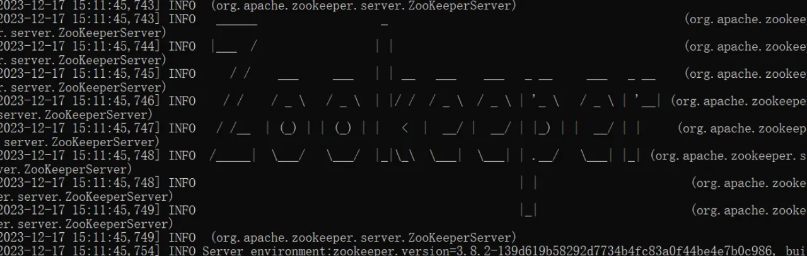
##### **4.1.2.2.2 执行Spark程序**
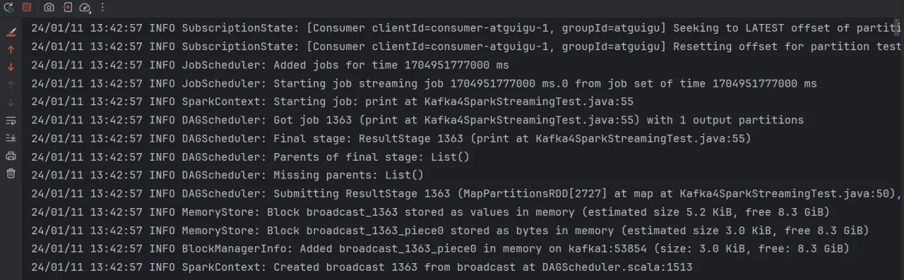
### **4.1.3 Flink集成**
Flink是分布式计算引擎，是一款非常强大的实时分布式计算框架，可以将Kafka作为数据源进行处理。

#### **4.1.3.1 编写功能代码**
##### **4.1.3.1.1 修改pom.xml文件，增加相关依赖**
```
<dependency>
<groupId>org.apache.flink</groupId>
<artifactId>flink-java</artifactId>
<version>1.17.0</version>
</dependency>
<dependency>
<groupId>org.apache.flink</groupId>
<artifactId>flink-streaming-java</artifactId>
<version>1.17.0</version>
</dependency>
<dependency>
<groupId>org.apache.flink</groupId>
<artifactId>flink-clients</artifactId>
<version>1.17.0</version>
</dependency>
<dependency>
<groupId>org.apache.flink</groupId>
<artifactId>flink-connector-kafka</artifactId>
<version>1.17.0</version>
</dependency>
```
##### **4.1.3.1.2 编写功能代码**
```
package com.atguigu.kafka;

import org.apache.flink.api.common.eventtime.WatermarkStrategy;
import org.apache.flink.api.common.serialization.SimpleStringSchema;
import org.apache.flink.connector.kafka.source.KafkaSource;
import org.apache.flink.connector.kafka.source.enumerator.initializer.OffsetsInitializer;
import org.apache.flink.streaming.api.datastream.DataStreamSource;
import org.apache.flink.streaming.api.environment.StreamExecutionEnvironment;

public class Kafka4FlinkTest {
public static void main(String[] args) throws Exception {

StreamExecutionEnvironment env = StreamExecutionEnvironment.getExecutionEnvironment();

KafkaSource<String> kafkaSource = KafkaSource.<String>builder()
.setBootstrapServers("localhost:9092")
.setTopics("test")
.setGroupId("atguigu")
.setStartingOffsets(OffsetsInitializer.latest())
.setValueOnlyDeserializer(new SimpleStringSchema())
.build();

DataStreamSource<String> stream = env.fromSource(kafkaSource, WatermarkStrategy.noWatermarks(), "kafka-source");

stream.print("Kafka");

env.execute();
}
}
```
#### **4.1.3.2 集成测试**
##### **4.1.3.2.1 启动Zookeeper、Kafka集群**

##### **4.1.3.2.2 执行Flink程序**
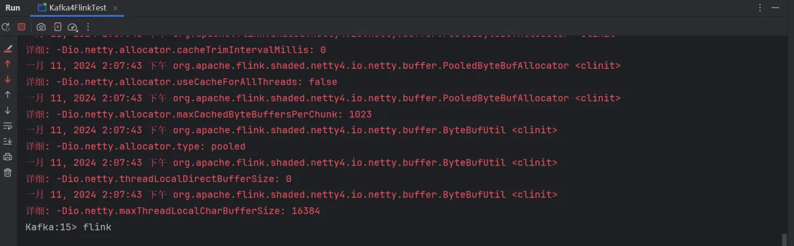
## **4.2 Java应用场景**
### **4.2.1 SpringBoot集成**
Spring Boot帮助您创建可以运行的、独立的、生产级的基于Spring的应用程序。您可以使用Spring Boot创建Java应用程序，这些应用程序可以通过使用java-jar或更传统的war部署启动。
我们的目标是：
Ø 为所有Spring开发提供从根本上更快、广泛访问的入门体验。
Ø 开箱即用，但随着要求开始偏离默认值，请迅速离开。
Ø 提供大型项目（如嵌入式服务器、安全性、指标、健康检查和外部化配置）常见的一系列非功能性功能。
Ø 绝对没有代码生成（当不针对原生图像时），也不需要XML配置。

#### **4.2.1.1 创建SpringBoot项目**
##### **4.2.1.1.1 创建SpringBoot项目**

##### **4.2.1.1.2 修改pom.xml文件**
```
<?xml version="1.0" encoding="UTF-8"?>
<project xmlns="http://maven.apache.org/POM/4.0.0" xmlns:xsi="http://www.w3.org/2001/XMLSchema-instance"
xsi:schemaLocation="http://maven.apache.org/POM/4.0.0 https://maven.apache.org/xsd/maven-4.0.0.xsd">
<modelVersion>4.0.0</modelVersion>
<parent>
<groupId>org.springframework.boot</groupId>
<artifactId>spring-boot-starter-parent</artifactId>
<version>3.0.5</version>
<relativePath/> <!-- lookup parent from repository -->
</parent>
<groupId>com.atguigu</groupId>
<artifactId>springboot-kafka</artifactId>
<version>0.0.1</version>
<name>springboot-kafka</name>
<description>Kafka project for Spring Boot</description>
<properties>
<java.version>17</java.version>
</properties>
<dependencies>
<dependency>
<groupId>org.springframework.boot</groupId>
<artifactId>spring-boot-starter</artifactId>
</dependency>
<dependency>
<groupId>org.springframework.boot</groupId>
<artifactId>spring-boot-starter-web</artifactId>
<exclusions>
<exclusion>
<groupId>org.springframework.boot</groupId>
<artifactId>spring-boot-starter-logging</artifactId>
</exclusion>
</exclusions>
</dependency>
<dependency>
<groupId>org.springframework.boot</groupId>
<artifactId>spring-boot-starter-test</artifactId>
<scope>test</scope>
</dependency>
<dependency>
<groupId>org.springframework.kafka</groupId>
<artifactId>spring-kafka</artifactId>
</dependency>
<dependency>
<groupId>org.apache.kafka</groupId>
<artifactId>kafka-clients</artifactId>
<version>3.6.1</version>
</dependency>
<dependency>
<groupId>com.alibaba</groupId>
<artifactId>fastjson</artifactId>
<version>1.2.83</version>
</dependency>
<dependency>
<groupId>cn.hutool</groupId>
<artifactId>hutool-json</artifactId>
<version>5.8.11</version>
</dependency>
<dependency>
<groupId>cn.hutool</groupId>
<artifactId>hutool-db</artifactId>
<version>5.8.11</version>
</dependency>
<dependency>
<groupId>org.projectlombok</groupId>
<artifactId>lombok</artifactId>
</dependency>
</dependencies>

<build>
<plugins>
<plugin>
<groupId>org.springframework.boot</groupId>
<artifactId>spring-boot-maven-plugin</artifactId>
</plugin>
</plugins>
</build>
</project>
```
##### **4.2.1.1.3 在resources中增加application.yml文件**
```
spring:
kafka:
bootstrap-servers: localhost:9092
producer:
acks: all
batch-size: 16384
buffer-memory: 33554432
key-serializer: org.apache.kafka.common.serialization.StringSerializer
value-serializer: org.apache.kafka.common.serialization.StringSerializer
retries: 0
consumer:
group-id: test#消费者组
#消费方式: 在有提交记录的时候，earliest与latest是一样的，从提交记录的下一条开始消费
# earliest：无提交记录，从头开始消费
#latest：无提交记录，从最新的消息的下一条开始消费
auto-offset-reset: earliest
enable-auto-commit: true #是否自动提交偏移量offset
auto-commit-interval: 1s #前提是 enable-auto-commit=true。自动提交的频率
key-deserializer: org.apache.kafka.common.serialization.StringDeserializer
value-deserializer: org.apache.kafka.common.serialization.StringDeserializer
max-poll-records: 2
properties:
#如果在这个时间内没有收到心跳，该消费者会被踢出组并触发{组再平衡 rebalance}
session.timeout.ms: 120000
#最大消费时间。此决定了获取消息后提交偏移量的最大时间，超过设定的时间（默认5分钟），服务端也会认为该消费者失效。踢出并再平衡
max.poll.interval.ms: 300000
#配置控制客户端等待请求响应的最长时间。
#如果在超时之前没有收到响应，客户端将在必要时重新发送请求，
#或者如果重试次数用尽，则请求失败。
request.timeout.ms: 60000
#订阅或分配主题时，允许自动创建主题。0.11之前，必须设置false
allow.auto.create.topics: true
#poll方法向协调器发送心跳的频率，为session.timeout.ms的三分之一
heartbeat.interval.ms: 40000
#每个分区里返回的记录最多不超max.partitions.fetch.bytes 指定的字节
#0.10.1版本后 如果 fetch 的第一个非空分区中的第一条消息大于这个限制
#仍然会返回该消息，以确保消费者可以进行
#max.partition.fetch.bytes=1048576  #1M
listener:
#当enable.auto.commit的值设置为false时，该值会生效；为true时不会生效
#manual_immediate:需要手动调用Acknowledgment.acknowledge()后立即提交
#ack-mode: manual_immediate
missing-topics-fatal: true #如果至少有一个topic不存在，true启动失败。false忽略
#type: single #单条消费？批量消费？ #批量消费需要配合 consumer.max-poll-records
type: batch
concurrency: 2 #配置多少，就为为每个消费者实例创建多少个线程。多出分区的线程空闲
template:
default-topic: "test"
server:
port: 9999
```
#### **4.2.1.2 编写功能代码**
##### **4.2.1.2.1 创建配置类：SpringBootKafkaConfig**
```
package com.atguigu.springkafka.config;

public class SpringBootKafkaConfig {
public static final String TOPIC_TEST = "test";
public static final String GROUP_ID = "test";
}
```
##### **4.2.1.2.2 创建生产者控制器：KafkaProducerController**
```
package com.atguigu.springkafka.controller;

import com.atguigu.springkafka.config.SpringBootKafkaConfig;
import lombok.extern.slf4j.Slf4j;
import cn.hutool.json.JSONUtil;
import org.springframework.beans.factory.annotation.Autowired;
import org.springframework.kafka.core.KafkaTemplate;
import org.springframework.kafka.support.SendResult;
import org.springframework.web.bind.annotation.*;

import org.springframework.util.concurrent.ListenableFuture;
import org.springframework.util.concurrent.ListenableFutureCallback;

@RestController
@RequestMapping("/kafka")
@Slf4j
public class KafkaProducerController {


@Autowired
private KafkaTemplate<String, String> kafkaTemplate;

@ResponseBody
@PostMapping(value = "/produce", produces = "application/json")
public String produce(@RequestBody Object obj) {

try {
String obj2String = JSONUtil.toJsonStr(obj);
kafkaTemplate.send(SpringBootKafkaConfig.TOPIC_TEST, obj2String);
return "success";
} catch (Exception e) {
e.getMessage();
}
return "success";
}
}
```
##### **4.2.1.2.3 创建消费者：KafkaDataConsumer**
```
package com.atguigu.springkafka.component;

import cn.hutool.json.JSONObject;
import cn.hutool.json.JSONUtil;
import lombok.extern.slf4j.Slf4j;
import com.atguigu.springkafka.config.SpringBootKafkaConfig;
import org.springframework.kafka.annotation.KafkaListener;
import org.springframework.kafka.support.KafkaHeaders;
import org.springframework.messaging.handler.annotation.Header;
import org.springframework.stereotype.Component;

import java.util.List;
import java.util.Optional;


@Component
@Slf4j
public class KafkaDataConsumer {
@KafkaListener(topics = SpringBootKafkaConfig.TOPIC_TEST, groupId = SpringBootKafkaConfig.GROUP_ID)
public void topic_test(List<String> messages, @Header(KafkaHeaders.RECEIVED_TOPIC) String topic) {
for (String message : messages) {
final JSONObject entries = JSONUtil.parseObj(message);
System.out.println(SpringBootKafkaConfig.GROUP_ID + " 消费了： Topic:" + topic + ",Message:" + entries.getStr("data"));
//ack.acknowledge();
}
}
}
```
#### **4.2.1.3 集成测试**
##### **4.2.1.3.1 启动ZooKeeper**

##### **4.2.1.3.2 启动Kafka**
##### **4.2.1.3.3 启动应用程序**
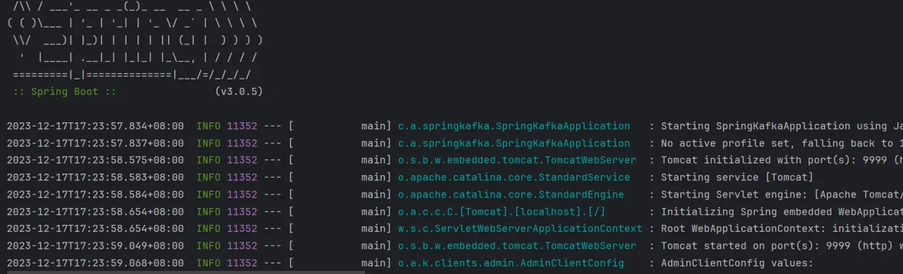
##### **4.2.1.3.4 生产数据测试**
可以采用任何的工具进行测试，我们这里采用postman发送POST数据
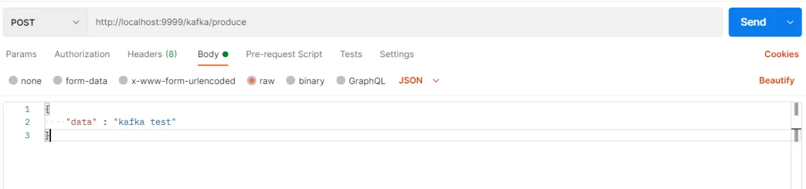
消费者消费数据
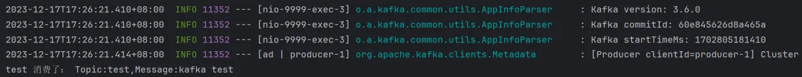
**

# **第5章  Kafka优化**
## **5.1 资源配置**
### **5.1.1 操作系统**
Kafka的网络客户端底层使用Java NIO的Selector方式，而Selector在Linux的实现是epoll，在Windows上实现机制为select。因此Kafka部署在Linux会有更高效的I/O性能。
数据在磁盘和网络之间进行传输时候，在Linux上可以享受到零拷贝机制带来的快捷和便利高效，而Windows在一定程度上会使用零拷贝操作。
所以建议Kafka部署在Linux操作系统上。
### **5.1.2 磁盘选择**
Kafka 存储方式为顺序读写，机械硬盘的最大劣势在于随机读写慢。所以使用机械硬盘并不会造成性能低下。所以磁盘选用普通机械硬盘即可，Kafka自身已经有冗余机制，而且通过分区的设计，实现了负载均衡的功能。不做磁盘组raid阵列也是可以的。
磁盘空间需要多少，需要根据具体场景进行简单估算
设计场景：日志数据每天向kafka发送1亿条数据，每条数据有两个副本防止数据丢失，数据保存两周，每条消息平均大小为1KB。
1) 每天1亿条1KB消息，保存两份，则每天总大小为：
(100000000*1KB*2)/1024/1024≈200GB
2) kafka除了消息数据还有其他类型的数据，故增加10%的冗余空间，则需要220GB
3) 两周时间则为 220GB*14≈3TB
4) 如果启用压缩，压缩比约在 0.75 左右，则总存储空间规划为3TB*0.75=2.25TB
### **5.1.3 网络带宽**
如果网络为万兆带宽，基本不会出现网络瓶颈，如果数据量特别大，按照下文中的设计场景进行计算。如果网络为百兆或者千兆带宽，在处理较大数据量场景下会出现网络瓶颈，可按照下面的传统经验公式进行计算处理，也可按照下述场景按照自己生产实际情况进行设计。
**经验公式：服务器台数 = 2 × (生产者峰值生产速率 × 副本数 ÷ 100) + 1**
带宽情况最容易成为 kafka 的瓶颈。
设计场景：如果机房为千兆带宽，我们需要在一小时内处理1TB的数据，需要多少台kafka 服务器？
1) 由于带宽为千兆网，1000Mbps=1Gbps，则每秒钟每个服务器能收到的数据量为 1Gb=1000Mb
2) 假设 Kafka 占用整个服务器网络的70%（其他 30%为别的服务预留），则Kafka可以使用到700Mb 的带宽，但是如果从常规角度考虑，我们不能总让Kafka顶满带宽峰值，所以需要预留出2/3甚至3/4的资源，也就是说，Kafka单台服务器使用带宽实际应为 700Mb/3=240Mb
3) 1 小时需要处理1TB数据，1TB=1024*1024*8Mb=8000000Mb，则一秒钟处理数据量为：8000000Mb/3600s=2330Mb 数据。
4) 需要的服务器台数为：2330Mb/240Mb≈10 台。
5) 考虑到消息的副本数如果为 2，则需要20台服务器，副本如果为3，则需要30台服务器。
### **5.1.4 内存配置**
Kafka运行过程中设计到的内存主要为JVM的堆内存和操作系统的页缓存，每个Broker节点的堆内存建议10-15G内存，而数据文件（默认为1G）的25%在内存就可以了。综合上述，Kafka在大数据场景下能够流畅稳定运行至少需要11G，建议安装Kafka的服务器节点的内存至少大于等于16G。
### **5.1.5 CPU选择**
观察所有的Kafka与线程相关的配置，一共有以下几个

在生产环境中，建议CPU核数最少为16核，建议32核以上，方可保证大数据环境中的Kafka集群正常处理与运行。
## **5.2 集群容错**
### **5.2.1 副本分配策略**
Kafka采用分区机制对数据进行管理和存储，每个Topic可以有多个分区，每个分区可以有多个副本。应根据业务需求合理配置副本，一般建议设置至少2个副本以保证高可用性。
### **5.2.2 故障转移方案**
当Kafka集群中的某个Broker节点发生故障时，其负责的分区副本将会被重新分配到其他存活的Broker节点上，并且会自动选择一个备份分区作为新的主分区来处理消息的读写请求。
### **5.2.3 数据备份与恢复**
Kafka采用基于日志文件的存储方式，每个Broker节点上都有副本数据的本地备份。在数据备份方面，可以通过配置Kafka的数据保留策略和数据分区调整策略来保证数据的持久性和安全性；在数据恢复方面，可以通过查找备份数据并进行相应的分区副本替换来恢复数据。
## **5.3 参数配置优化**
| **参数名** | **默认参数值** | **位置** | **优化场景** | **备注** |
| --- | --- | --- | --- | --- |
| num.network.threads | 3 | 服务端 | 低延迟 | 
 |
| num.io.threads | 8 | 服务端 | 低延迟 | 
 |
| socket.send.buffer.bytes | 102400(100K) | 服务端 | 高吞吐 | 
 |
| socket.receive.buffer.bytes | 65536(64K) | 服务端 | 高吞吐场景 | 
 |
| max.in.flight.requests.per.connection | 5 | 生产端 | 幂等 | 
 |
| buffer.memory | 33554432（32M） | 生产端 | 高吞吐 | 
 |
| batch.size | 16384(16K) | 生产端 | 提高性能 | 
 |
| linger.ms | 0 | 生产端 | 提高性能 | 
 |
| fetch.min.bytes | 1 | 消费端 | 提高性能 | 网络交互次数 |
| max.poll.records | 500 | 消费端 | 批量处理 | 控制批量获取消息数量 |
| fetch.max.bytes | 57671680 (55M) | 消费端 | 批量处理 | 控制批量获取消息字节大小 |

## **5.4 数据压缩和批量发送**
通过压缩和批量发送可以优化Kafka的性能表现。Kafka支持多种数据压缩算法，包括Gzip、Snappy、LZ4和zstd。在不同场景下，需要选择合适的压缩算法，以确保性能最优。
下面的表格为网络上不同压缩算法的测试数据，仅作参考

| **压缩算法** | **压缩比率** | **压缩效率** | **解压缩效率** |
| --- | --- | --- | --- |
| snappy | 2.073 | 580m/s | 2020m/s |
| lz4 | 2.101 | 800m/s | 4220m/s |
| zstd | 2.884 | 520m/s | 1600m/s |

从表格数据可以直观看出，zstd有着最高得压缩比，而LZ4算法，在吞吐量上表现得非常高效。对于Kafka而言，在吞吐量上比较：lz4 > snappy>zstd>gzip。而在压缩比上：zstd>lz4>gzip>snappy
Kafka支持两种批处理方式：异步批处理和同步批处理。在不同场景下，需要选择合适的批处理方式，进行性能优化。同时需要合理设置批处理参数，如batch.size、linger.ms等。
**

# **第6章  Kafka常见问题**
## **6.1 Kafka都有哪些组件？**
## **6.2 Kafka的LSO、LEO、 HW 的含义？**
LSO，LEO，HW其实都是kafka中的偏移量。只不过它们代表的含义是不相同的。
这里的LSO有两层含义：
一个是**Log Start Offset**， 一个是**Log Stable Offset**，第一个表示数据文件的起始偏移量，同学们还记的，咱们的log文件的文件名吗，文件名中的那个数字就是当前文件的LSO, 第二个表示的位移值是用来判断事务型消费者的可见性，就是所谓的事务隔离级别，一个叫read_commited, 一个叫read_uncommited。当然了，如果你的生产者或消费者没有使用事务，那么这个偏移量没有任何的意义。
LEO 表示 Log End Offset，就是下一个要写入的数据偏移量，所以这个偏移量的数据是不存在的
HW表示高水位线偏移量的意思。是kafka为了数据的一致性所增加的一种数据隔离方式。简单的理解，就是消费者只能消费到，小于高水位线偏移量的数据。
## **6.3 Controller选举是怎么实现的？**
这里的controller选举主要指的还是Kafka依赖于ZK实现的controller选举机制，也就是说，kafka的所有broker节点会监听ZK中的一个controller临时节点，如果这个节点没有创建，那么broker就会申请创建，一旦创建成功，那么创建成功的broker就会当选为集群的管理者controller，一旦失去了和ZK的通信，那么临时节点就会消失，此时就会再次进行controller的选举，选举的规则是完全一样的，一旦新的controller选举，那么controller纪元会被更新。
## **6.4 分区副本AR, ISR, OSR的含义？**
这里的AR可以理解为分区的所有副本集合。而ISR表示的就是正在同步数据的副本列表，列表的第一个就是分区的Leader副本，其他的副本就是Follower副本。OSR就是没有处于同步数据的副本列表。一旦副本拉取数据满足了特点的条件，那么会从OSR中移除并增加到ISR中。同样，如果副本没有拉取数据满足了特定的条件，就会从ISR中移除，放入到OSR中。这就是所谓的ISR列表的收缩和扩张。kafka使用这种ISR的方式有效的权衡了数据可靠性和性能之间的关系
## **6.5 Producer生产消息是如何实现的？**
这里所谓的生产消息。指的就是生产者客户端的生产数据的基本流程。咱们之前的图形中，就把这个流程已经画出来了。我相信图形比文字应该更容易记忆，所以请大家参考前面的生产者组件。
## **6.6 Producer ACK应答策略？**
ACK应答机制其实就是生产者发送数据后kafka接收确认方式。Kafka确认的方式有3种:
第一种是当生产者数据发送到网络客户端的缓冲区后，Kafka就认为数据收到了，那么就会进行响应，也就是应答。但是这种方式，数据可靠性是非常低的，因为不能保证数据一定会写入日志文件。但是发送效率影响不大。
第二种是当主题分区的Leader副本将数据写入日志后，Kafka才认为数据收到了，然后再对生产者进行响应。这种方式，发送数据的效率会降低，但是可靠性会高一些。而可靠性最高的就是第三种方式，
第三种方式就是主题分区的ISR副本列表种所有的副本都已经将数据写入日志后。Kafka才认为数据收到了，然后再对生产者进行响应。这种方式，发送数据的效率会非常低。生产者对象可以根据生产环境和业务要求对应答机制进行配置。
三种方式分别对应0，1和-1(all)。另外，生产者数据幂等性操作要求ACK应答处理机制必须为-1，而ACK的参数默认值也是-1
## **6.7 Producer 消息重复或消息丢失的原因？**
Producer消息重复和消息丢失的原因，主要就是kafka为了提高数据可靠性所提供的重试机制，如果禁用重试机制，那么一旦数据发送失败，数据就丢失了。而数据重复，恰恰是因为开启重试机制后，如果因为网络阻塞或不稳定，导致数据重新发送。那么数据就有可能是重复的。所以kafka提供了幂等性操作解决数据重复，并且幂等性操作要求必须开启重试功能和ACK取值为-1，这样，数据就不会丢失了。
kafka提供的幂等性操作只能保证同一个生产者会话中同一个分区中的数据不会重复，一旦数据发送过程中，生产者对象重启，那么幂等性操作就会失效。那么此时就需要使用Kafka的事务功能来解决跨会话的幂等性操作。但是跨分区的幂等性操作是无法实现的。
## **6.8 Follower拉取Leader消息是如何实现的？**
这个问题说的是数据拉取流程，请大家参考数据拉取流程
## **6.9 Consumer拉取消息是如何实现的？**
这个问题说的是数据拉取流程，请大家参考数据拉取流程
## **6.10 Consumer消息重复或消息丢失的原因？**
这里主要说的是消费者提交偏移量的问题。消费者为了防止意外情况下，重启后不知道从哪里消费，所以会每5s时间自动保存偏移量。但是这种自动保存偏移量的操作是基于时间的，一旦未达到时间，消费者重启了，那么消费者就可能重复消费数据。
Kafka提供自动保存偏移量的功能的同时，也提供了手动保存偏移量的2种方式，一个是同步提交，一个是异步提交。本质上都是提交一批数据的最后一个偏移量的值，但是可能会出现，偏移量提交完毕，但是拉取的数据未处理完毕，消费者重启了。那么此时有的数据就消费不到了，也就是所谓的数据丢失。
## **6.11 Kafka数据如何保证有序？**
这里的有序我们要考虑的点比较多，但是总结起来就是生产有序，存储有序，消费有序。
所谓的生产有序就是生产者对象需要给数据增加序列号用于标记数据的顺序，然后再服务端进行缓存数据的比对，一旦发现数据是乱序的，那么就需要让生产者客户端进行数据的排序，然后重新发送数据，保证数据的有序。不过这里的缓存数据的比对，最多只能有5条数据比对，所以生产者客户端需要配置参数，将在途请求缓冲区的请求队列数据设置为5，否则数据依然可能乱序。因为服务端的缓存数据是以分区为单位的，所以这就要求生产者客户端需要将数据发送到一个分区中，如果数据发送到多个分区，是无法保证顺序的。这就是生产有序的意思。那存储有序指的是kafka的服务端获取数据后会将数据顺序写入日志文件，这样就保证了存储有序，当然也只能是保证一个分区的数据有序。接下来就是消费有序。所谓的消费有序其实就是kafka在存储数据时会给数据增加一个访问的偏移量值，那消费者只能按照偏移量的方式顺序访问，并且一个分区的数据只能被消费者组中的一个消费者消费，那么按照偏移量方式的读取就不会出现乱序的情况。所以综合以上的描述。Kafka就能够实现数据的有序。