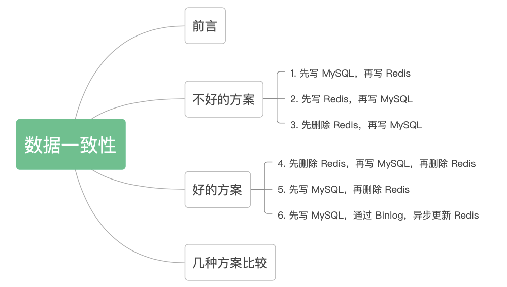
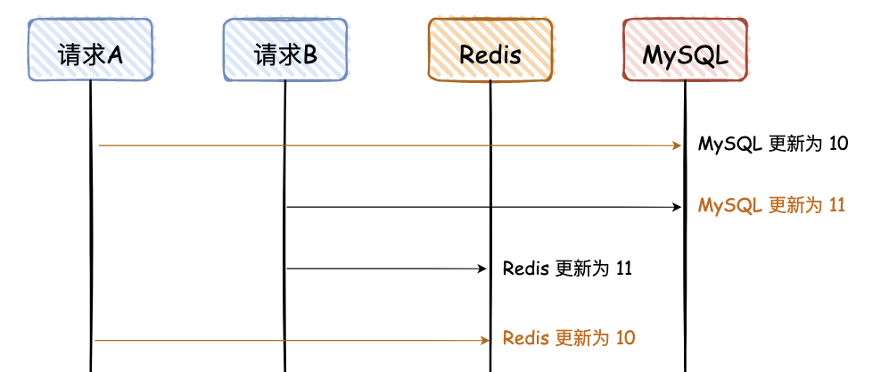
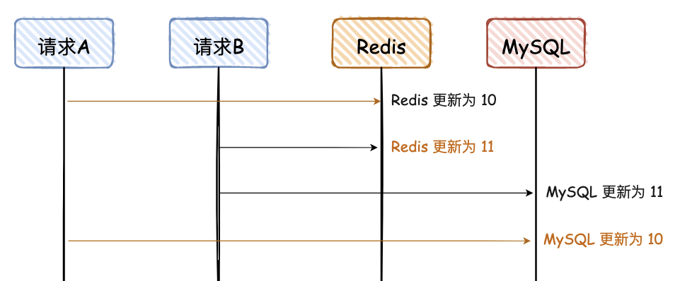
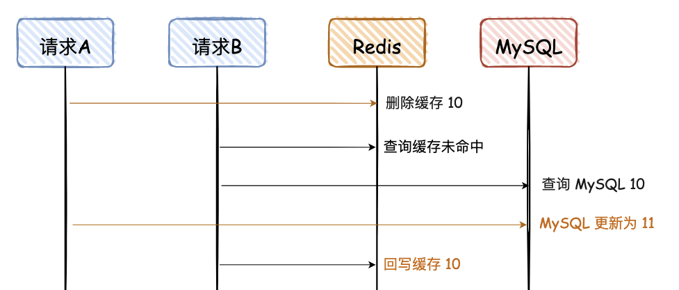
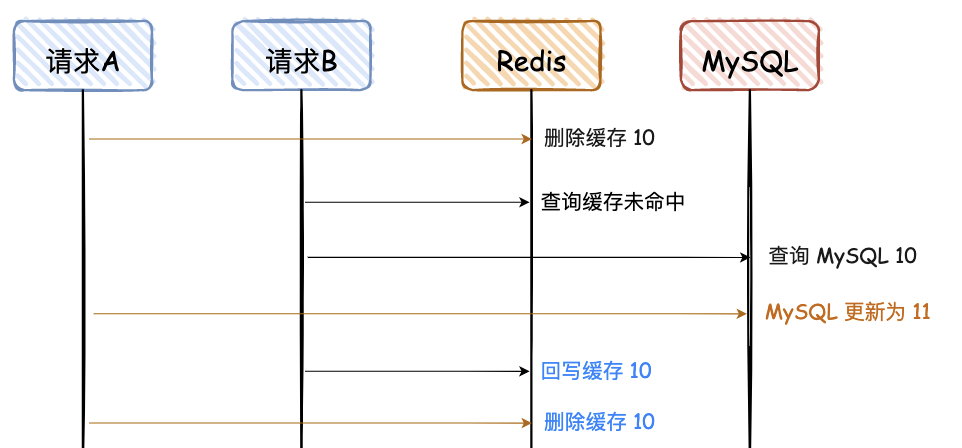
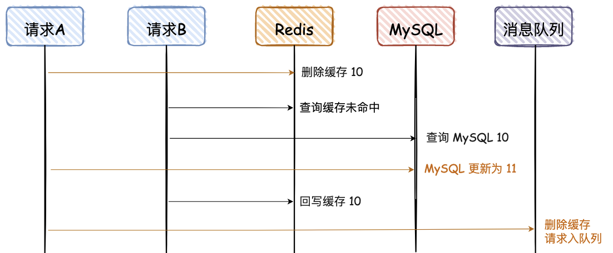
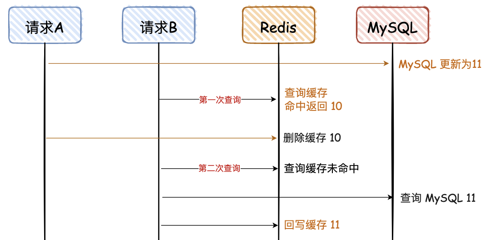
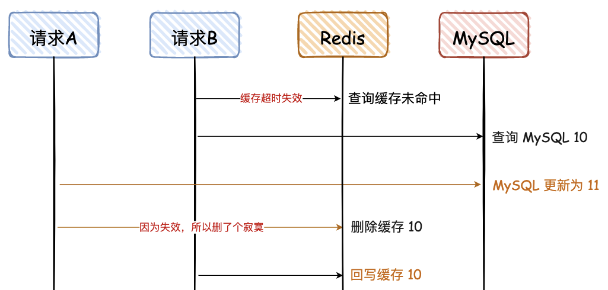
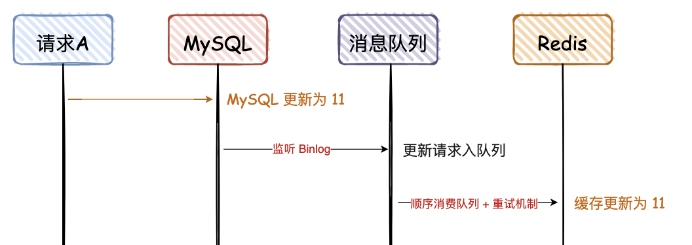

如何保障 MySQL 和 Redis 的数据一致性？这个问题很早之前我就遇到过，但是一直没有仔细去研究，上个月看了极客的课程，有一篇文章专门有过讲解，刚好有粉丝也问我这个问题，所以感觉有必要单独出一篇。

**之前也看了很多相关的文章，但是感觉讲的都不好**，很多文章都会去讲各种策略，比如（旁路缓存）策略、（读穿 / 写穿）策略和（写回）策略等，感觉意义真的不大，然后有的文章也只讲了部分情况，也没有告诉最优解。

我直接先抛一下结论：**在满足实时性的条件下，不存在两者完全保存一致的方案，只有最终一致性方案。** 根据网上的众多解决方案，总结出 6 种，直接看目录：

##  不好的方案

###  1. 先写 MySQL，再写 Redis

> 图解说明：
> - 这是一副时序图，描述请求的先后调用顺序；
> - 橘黄色的线是请求 A，黑色的线是请求 B；
> - 橘黄色的文字，是 MySQL 和 Redis 最终不一致的数据；
> - 数据是从 10 更新为 11；
> - 后面所有的图，都是这个含义，不再赘述。

请求 A、B 都是先写 MySQL，然后再写 Redis，在高并发情况下，如果请求 A 在写 Redis 时卡了一会，请求 B 已经依次完成数据的更新，就会出现图中的问题。

这个图已经画的很清晰了，我就不用再去啰嗦了吧，**不过这里有个前提，就是对于读请求，先去读 Redis，如果没有，再去读 DB，但是读请求不会再回写 Redis。** 大白话说一下，就是读请求不会更新 Redis。

###  2. 先写 Redis，再写 MySQL

同“先写 MySQL，再写 Redis”，看图可秒懂。

###  3. 先删除 Redis，再写 MySQL

这幅图和上面有些不一样，前面的请求 A 和 B 都是更新请求，这里的请求 A 是更新请求，**但是请求 B 是读请求，且请求 B 的读请求会回写 Redis。**

请求 A 先删除缓存，可能因为卡顿，数据一直没有更新到 MySQL，导致两者数据不一致。

**这种情况出现的概率比较大，因为请求 A 更新 MySQL 可能耗时会比较长，而请求 B 的前两步都是查询，会非常快。**

##  好的方案

###  4. 先删除 Redis，再写 MySQL，再删除 Redis
对于“先删除 Redis，再写 MySQL”，如果要解决最后的不一致问题，其实再对 Redis 重新删除即可，**这个也是大家常说的“缓存双删”。**

为了便于大家看图，对于蓝色的文字，“删除缓存 10”必须在“回写缓存10”后面，那如何才能保证一定是在后面呢？**网上给出的第一个方案是，让请求 A 的最后一次删除，等待 500ms。**

对于这种方案，看看就行，反正我是不会用，太 Low 了，风险也不可控。

**那有没有更好的方案呢，我建议异步串行化删除，即删除请求入队列**

异步删除对线上业务无影响，串行化处理保障并发情况下正确删除。

如果双删失败怎么办，网上有给 Redis 加一个缓存过期时间的方案，这个不敢苟同。**个人建议整个重试机制，可以借助消息队列的重试机制，也可以自己整个表，记录重试次数**，方法很多。

> 简单小结一下：
> - “缓存双删”不要用无脑的 sleep 500 ms；
> - 通过消息队列的异步&串行，实现最后一次缓存删除；
> - 缓存删除失败，增加重试机制。

###  5. 先写 MySQL，再删除 Redis

对于上面这种情况，对于第一次查询，请求 B 查询的数据是 10，但是 MySQL 的数据是 11，**只存在这一次不一致的情况，对于不是强一致性要求的业务，可以容忍。**（那什么情况下不能容忍呢，比如秒杀业务、库存服务等。）

当请求 B 进行第二次查询时，因为没有命中 Redis，会重新查一次 DB，然后再回写到 Reids。

这里需要满足 2 个条件：
- 缓存刚好自动失效；
- 请求 B 从数据库查出 10，回写缓存的耗时，比请求 A 写数据库，并且删除缓存的还长。

对于第二个条件，我们都知道更新 DB 肯定比查询耗时要长，所以出现这个情况的概率很小，同时满足上述条件的情况更小。

###  6. 先写 MySQL，通过 Binlog，异步更新 Redis

这种方案，主要是监听 MySQL 的 Binlog，然后通过异步的方式，将数据更新到 Redis，这种方案有个前提，查询的请求，不会回写 Redis。

这个方案，会保证 MySQL 和 Redis 的最终一致性，但是如果中途请求 B 需要查询数据，如果缓存无数据，就直接查 DB；如果缓存有数据，查询的数据也会存在不一致的情况。

**所以这个方案，是实现最终一致性的终极解决方案，但是不能保证实时性。**

##  几种方案比较

我们对比上面讨论的 6 种方案：
1. 先写 Redis，再写 MySQL
- **这种方案，我肯定不会用**，万一 DB 挂了，你把数据写到缓存，DB 无数据，这个是灾难性的；
- 我之前也见同学这么用过，如果写 DB 失败，对 Redis 进行逆操作，那如果逆操作失败呢，是不是还要搞个重试？

2. 先写 MySQL，再写 Redis
- **对于并发量、一致性要求不高的项目，很多就是这么用的**，我之前也经常这么搞，但是不建议这么做；
- 当 Redis 瞬间不可用的情况，需要报警出来，然后线下处理。
  
3. 先删除 Redis，再写 MySQL
- 这种方式，我还真没用过，**直接忽略吧。**

4. 先删除 Redis，再写 MySQL，再删除 Redis
- 这种方式虽然可行，但是**感觉好复杂**，还要搞个消息队列去异步删除 Redis。

5. 先写 MySQL，再删除 Redis
- **比较推荐这种方式**，删除 Redis 如果失败，可以再多重试几次，否则报警出来；
- 这个方案，是实时性中最好的方案，在一些高并发场景中，推荐这种。

6. 先写 MySQL，通过 Binlog，异步更新 Redis
- **对于异地容灾、数据汇总等，建议会用这种方式**，比如 binlog + kafka，数据的一致性也可以达到秒级；
- 纯粹的高并发场景，不建议用这种方案，比如抢购、秒杀等。
  
  
**个人结论：**
- **实时一致性方案**：采用“先写 MySQL，再删除 Redis”的策略，这种情况虽然也会存在两者不一致，但是需要满足的条件有点苛刻，**所以是满足实时性条件下，能尽量满足一致性的最优解。**
- **最终一致性方案**：采用“先写 MySQL，通过 Binlog，异步更新 Redis”，可以通过 Binlog，结合消息队列异步更新 Redis，**是最终一致性的最优解。**

----

> 整理：沉默王二，戳[转载链接](https://mp.weixin.qq.com/s/RL4Bt_UkNcnsBGL_9w37Zg)，作者：楼仔，戳[原文链接](https://mp.weixin.qq.com/s/l7v4s1VekIPNi7KZuUgwGQ)。

